# [Pre-Linux OS Basics Sprint / OSTEP Prereq Knowledge]
## (1/9/25 - 11/12/25)
**Task:**

The Pre-Linux OS Basics Sprint requires me to read the book [*"Operating Systems: Three Easy Pieces"*](https://pages.cs.wisc.edu/~remzi/OSTEP/ "Operating Systems: Three Easy Pieces"). However, the book starts with the following warning:

> If you are taking an undergraduate operating systems course, you should already have some idea of what a computer program does when it runs. If not, this book (and the corresponding course) is going to be difficult — so you should probably stop reading this book, or run to the nearest bookstore and quickly consume the necessary background material before continuing (both Patt & Patel [[PP03]](https://icourse.club/uploads/files/96a2b94d4be48285f2605d843a1e6db37da9a944.pdf "Introduction to Computing Systems: From Bits and Gates to C and Beyond") and Bryant & O’Hallaron
[BOH10](https://www.cs.sfu.ca/~ashriram/Courses/CS295/assets/books/CSAPP_2016.pdf "Computer Systems: A Programmer’s Perspective") are pretty great books).

Since I don't have the time to read these books, this file contains all prereq topics I need knowledge of before OSTEP (with notes).

## 1) Data and representation
### Integers (two's complement)
Two's complement (as opposed to Sign-Magnitude) is a way to reprsent both positive and negative integers in binary so that the computer's arithmetic logic unit (ALU) can work with them.

Example:
- `+5` would be `0000 0101`
- `-5` would be `1111 1011`

The **Most Significant Bit (MSB)** is the sign bit. (`0` for postive, `1` for negative.)

For an `n`-bit number, the range of values is from `-2^(n-1)` to `2^(n-1) - 1`.
- **8-bit Example:** The range is `-128` (`-2^7`) to `+127` (`-2^7 - 1`)

To represent the negative version of a positive number `X` (e.g., `-1`):
1. Start with the positive binary representation (`+1`): `0000 0001`
2. Invert all the bits: `0000 0001` &rarr; `1111 1110`
3. Add `1` to the results: `1111 1110 + 1 = 1111 1111`

<br>

### Floating point (IEEE-754)

IEEE-754 is a technical standard that defines how computers represent and handle floating-point numbers. A float is split into three parts:

- **Sign bit (1 bit):** `0` if positive, `1` if negative.
- **Exponent (8 bits for 32-bit float):** Represents the "power" (like `23` in `10²³`). It's stored with a bias to handle negative exponents, meaning `Actual Exponent = Stored Exponent - Bias`)<br>
For 32-bit floats, this bias is `127`. Stored exponent range: `1–254`; corresponding to actual exponents: `-126–127`.
- **Fraction/Mantissa (23 bits for 32-bit float):** The significant digits of the number (like the `6.022` from `6.022 x 10²³`).

The formula for the value of a IEEE-754 float is: <br>
`Value = (-1)^Sign x (1 + Fraction) x 2^(Exponent - Bias)`

#### **Example 1: Storing 0.15625 in 32-bit float**

**Step 1) Determine the Sign Bit**
<br>
Since `0.15625` is positive, the sign bit is **`0`**.

**Step 2) Convert `0.15625` to binary:**
<br>
To convert a decimal fraction to binary, multiply by 2 repeatedly and take the integer parts (`0` or `1`) until the fraction becomes zero or until you have enough bits. For `0.15625`:
- 0.15625 x 2 = 0.3125 &rarr; **integer part `0`**
- 0.3125 x 2 = 0.625 &rarr; **integer part `0`**
- 0.625 x 2 = 1.25 &rarr; **integer part `1`**
- 0.25 x 2 = 0.5 &rarr; **integer part `0`**
- 0.5 x 2 = 1 &rarr; **integer part `1`**

Reading the integer parts from top to bottom, we get `0.00101₂`. Thus, `0.15625 = 0.00101₂`.

**Step 3) Normalize to Scientific Notation**
<br>
In binary scientific notation, we express the number as 1.xxxx x 2<sup>exponent</sup>. For `0.00101₂`, we move the binary point three places to the right to get `1.01₂`. This is equivalent to multiplying by `2⁻³`. So:
- Value: `1.01₂ x 2⁻³`
- The leading `1.` is implicit in the representation (not stored), so we focus on the fractional part "`01`".

**Step 4) Calculate the Stored Exponent**
<br>
The actual exponent is `-3`. We add the bias (`127`) to get the stored exponent: `-3 + 127 = 124`
<br>
Now, convert 124 to binary (8 bits): `01111100`

**Step 5) Extract the Fraction (Mantissa)**
<br>
The normalizaed value is `1.01₂`. The fraction part is the bits after the decimal point, which is "`01₂`". However, since IEEE-754 requires a 23-bit fraction, we pad with zeros to the right: `01000000000000000000000₂`.

> <!-- --- -->
> **\*\*NOTE**** <br>
> Converting this from binary (base-2) to decimal (base-10): `1.01₂` = 1 x 2<sup>0</sup> + 0 x 2<sup>-1</sup> + 1 x 2<sup>-2</sup> = `1.25`
> <!-- --- -->

**Step 6) Full binary representation:**
<br>
The 32-bit float consists of:
- Sign bit: 1 bit (`0`)
- Exponent: 8 bits (`01111100₂`)
- Fraction: 23 bits (`01000000000000000000000₂`)

Thus, the full binary representation is: <br>
**`0011 1110 0010 0000 0000 0000 0000 0000`**<br>
The hexadecimal representation is: `0x3E200000`.

#### **How the Float is Read from Memory and Interpreted**

**Step 1: Read and Reconstruct the 32-Bit Value**
<br>
The CPU fetches **4 bytes** from memory addresses `0x1000` to `0x1003`. Assuming the system is **little-endian**, the CPU then reverses the order of the bytes to get the correct 32-bit value: `0x3E200000`.

**Step 2: Interpret the Bits**
<br>
The CPU parses the 32-bit string according to IEEE-754, splitting it into the three defined fields:
- **Bit 31 (The Sign Bit):** `0`, meaning the number is **positive**.
- **Bits 30-23 (The Exponent Bits:** `01111100` &rarr; `124`.
- **Bits 22&ndash;0 (The Fraction Bits):** `01000000000000000000000`

**Step 3: Apply the IEEE-754 Formula**
<br>
`Value = (-1)^Sign x (1 + Fraction) x 2^(Exponent - Bias)`
1. **Calculate the Sign:**
    `(-1)^Sign` = (-1)^0 = `1`
2. **Calculate the true Exponent:**
    `Exponent - Bias` = 124 - 127 = `-3`
3. **Calculate the Significand (1+ Fraction):**<br>
    `1.01000000000000000000000₂` = 1 x 2<sup>0</sup> + 0 x 2<sup>-1</sup> + 1 x 2<sup>-2</sup> + 0 x 2<sup>-3</sup> + . . . + 0 x 2<sup>-23</sup> = 1 + 0 + 0.25 + 0 + . . . + 0 = `1.25`.
4. **Final Value:**<br>
    `1 x 1.25 x 2⁻³ = 0.15625`

#### **Example 2: Storing 35.7911 in 32-bit float**

**Step 1) Sign Bit**:
<br>
Since `35.7911` is positive, the sign bit is **`0`**.

**Step 2) Convert `35.7911` to binary:**

- **Integer part (`35`):**<br>
    35 ÷ 2 = 17 remainder `1`<br>
    17 ÷ 2 = 8 remainder `1`<br>
    8 ÷ 2 = 4 remainder `0`<br>
    4 ÷ 2 = 2 remainder `0`<br>
    2 ÷ 2 = 1 remainder `0`<br>
    1 ÷ 2 = 0 remainder `1`

    So, `35` in binary is `100011`.
- **Fraction part (0.7911):**<br>
    0.7911 x 2 = 1.5822 &rarr; `1`<br>
    0.5822 x 2 = 1.1644 &rarr; `1`<br>
    0.1644 x 2 = 0.3288 &rarr; `0`<br>
    0.3288 x 2 = 0.6576 &rarr; `0`<br>
    0.6576 x 2 = 1.3152 &rarr; `1`<br>
    0.3152 x 2 = 0.6304 &rarr; `0`<br>
    0.6304 x 2 = 1.2608 &rarr; `1`<br>
    0.2608 x 2 = 0.5216 &rarr; `0`<br>
    0.5216 x 2 = 1.0432 &rarr; `1`<br>
    0.0432 x 2 = 0.0864 &rarr; `0`<br>
    0.0864 x 2 = 0.1728 &rarr; `0`<br>
    0.1728 x 2 = 0.3456 &rarr; `0`<br>
    0.3456 x 2 = 0.6912 &rarr; `0`<br>
    0.6912 x 2 = 1.3824 &rarr; `1`<br>
    0.3824 x 2 = 0.7648 &rarr; `0`<br>
    0.7648 x 2 = 1.5296 &rarr; `1`<br>
    0.5296 x 2 = 1.0592 &rarr; `1`<br>
    0.0592 x 2 = 0.1184 &rarr; `0`<br>
    0.1184 x 2 = 0.2368 &rarr; `0`<br>
    . . .
    
    So, the fractional part in binary is approximately `1100101010000101100...`
- **Combine integer and fractional parts:**<br>
    `100011.1100101010000101100...`

**Step 3) Normalize to Scientific Notation**
<br>
Move the binary point 5 places to the left:<br>
`1.000111100101010000101100...` x `2^5`.

**Step 4) Calculate the Stored Exponent**
<br>
The actual exponent is `5`. To get the stored exponent: `5 + 127 = 132`.
<br>
Now, convert 132 to binary: (8 bits): `1000 0100`

**Step 5) Extract the Fraction (Mantissa)**
<br>
The significand is `1.000111100101010000101100...`, so the fraction bits are `00011110010101000010110` (23 bits).

**Step 6) Full binary representation:**
<br>
- **Sign:** `0`
- **Exponent:** `10000100`
- **Fraction:** `00011110010101000010110`

Thus, the full binary representation is: <br>
**`0100 0010 0000 1111 0010 1010 0001 0110`**<br>
The hexadecimal representation is: `0x420F2A16`.

<br>

### Endianness

**Endianness** defines whether the most significant byte (MSB) or least significant byte (LSB) is placed at the lowest memory address when storing multi-byte data types in computer memory.

**Big-Endian**
<br>
`0x12` &rarr; `0x32` &rarr; `0x56` &rarr; `0x78` = `0x12345678`

**Little-Endian**
<br>
`0x78` &rarr; `0x56` &rarr; `0x32` &rarr; `0x12` = `0x12345678`

#### How to Determine Endianness
``` c
#include <studio.h>
int main()
{
    int num = 0x12345678
    char *byte = (char *)&num;

    if (*byte == 0x78)
    {
        printf("Little-Endian\n");
    }
    else if (*byte == 0x12)
    {
        printf("Big-Endian\n");
    }
    return 0;
}
```

<br>

### Alignment and Padding

#### **Alignment**
The requirement that data types in memory must start at specific memory addresses that are multiples of their size. Because CPUs read memory in chunks (called **`memory words`** or **`cache lines`**), and we want to avoid bit-shifting or crashes. For example,
- A 4-byte `int` should start at an address divisible by 4.
- A 8-byte `double` should start at an address divisible by 8.

> <!-- --- -->
> **\*\*NOTE**** <br>
> A **`Memory Word`** is the basic unit of data a CPU can work with in a single operation. On a modern 64-bit system, typically 8 bytes.
>
> A **`Cache Line`** is a larger block of memory (e.g. 64 bytes) that the CPU's cache loads from the main RAM all at once to be ready for super-fast access.
> <!-- --- -->

#### **Padding**
Extra bytes inserted by the compiler between fields in a `struct`/`class` to ensure each field is properly aligned.<br>
It can also be added at the end of a `struct` to ensure alignment in arrays.

#### **Example:** `struct X { char c; int i; };`
1. **Member Sizes:**
   - `char c`: 1 byte
   - `int i`: 4 bytes
2. **Without Padding:**
   - Let the struct started at address `0x1000`:
     - `c` would be at `0x1000` (aligned)
     - `i` would start at `0x1001` (misaligned)
3. **Compiler Adds Padding:**
   - To align `i`, the compiler inserts **3 bytes of padding after `c`**:
     - `c` at `0x1000`
     - Padding at `0x1001`,`0x1002`,`0x1003`.
     - `i` starts at `0x1004` (aligned).
4. **Total Size:**
    - `char c`: 1 byte
    - Padding: 3 bytes
    - `int i`: 4 bytes
    - **Total: 8 bytes**


<hr>
<br>


## 2) From source to a running program (the whole pipeline)

### The toolchain: preprocess &rarr; compile &rarr; assemble &rarr; link

####  **1\. Preprocessing (`cpp`)** 

The preprocessor handles all lines beginning with a `#` directive.
<br>
**Key Operations:**
- **`#include` Expansion** <br>
Finds the specified header files (like `stdio.h`) and literally copy-pastes their contents in source file.
- **Macro Expansion** <br>
Replaces all instances of defined macros (like `MESSAGE`) with their actual values.
- **Conditional Compilation** <br>
Processes `#if`, `#ifdef`, `#endif` directives, including or excluding blocks of code based on defined conditions.

**Input**: `hello.c`, **Output**: `hello.i`

####  **2\. Compilation (`cc1`)** 

The compiler takes the preprocessed code and translates it into **assembly language**.
<br>
**Key Operations:**
- **Parsing & Syntax Analysis** (checking for syntax errors)
- **Semantic Analysis** (type checking)
- **Optimization** (high-level optimizations)
- **Code Generation** (outputs a human-readable assembly language `.s` file)

**Input**: `hello.i`, **Output**: `hello.s`

#### **3\. Assembly (`as`)**

Takes the assembly code and translates it into machine code (pure binary)
<br>
**Key Operations:**
- **Mnemonic Translation**<br>
  Converts human-readable assembly mnemonics into their binary opcodes.
- **Resolving Addresses**<br>
  Assigns preliminary addresses to instructions and data.
- **Creating the Object File**<br>
  Outputs a structured file containing:
  1. **Machine Code**<br>(binary)
  2. **A Symbol Table**<br>(directory of names (`_main`, `_printf`, etc.) in the file, noting which ones are defined vs undefined)
  3. **Relocation Information**<br>(instructions for the linker on how to adjust addresses once final locations are known)


**Input**: `hello.s`, **Output**: `hello.o`

#### **4\. Linking (`ld`)**

The linker combines one or more `.o` object files and libraries into a single, executable file.
<br>
**Key Operations:**
- **Symbol Resolution**<br>
  The linker's **main job**. It looks at the symbol tables from the `.o` files, and when it sees an undefined symbol, it searches through all the linked libraries and other `.o` files to find its definition.
- **Relocation**<br>
  Assigns final memory addresses to all the code and data sections. It then goes back and updates all the preliminary addresses that the assembler created with these final addresses (using the Relocation Information from the **Symbol Table**).
- **Library Handling**<br>
  It can link two types of libraries:
  - **Static Libraries**<br>
  `.a` on Linux, `.lib` on Windows.
  The library code is physically copied into final executable.
  - **Dynamic/Shared Libraries**<br>
  `.so` on Linux, `.dll` on Windows.
  The library code is only referenced in the final executable, so the library is loaded into memory at runtime.

**Input**: `hello.o` + `libc.a`, **Output**: `hello` (executable)

#### **Summary:**
```
hello.c (Source)
      |
      v Preprocessing (cpp)
hello.i (Preprocessed)
      |
      v Compilation (cc1)
hello.s (Assembly)
      |
      v Assembly (as)
hello.o (Object File) + libc.a (Library)
      |               /
      v Linking (ld) /
   hello (Executable)
```

> <!-- --- -->
> **\*\*NOTE**** <br>The Python "Toolchain", by contrast, is a two-stage process.
> 1. Compilation to ByteCode
> 2. Interpretation by the Python Virtual Machine
> 
> 
> <!-- --- -->

<br>

### Executable layout

An executable file is a highly structured toolbox.
This structure is divided into named **sections** (or **segments** when loaded into memory), each with a specific purpose and set of permissions (read, write, execute).

#### **The Common Sections/Segments**
##### **1. `.text` (Code Segment)**
- **Contents**<br>
  All the executable machine code (i.e. the actual instruction for the CPU).
- **Permissions: Read-Only and Execute**
  - **Read-only** to prevent a program from accidentally modifying its own instructions.
  - **Executable** so the CPU can run the instructions.

##### **2. `.rodata` (Read-Only Data)**
- **Contents**<br>
  Constants and literal values that should never change during execution.
- **Permissions: Read-Only and Execute**<br>

##### **3. `.data` (Initialized Data)**
- **Contents**<br>
  Global and static variables that have an explicit initial value set in the source code.
  > <!-- --- -->
  > **\*\*NOTE**** <br>Physically stored in the executable file on disk.
  > <!-- --- -->
- **Permissions: Read-Write**<br>
  Because these variables are supposed to be changed during runtime.

##### **4. `.bss` (Block started by Symbol)**
- **Contents**<br>
  Global and static variables that are initialized to zero or have no explicit initializer.
  > <!-- --- -->
  > **\*\*NOTE**** <br>Occupies no physical space on the disk in the executable file. This section in the executable is more like a note saying "When you load this program, please allocate 10,000 bytes of memory and fill it all with zeros.
  > <!-- --- -->
- **Permissions: Read-Write**<br>

##### **5. "Metadata" and Instructions for the OS**
Beyond the raw data and code, the executable file contains **headers** full of crucial metadata that tells the OS how to load and run it.
1. **The Entry Point (`_start`)**<br>
   The file specifies exactly where the OS should start executing the program. The entry point is usuallly a symbol named `_start`.
2. **Dynamic Linking Information**<br>
   Contains a "shopping list" of required shared libraries and a list of symbols needed from them. When the OS loads the program, the **dynamic linker** reads this list to perform dynamic linking.

#### **Visual Summary: From Disk to Memory**



<hr>
<br>


## 3) Program Start: From Command to Running Process
Imagine we type `./my_program` into shell and hit enter. Here's what happens, step-by-step.

### **Step 1: The `execve` System Call**

The shell calls the the `execve` system call to execute program.
- **`execve`'s Job:** To replace the current process's memory with the contents of a new program file and then start running that new program.

The shell passes the path to the executable file (`./my_program`) and the arguments (`argv`) and environment variables 
(`envp`) to the kernel. The kernel now takes over.

<br>

### **Step 2: The Kernel's Loader**

The kernel's "**loader**" is responsible for setting up a new process in memory. Here's what it does:

**1\. Creates a New Process with a Fresh Virtual Address Space**<br>
Creates (or reuses) a process structure. A key part of this is creating a brand new, empty **virtual address space**.

> <!-- --- -->
> **\*\*NOTE**** <br>
> The **process structure** or **Process Control Block (PCB)** is a data structure inside the kernel's memory that contains all the information the OS needs to manage and track a specific process.<br>
> It consists of:
> - **Process ID (PID)**
> - **Process State:** Is it running, waiting, or ready to run? 
> - **Program Counter:** The address of the next instruction to execute.
> - **CPU Registers:** A saved copy of all the CPU's working memory for this process (so it can be paused and resumed)
> - **Memory Management Info:** Pointers to the virtual address space.
> - **Accounting Info:** How much CPU time has this process used?
> - **I/O Status Info:** What files, network sockets, or devices is this process using?
> <!-- --- -->

**2\. Maps Code and Data into Memory**
- Parses the headers of the executable file. It looks for the "program headers" that describe the **segments** (`.text`,`.data`, etc.) and where they need to be loaded.
- Performs **memory mapping**: setting up the process's page tables so that a specific **virtual address** points to the corresponding **physical page**. The actual code is only loaded from disk into physical RAM by the kernel when the CPU tries to access it (a "**page fault**").

> <!-- --- -->
> **\*\*NOTE**** <br>
> A **page fault** is when a program tries to access a portion of memory (a page) that is not currently in physical RAM.
> <!-- --- -->

**3\. Creates a Stack and an Empty Heap**
- **The Stack:** 
  Kernel allocates physical memory for the stack and maps it to a virtual address at the very top of the process's address space. The stack grows downwards. This memory is read-write.
- **The Heap:** Kernel sets up a single page of memory for the "program break" and maps it. This is the start of the heap. Initially, it's mostly empty, but it will grow upwards later (when `malloc()` or `brk()` are called).

> <!-- --- -->
> **\*\*NOTE****<br>
> The **program break** is a kernel-maintained pointer that defines the current end of the process's data segment—the boundary between the heap's allocated memory and the unmapped memory beyond it.
> <!-- --- -->

> <!-- --- -->
> **\*\*NOTE****<br>
> ```
> High Addresses  +----------------------+
>                 |      Kernel Space    | (Memory reserved for the OS)
>                 +----------------------+
>                 |                      |
>                 |         STACK        | <- Grows DOWNWARD
>                 |           |          |
>                 |           v          |
>                 |          ...         |
>                 |                      |
>                 |           ^          |
>                 |           |          |
>                 |          HEAP        | <- Grows UPWARD
>                 |                      |
>                 |          BSS         | (Uninitialized data)
>                 +----------------------+
>                 |          Data        | (Initialized data)
>                 +----------------------+
>                 |         rodata       | (Constants)
>                 +----------------------+
>                 |          Text        | (Program's code)
> Low Addresses   +----------------------+
> ```
> <!-- --- -->

**4\. Maps Needed Shared Libraries**
- Reads the list of shared libraries from the executable's headers.
- It finds these libraries on the filesystem and recursively maps their code (`.text`) and read-only data (`.rodata`) segments into the process's address space, just like it did for the main program in `2.`.

**5\. Places Initial Data on the Stack**<br>
Prepares the initial environment for the program by pushing information onto the new stack it just created: `argc`, `argv[]`, `envp[]`, `auxv`.

<br>

### **Step 3: The Handoff to `_start`**
Once the kernel has successfully built the entire virtual environment, the final step is to set the CPU's instruction pointer (`%rip`) to the address of the entry point specified in the executable header (`_start`) and let the CPU run.

#### **The Job of `_start`**
1. **Set up the C runtime environment**
2. **Extract arguments for `main`.** It reads `argc`, `argv`, and `envp` from the stack.
3. **Initialize the standard library**
4. **Call our `main` function.** (`main(argc, argv, envp)`)
5. **Handle the return.** When `main()` returns, `_start` takes its return value, passes it to the `exit()` system call, and terminates the process.

<br>

### User vs kernel mode

The CPU is designed with multiple levels of privilege, often called **rings**.

#### **Kernel Mode (Ring 0)**

Where the OS kernel runs.<br>
Code here has the **highest level of privilege**: full, unrestricted access to the CPU and all hardware. It can do anything.

#### **User Mode (Ring 3)**

Where all our applications (processes) run.<br>
Code running in User Mode is "sandboxed and restricted to the **lowest level of privilege**. It is physically prevented by the CPU from:
- Direct Hardware Access
- Modifying Page Tables
- Disabling Interrupts
- Halting the CPU
- Changing Privilege Levels

> <!-- --- -->
> **\*\*NOTE****<br>
> An **Interrupt** is a signal sent to the CPU that immediately grabs its attention, forcing it to temporarily stop what it's doing and execute a special piece of code called an **interrupt handler**.
> <br>
> Two types: **Hardware Interrupts** and **Software Interrupts**
> 
> Interrupts are what allow the CPU to respond to event in real-time (`e.g.` keyboard key pressed).
> 
> The computer's timer chip is advised to generate a hardware interrupt **many times per second**. Every time the timer interrupt fires, the kernel has to decide:
> - Has the current program used up its fair share of CPU time?
> If yes, it saves the program's state and switches to running a different program.
>
> This happens extremely fast for milliseconds at a time, allowing the CPU to "multi-task".
> <!-- --- -->


<hr>
<br>


## 4) The process and its memory (while running)

### Virtual address space

**Virtual Address Space** is an abstraction provided by the OS and **Memory Management Unit (MMU)** that presents each running process with a private, linear range of memory addresses. It is "virtual" because it's independent of physical memory, creating the illusion that the process has exclusive access to the entire system's memory.

Virtual memory is **mapped** to physical memory by the kernel loader after `execve`, with physical RAM only being allocated **lazily** at first access.

<br>

### Heap and Stack

#### **Heap**

- A region for **dynamic memory allocation**. This is memory you explicitly request at runtime using functions like `malloc()`, `calloc()`, or `new`. It is used for data that must persist beyond the lifetime of a single function call or whose size is unknown at compile time.
- **Managed by a memory allocator library.**
- The heap **grows upward** toward higher memory. Size is managed explicitly by the programmer (with `malloc()` and `free()`).
- The top of the heap, the **program break**, is moved using `brk()`, `sbrk()`, and `mmap()`  system calls. `malloc()` uses these implicitly.

> <!-- --- -->
> **\*\*NOTE****<br>
> `mmap()` for very large allocations.
> `mmap()` creates an independent mapping that is not connected to the main heap.
> <!-- --- -->

#### **Stack**

- A region for **automatic memory allocation**. It handles function calls and storage of local variables, function arguments, return addresses, and saved register values.
- **Managed by compiler**.
- Starts at a high memory address and **grows downward** toward lower addresses. Each function call pushes a "**stack frame**" onto the stack. When a function returns, its entire frame is popped off the stack. This allocation and freeing is automatic and handled by the compiler.
- A typical **stack frame** contains, in order:
  1. Function Arguments
  2. Return Address
  3. Saved Frame Pointer (a pointer to the previous stack frame)
  4. Local Variables
  5. Temporary Data

Once the stack and heap meet, the program is out of memory.

<br>

### Memory bugs and why they crash

Memory bugs crash because they violate the contracts and assumptions made by the OS and the **memory allocator**.

> <!-- -- -->
> **\*\*NOTE****<br>
> The **Memory Allocator** is a software library (e.g., part of the C standard library `glibc`) that manages a pool of memory within a process's virtual address space.
> 
> It acts as an intermediary between a program and the OS.
> 1. It asks the OS for large chunks of memory (using system calls like `brk`, `sbrk`, `mmap`).
> 2. It then takes that large chunk and splits it up into smaller pieces to fulfill your many small `malloc()` requests.
> 3. It keeps complex data structures (like linked lists) to track which parts of that large chunk are free and which are allocated.
> 4. When you call `free()`, it doesn't usually return the memory to the OS immediately. Instead, it just marks that small piece as "free" in its internal list so it can be reused by a future `malloc()` call.
> <!-- -- -->

#### 1. Out-of-Bounds Access

Reading or writing to an array or buffer outside of its allocated boundaries.

##### **Why it crashes**
A program's virtual address space is a map of **valid** (mapped to something) and **invalid** (unmapped) addresses. The allocator or the compiler gives you a pointer to a block of valid addresses. When you access memory outside that block, one of two things happens:
1. **You touch an unmapped address:**<br>
   The MMU triggers a **page fault**. The OS responds by sending the `SIGSEGV` (Segmentation Violation) signal to the process, which typically terminates it immediately.
2. **You touch a mapped address that belongs to something else:**<br>
   Might overwrite the contents of a different variable, a part of the heap's internal data structures, or even your own function's return address on the stack. This **corrupts data** but doesn't cause an immediate crash.

#### 2. Use-After-Free (Dangling Pointer)

Continuing to use a pointer after the memory it points to has been `free()`'d or has gone out of scope.

##### **Why it crashes**
Once `free` is called on a block of memory, the allocator now owns that block and can reassign it to a future `malloc()` call. If you use the old (dangling) pointer, two things can happen:
1. **The memory is reallocated:**<br>
   The allocator may have given the freed block to another part of the program. A write operation on this block corrupts the new, completely unrelated data.
2. **The memory is unmapped:**<br>
   To improve performance, the allocator may return large blocks of memory to the OS using a system call like `munmap`. Any operation on this block will result in **out-of-bounds access** (**page fault** &rarr; `SIGSEGV` system call).

#### 3. Double Free

Calling `free()` on the same pointer twice without an intervening `malloc()`.

##### **Why it crashes**
This corrupts the allocator's internal metadata.

> <!-- --- -->
> **\*\*NOTE**** <br>
> The allocator stores metadata in the heap, consisting of (at least) two lists:
> 1. A list of **allocated** blocks.
> 2. A list of **free** blocks
> 
> When you call `malloc`, it searches the **free list** for a block that's big enough.
> <br>
> When you call `free`, it takes the block and adds it to the **free list**.
> 
> Right before every single piece of memory that `malloc` gives you, it secretly stores a small header&mdash;a piece of metadata that describes the block that follows.
> ```
> +-----------------------------------------------------------------------+
> |  |              |  |              |  |                               | |
> |H | Your 100-byte|H | Your 40-byte |H |       Free 60-byte block      | |
> |E |   block      |E |   block      |E |    (on the free list)         | |
> |A |   (allocated)|A |   (allocated)|A |                               | |
> |D |              |D |              |D |                               | |
> |E |              |E |              |E |                               | |
> |R |              |R |              |R |                               | |
> +-----------------------------------------------------------------------+
> ^                  ^                  ^
> Pointer returned   Pointer returned   This block's metadata is part
> by malloc(100)     by malloc(40)      of the free list, pointing to
>                                      the next free block.
> ```
> What's in this header:
> - **Size of the block**
> - **Flags** (bits indicating if allocated or free)
> - **Pointers** (to link to the next block in the free list)
> <!-- --- -->

**The first `free(ptr)`** correctly puts the block on the "free list.":
1. It take the pointer `ptr` and goes backwards in memory to find the **metadata header** for that memory block.
2. It changes the flag in the metadata from `allocated` to `free`.
3. It splices the header to this now-free block into the **free list** linked list.

**The second `free(ptr)`**
1. The allocator takes `ptr` and goes to the same metadata.
2. It unexpectedly finds the metadata's flag status is already `free`.
3. It attempts to add the the block to the **free list** a second time, corrupting the linked list.

The crash often doesn't happen at the moment of the double-free. It's triggered later by a subsequent `malloc()` or `free()` call.

#### 4. Memory Leak

Allocating memory with `malloc()` but never `free()`ing it.

##### **Why it crashes**
It doesn't cause an immediate crash, it slowly **wastes memory**.

The heap grows and grows until the process runs out of available virtual address space or the system runs out of physical RAM. At this point, any `malloc()` call will fail and return `NULL`. Trying to use this `NULL` pointer will cause the program to crash.


<hr>
<br>


## 5) Calling conventions and the stack (how functions really call)

**The Need for a Calling Convention**

When one function calls another, they need a strict agreement on:
1. **Where to put the arguments** so the callee can find them.
2. **Where to put the return value** so the caller can find it.
3. **Which registers can be freely used** and which must be saved and restored.

> <!-- --- -->
> **\*\*NOTE**** <br>
> **Registers** are a very small number of ultra-fast, super-efficient storage locations built directly into the CPU chip itself; they are the fastest form of storage in a computer.
> <br>
> Accessing a register is much faster than accessing RAM, because they're on the CPU, which uses registers for all its immediate tasks:
> - Holding values it's working on right now
> - Performing calculations
> - Keeping track of addresses
> - etc.
>
> Registers are **fixed-size**. On a `64-bit` CPU, most general-purpose registers are `64 bits` (8 bytes) wide.
> <!-- --- -->

This agreement or **calling convention** is called the **Application Binary Interface (ABI)**. Without it, compilers for different languages/version could never work together.

The most common one for 64-bit Linux/macOS is the **`System V AMD64 ABI`**:

### 1. Passing Arguments and Return Values

- **Integer/Pointer Arguments:**<br>
  The first 6 arguments are passed through CPU registers (in the following order):
  - `rdi` (1st arg)
  - `rsi` (2nd arg)
  - `rdx` (3rd arg)
  - `rcx` (4th arg)
  - `r8` (5th arg)
  - `r9` (6th arg)
  - Any additional arguments are pushed to stack.
- **Return Value:**<br>
  The result of a function is passed back to the caller in the `rax` register (or `rdx:rax` for very large values).

<br>

### 2. Caller-Saved vs. Callee-Saved Registers

- **Caller-Saved (Volatile) Registers:**<br>
  (`rax`, `rcx`, `rdx`, `rsi`, `rdi`, `r8`, `r9`, `r10`, `r11`)
  - **Rule:** The callee is free to **clobber** (overwrite) these registers without saving them.
  - **Responsibility:** If the caller has a value in one of these registers that it needs to survive the function call, the caller must save it *before* setting up the arguments and calling the function. 

- **Callee-Saved (Non-Volatile) Registers:**<br>
  (`rbx`, `rbp`, `r12`, `r13`, `r14`, `r15`)
  - **Rule:** If the callee wants to use these registers, it must restore them to their original values before returning to the caller.
  - **Responsibility:** The callee typically saves them onto the stack at the very start (in the prologue) and restores them at the very end (in the epilogue).

<br>

### 3. The Function Frames: Prologue, Body, Epilogue

The life cycle of a function can be broken down into three distinct phases: the **Prologue**, the **Body**, and the **Epilogue**.

To illustrate, suppose the simple function:
``` c
int my_calc(int a, int b)
{
  int result = a + b;
  return result;
}
```
**Assembly (Simplified):**

Let the stack is set up for a function that has just been called. The `call` instruction has done two things: **1)** pushed the return address onto the stack, and **2)** jumped to the new function:
  
| Memory Address | Content (Value) | Description | Register Pointing Here |
| --- | --- | --- | --- |
| `0x7fffffffe110` | ... | Caller's local variables | `rbp` (Caller's frame) |
| `...` | ... | ... | |
| `0x7fffffffe108` | `0x400567` | **Return Address** (saved by `call`) | `rsp` |

#### **Prologue: Setting Up the Function's Workspace**

This is the function's "setup" ritual&mdash;once the function is called&mdash;to create the **stack frame**:
``` asm
push  rbp
move  rbp, rsp
sub   rsp, N
```

- **Step 1 (`push rbp`):** Save the Caller's Frame Pointer.

  The `push` instruction does two things:
  1. It decrements the stack pointer (`rsp`).
  2. It then copies the value from the specified register (`rbp`) to the new memory location that `rsp` now points to.

  By pushing `rbp` onto the stack, we are saving the caller's frame pointer so we can restore the caller's stack when we're done.
  <br>
  This single action creates a linked list of stack frames, allowing each function to cleanly return to its caller's perfectly restored state.

  Now the stack looks like this:

  | Memory Address | Content (Value) | Description | Register Pointing Here |
  | --- | --- | --- | --- |
  | `0x7fffffffe110` | ... | Caller's local variables | `rbp` (Caller's frame) |
  | `...` | ... | ... | |
  | `0x7fffffffe108` | `0x400567` | **Return Address** | |
  | `0x7fffffffe100` | `0x7fffffffe110` | **Saved `rbp`** (Caller's frame pointer) | `rsp` |

- **Step 2 (`move rbp, rsp`):** Establish Our Own Frame Pointer.

  This copies the current stack pointer into the base pointer register (`rbp = rsp = 0x7fffffffe100`). This is the moment our new stack frame is officially created, with `rbp` acting as the anchor point for the *current* function's frame:

  | Memory Address | Content (Value) | Description | Register Pointing Here |
  | --- | --- | --- | --- |
  | `0x7fffffffe110` | ... | Caller's local variables | |
  | `...` | ... | ... | |
  | `0x7fffffffe108` | `0x400567` | **Return Address** | |
  | `0x7fffffffe100` | `0x7fffffffe110` | **Saved `rbp`** | `rsp`, `rbp` |

- **Step 3 (`sub rsp, N`):** Allocate Space for Local Variables.

  Moves the stack pointer down by `N` bytes to reserve space for local variables.
  The compiler calculates the total size needed for all local variables and adjusts `rsp` by that amount in one go.
  
  Let `N=16`. The stack's final form for the function's execution:

  | Memory Address | Content (Value) | Description | Register Pointing Here |
  | --- | --- | --- | --- |
  | `0x7fffffffe110` | ... | Caller's local variables | |
  | `...` | ... | ... | |
  | `0x7fffffffe108` | `0x400567` | **Return Address** | |
  | `0x7fffffffe100` | `0x7fffffffe110` | **Saved `rbp`** | `rbp` |
  | `0x7fffffffe0f8` | ? | **Local Variable 1** | |
  | `0x7fffffffe0f0` | ? | **Local Variable 2** | `rsp` |

> <!-- --- -->
> **\*\*NOTE**** <br>
> The compiler may automatically **spill** the register-based arguments (`a` in `edi`, `b` in `esi`) onto the stack between the **Prologue** and **Body steps**.
>
> **In modern, optimized code, the body just directly uses registers to access arguments.**
> <!-- --- -->

#### **Body: Doing the Actual Work**

The function body uses the registers and the stack space that was just set up to carry out the actual function code:
``` asm
mov    eax, DWORD PTR [rbp-4]
add    eax, DWORD PTR [rbp-8]
mov    DWORD PTR [rbp-12], eax
```
1. **`mov eax, DWORD PTR [rbp-4]`**<br>
   Loads the 4-byte value from `[rbp-4]` in memory into the `eax` register.
2. **`add eax, DWORD PTR [rbp-8]`**<br>
   Adds the 4-byte value from `[rbp-8]` in memory to the value in `eax`.
3. **`mov DWORD PTR [rbp-12], eax`**<br>
   Stores the 4-byte value from `eax` into memory at `[rbp-12]`.

The final state of the stack:

| Memory Address | Content (Value) | Description | Register Pointing Here |
| --- | --- | --- | --- |
| `0x7fffffffe110` | ... | Caller's local variables | |
| `...` | ... | ... | |
| `0x7fffffffe108` | `0x400567` | **Return Address** | |
| `0x7fffffffe100` | `0x7fffffffe110` | **Saved `rbp`** | `rbp` |
| `0x7fffffffe0fc` | `10` | **Local Var: `a`** | |
| `0x7fffffffe0f8` | `20` | **Local Var: `b`** | |
| `0x7fffffffe0f4` | `30` | **Local Var: `result`** | |
| `...` | ... | ... | |
| `0x7fffffffe0f0` | ? | (Unused space) | `rsp` |

> <!-- --- -->
> **\*\*NOTE**** <br>
> `DWORD PTR` is a **size directive** for the assembler.
> 
> **`PTR`**: Signifies the following expression is a memory address to be dereferenced.<br>
> **`DWORD`**: Stands for "Double Word", which represents 32 bits (4 bytes).
> <!-- --- -->

#### **Epilogue: Cleaning Up and Returning**

This is the "cleanup" ritual:
``` asm
mov    eax, DWORD PTR [rbp-12]
leave
ret
```
1. **`mov eax, DWORD PTR [rbp-12]`**<br>
   Loads the 32-bit result from its stack location into the `eax` register. **Calling convention** mandates that integer and pointer return values are placed in `rax`/`eax`.

2. **`leave`**<br>
   Performs two operations:

   **First Operation (`move rsp, rbp`)**:<br>
   `rsp` now points to the same address as `rbp`. This **instantly deallocates the entire stack frame**:

    | Memory Address | Content (Value) | Description | Register Pointing Here |
    | --- | --- | --- | --- |
    | `0x7fffffffe110` | ... | Caller's local variables | |
    | `...` | ... | ... | |
    | `0x7fffffffe108` | `0x400567` | **Return Address** | |
    | `0x7fffffffe100` | `0x7fffffffe110` | **Saved `rbp`** | `rsp`, `rbp` |

   **Second Operation (`pop rbp`)**:<br>
   Pops the top value off the stack and loads it into the `rbp`. `pop` also incrememnts `rsp` by 8. This **restores the caller's frame pointer**:

    | Memory Address | Content (Value) | Description | Register Pointing Here |
    | --- | --- | --- | --- |
    | `0x7fffffffe110` | ... | Caller's local variables | `rbp` |
    | `...` | ... | ... | |
    | `0x7fffffffe108` | `0x400567` | **Return Address** | `rsp` |

3. **`ret`**<br>
   Pops the top value off the stack and loads it into the `rip` (Instruction Pointer) register. The CPU's next instruction will now be fetched from `0x400567`, **fully returning control to the caller**:

    | Memory Address | Content (Value) | Description | Register Pointing Here |
    | --- | --- | --- | --- |
    | `0x7fffffffe110` | ... | Caller's local variables | `rsp`, `rbp` |

<br>

### 4. Recursion

Recursion work seamlessly because of this stack mechanism. Every time a function calls itself, a brand new **stack frame** is created.
- Each call gets its own set of arguments, saved registers, and local variables on the stack.
- The `rbp` and `rsp` pointers are updated to point to the new frame.
- When the function returns, its frame is popped off the stack, and the previous function's frame is restored, with all its local variables intact.

<br>

> <!-- --- -->
> **\*\*NOTE**** <br>
> **x86-64 CPU Registers: A Comprehensive Reference**
> 
> | Category | Register | 64-bit | 32-bit | Primary Purpose |
> | --- | --- | --- | --- | --- |
> | **General Purpose** | Accumulator | `rax` | `eax` | **Function return value.** Used for arithmetic operations. The canonical register for results. |
> | | Counter | `rcx` | `ecx` | **Loop counter.** Used by `loop` instructions and `rep` string prefixes. **Caller-saved**. |
> | | Data | `rdx` | `edx` | **Extended arithmetic.** Hold high bits for multiply/divide operations. **Caller-saved**. |
> | | Base | `rbx` | `ebx` | **Base pointer.** Often used for data addressing. **Callee-saved**. |
> | **Stack Management** | Stack Pointer | `rsp` | `esp` | **Points to the top of the stack.** The current end of the stack frame. Changed by `push`, `pop`, `call`, `ret`. |
> | | Base Pointer | `rbp` | `ebp` | **Frame Pointer.** Points to the base of the current stack frame. Used to access arguments and locals. **Callee-saved**. |
> | **Function Arguments** | Destination Index | `rdi` | `edi` | **1st Integer/Pointer Argument.** Also used as destination for string operations. **Caller-saved**. |
> | | Source Index | `rsi` | `esi` | **2nd Integer/Pointer Argument.** Also used as source for string operations. **Caller-saved**. |
> | **Extended GPRs** | 8-11 | `r8`-`r11` | `r8d`-`r11d` | **3rd, 4th, 5th, 6th Integer Arguments.** **Caller-saved**. `r11` is also used by the syscall mechanism |
> | | 12-15 | `r12`-`r15` | `r12d`-`r15d` | **General purpose, but have a special property: Callee-saved.** Must be restored before returning to the caller. |
> | **Special Purpose** | Instruction Pointer | `rip` | `eip` | **The most important register.** Holds the memory address of the **next instruction** to be executed. Cannot be accessed directly like GPRs. Changed by `jmp`, `call`, `ret`, and interrupts. |
> | | Flags Register | `rflags` | `eflags` | **Status and Control Register.** A collection of single-bit flags that report on the results of operations (e.g. Zero Flag `ZF`, Carry Flag `CF`, Sign Flag `SF`). Also contains control flags that change CPU behavior. |
> <!-- --- -->


<hr>
<br>


## 6) Assembly literacy

### Instructions: The Basic Vocabulary

| Category | Example Instructions | What They Do |
| --- | --- | --- |
| **Loads/Stores** | `mov`, `push`, `pop` | Move data between memory and registers. |
| **Arithmetic/Logic** | `add`, `sub`, `inc`, `and`, `or`, `xor`, `shl` | Perform calculations and bitwise operations on data in registers. |
| **Branches (Jumps)** | `jmp`, `je`, `jne`, `jg`, `jl` | Change the flow of execution. They make the `rip` instruction pointer jump to a new address.<br> This is how `if`, `for`, and `while` are implemented.|
| **Calls/Returns** | `call`, `ret` | `call` jumps to a function's code and pushes the return address.<br> `ret` pops that address and jumps back. |

<br>

### Addressing: How to Talk About Memory

Programs rarely use absolute addresses for accessing memory; they use formulas. The common pattern is **Base + Offset** addressing: `[BaseReg + Constant]`.
- **`BaseReg`**: Almost always `rbp` or `rsp` for accessing function arguments and local vars.
- **`Constant`**: A fixed number of bytes.
- **e.g.**: `[rbp - 8]`; `[rbp + 16]`; `[rax - rdx*8]` (Classic array access).

<br>

### Condition Codes

The CPU has a special register called `RFLAGS` (or `EFLAGS`). It's a collection of single-bit **flags** that are automatically set by most arithmetic and logic instructions.

| Common Flags | Full Name | Set to 1 when... | Typical Use |
| --- | --- | --- | --- |
| **ZF** | Zero Flag | The result of an operation is zero. | Testing for equality (**`a == b`**) |
| **CF** | Carry Flag | An operation generated a **carry** (unsigned overflow) | Working with unsigned numbers. |
| **SF** | Sign Flag | The result of an operation is **negative**. | Working with signed numbers. |
| **OF** | Overflow Flag | An operation generated a **signed overflow**. | Working with signed numbers. |

#### **How Branches Use Them**

**Branches** (`jump` instructions) test these flags. Since there is no "if" statement in assembly, conditional logic is implemented at the machine level as "calculate, set flags, then jump based on flags."
- `cmp a, b` doesn't store a result. It calculates `a - b` and sets the **flags** based on the result.
- `je target` means **Jump if Equal**, which in application, is "jump if the **ZF flag is set**." It's the instruction that follows a `cmp`.
- `jne target` means **Jump If Not Equal** ("jump is ZF is 0").

##### **Example**

Suppose the following simple C `if/else` statement:
``` c
if (a == 10) {
  return_value = 1;
} else {
  return_value = 2;
}
// ... rest of code ...
```
This code directly translated to assembly is as follows:
``` asm
cmp   edi, 10     ; Compare the first argument to 10 (sets flags)
jne   .L2         ; Jump to label .L2 if they are *not* equal (if ZF=0)
mov   eax, 1      ; This line only runs if the comparison was *equal*
jmp   .L3         ; Skip the next line
.L2:
mov   eax, 2      ; This line runs if it was *not equal*
.L3:
; ... rest of code ...
```

<br>

### How to Read a Small Function: A Practical Guide

#### **C Code**:
``` c
int add_and_increment(int a, int b) {
  int result = a + b;
  return result + 1;
}
```
#### **Assembly**:
``` asm
add_and_increment:
    ; ----- PROLOGUE -----
    push    rbp
    mov     rbp, rsp
    sub     rsp, 16

    ; ----- BODY -----
    lea     eax, [rdi + rsi]
    add     eax, 1

    ; ----- EPILOGUE -----
    leave
    ret
```


<hr>
<br>


## 7) System calls vs library calls

**The big picture:** The application talks to the library. The library talks to the kernel on your behalf.

### System Calls

A **system call** is the only way a user program can request a service from the OS kernel.

#### **How it Works: The Controlled Gate**
1. **Special Instruction**: Ringing the doorbell to the kernel.<br>
   Common examples:
   - `int 0x80` (Classic Linux 32-bit)
   - `syscall` (Modern x86-64 Linux)
   - `svc` (ARM)
2. **CPU Switch to Kernel Mode**: From `User Mode` to `Kernel Mode`.
3. **Kernel Takes Over**:<br>
   CPU starts executing a pre-defined **system call handler** function, that looks at the registers to figure out what you want.
4. **The "What" and "How"**:<br>
   You must communicate your request by placing specific values *before* `syscall`:
   - **System Call Number**: e.g., `0` for `sys_read`, `1` for `sys_write`, etc. This goes on `rax`.
   - **Arguments**: Up to 6 for the call, placed in `rdi`, `rsi`, `rdx`, `r10`, `r8`, `r9`.
5. **Kernel Performs the Task**
6. **Return to User Model**: Kernel places a return value in `rax` and switches CPU back to `User Mode`.

#### **Examples of System Calls:**
- `read`/`write`, `open`/`close`, `fork`/`execve`, `mmap`/`brk`, `exit`

<br>

### Library Calls

A **library call** is a function that lives in a shared library (e.g., `libc.so`, the C standard library) that is loaded into your process's memory space. It runs entirely in **User Mode**.

#### **Example: The Journey of `printf("Hello, %s!\n", name)`**
1. **`printf` Call**
2. **Library Work (in User Mode)**:<br>
   - The `printf` code in `libc` parses the format string "Hello %s~\n".
   - It loops through the string, copying characters into an internal memory buffer (in the heap).
   - When it encounter `%s`, it fetches the `name` argument and copies its string into the buffer.
3. **System Call**:<br>
   The buffer has a limited size. When it's full, or when the program ends, `printf` will finally make a `write` **system call** to ask the kernel to actually send the buffered data to the screen.
   > <!-- --- -->
   > **\*\*NOTE**** <br>
   > By buffering data, `printf` can make one `write` system call for 100 chars instead of 100 `write` system calls for 1 char each.
   > <!-- --- -->

#### **Examples of Library Calls:**
- `printf`/`scanf`, `fopen`/`fclose`, `malloc`/`free`, `strcpy`/`strlen`

<br>

### Summary
| Feature | Systsem Call | Library Call |
| --- | --- | --- |
| **Definition** | A controlled entry point into the kernel. | A function in a user-space library. |
| **Privilege Level** | Executes in **Kernel Mode (Ring 0)** | Executes in **User Mode (Ring 3)** |
| **Invocation** | Via a special CPU instruction (`syscall`, `int 0x80`) | Via a standard function call (`call printf`) |
| **Performance** | **Slow** (requires full context switch) | **Fast** (no privilege switch) |
| **Functionality** | Primitive, low-level (read/write bytes, manage processes) | Complex, high-level (formatting, buffering, data structures) |
| **Example** | `write(1, "hello", 5)` | `printf("Hello, %s!", name)` |


<hr>
<br>


## 8) Files and I/O (the Unix mental model)

### File Descriptors (FDs)

When a program opens something (like a file, a network connection, etc.), the OS gives it a **file descriptor** as a handle for that resource. A **file descriptor** is a small, non-negative integer index into the **file descriptor table**.

> <!-- --- -->
> **\*\*NOTE**** <br>
> **File descriptor table** is a kernel-managed data structure that exists for each process. Each slot in the table can contain a pointer to a kernel object.
> <!-- --- -->

#### **Standard FDs (Always Open)**
- **0 = stdin (Standard Input)**: The source from which the program reads input (keyboard by default)
- **1 = stdout (Standard Output)**: The destination where the program writes normal output (terminal by default)
- **2 = stderr (Standard Error)**: The destination where the program writes its error messages (terminal by default)

> <!-- --- -->
> **\*\*NOTE**** <br>
> **FD is OPEN** &rarr; The slot for that FD index contains a valid, non-NULL pointer to a kernel object. The resource (file, socket, etc.) is active and can be used.
> <!-- --- -->

#### **Redirection**

**Redirection** is the process where the shell creates a new child process and modifies its file descriptor table before executing the target program.

##### **Example:**
``` bash
./myprogram < input.txt > output.txt 2> errors.txt
```
- **`./myprogram`**
  - This is the target program.
- **`< input.txt` (Redirecting Standard Input - FD 0)**
  - The shell opens the file `input.txt` for reading. 
  - Whenever `myprogram` tries to read from stdin, it will now read lines `input.txt` instead of waiting for keyboard input.
- **`> output.txt` (Redirecting Standard Output - FD 1)**
  - The shell creates (or overwrites) the file `output.txt` for writing.
  - Any normal output that `myprogram` produces is written to `output.txt` instead of appearing on terminal screen.
- **`2> errors.txt` (Redirecting Standard Error - FD 2)**
  - The shell creates (or overwrites) the file `errors.txt` for writing.
  - Any error messages that `myprogram` generates are written to `errors.txt` instead of appearing on terminal screen.

##### **Common Redirection Operators & Syntax**
| Operator | Syntax | Description |
| --- | --- | --- |
| Input Redirection | `command < file` | Connect `file` to stdin (FD 0) |
| Output Redirection | `command > file` | Connect stdout (FD 1) to `file` (overwrite) |
| Output Append | `command >> file` | Connect stdout (FD 1) to `file` (append) |
| Error Redirection | `command 2> file` | Connect stderr (FD 2) to `file` (overwrite) |
| Error Append | `command 2>> file` | Connect stderr (FD 2) to `file` (append) |
| Combine stdout & stderr | `command > file 2>&1` | Redirect stdout to file, then send stderr to the same place as stdout. The &1 means "the same location as file descriptor 1"  |
| Combine (shorthand) | `command &> file` | Redirect both stdout and stderr to file |

<br>

### "Everything is a File": The Universal Interface

In Unix/Linux systems, almost every resource is represented as something you can interact with using the same simple file operations: `open()`, `read()`, `write()`, and `close()`.<br> The OS gives everything a "file-like" interface, even when it's not actually a file on disk.

The same simple `read()`/`write()` interface works on many different things:
1. **Regular Files**
   - **Example**: `/home/user/document.txt`
   - **What it is**: Actual file stored on disk
   - **How you'd use it**: `cat document.txt`, `vim document.txt`
2. **Directories**
   - **Examples**: `/home/user/`
   - **What it is**: A file that contains names and references to other files
   - **How you'd use it**: `ls /home/user/`
3. **Pipes**
   - **Examples**: `|` symbol in commands
   - **What it is**: A temporary connection where one program's output becomes another's input
   - **How you'd use it**: `ls | grep "txt"`
4. **Sockets**
   - **Examples**: Network connections to websites
   - **What it is**: Endpoints for network communication
   - **How you'd use it**: Web browsers use sockets to talk to servers, using the same `read()/write()` calls as files
5. **Devices**
   - **Examples**: `/dev/sda` (hard disk), `/dev/ttyS0` (serial port)
   - **What it is**: Hardware represented as files
   - **How you'd use it**: `cat /dev/zero > empty_file.txt` (Read from hard drive like a file)
6. **Pseudo-Files - Kernel Information**
   - **Examples**: `/proc/cpuinfo`, `/sys/class/net/eth0`
   - **What it is**: Virtual files that expose system information or controls
   - **How you'd use it**:
      ``` bash
      cat /proc/cpuinfo   # Read CPU info as if it were a file
      echo 1 > /sys/class/leds/input3::capslock/brightness  # Control hardware LED
      ```

<br>

### Unbuffered I/O vs Buffered I/O

**Talking directly to the OS every time** vs **Using a middleman (buffer) to batch operations.**

#### **Unbuffered I/O: The Direct Approach**
``` c
char buffer[100];
ssize_t bytes_read = read(fd, buffer, sizeof(buffer));
ssize_t bytes_written = write(fd, buffer, bytes_read);
```
- Each `read()` or `write()` is a **system call**.
- Program stops, switches to kernel mode, the OS handles the operation, then returns.

##### **Pros**:
- **Immediate** - Data gets written/read right now
- **Predictable** - You know exactly when operations happen

##### **Cons**:
- **Slow** - System calls are expensive (context switching overhead)
- **Inefficient** - Many small reads/writes

**Use Case:** When dealing with non-regular files (sockets, pipes) or when precise control is needed.

#### **Buffered I/O: The Efficient Approach**
``` c
FILE *file = fopen("data.txt", "r+")
char buffer[100];
fread(buffer, 1, sizof(buffer), file);
fprintf(file, "Hello %s\n", name);
fflush(file);
```
- The C library maintains a **buffer** (typically 4KB-8KB) in your program's memory
- Small reads/writes go to this buffer first
- Only when buffer is full (or you call `fflush`) does it make a system call

##### **Pros:**
- **Much faster** - Fewer system calls
- **More efficient** - Batches small operations together

##### **Cons:**
- **Unpredictable** - Data might sit in buffer for a while
- **Risk of data loss** - If program crashes, buffered data disappear

##### **Buffering Strategies:**
1. **Fully Buffered (files)**
   - Flushes when buffer is full
   - Most efficient for file I/O
2. **Line Buffered (terminals)**
   - Flushes when it sees a newline `\n`
   - Good for interactive output: `printf("Hello\n");` shows immediately
3. **Unbuffered**
   - Flushes immediately every time
   - `stderr` is unbuffered so errors show immediately

#### **When to Use Which**
Use **buffered I/O** for most file operations.<br>
Use **unbuffered I/O** when you need data to be written immediately (logs, critical data, real-time communication, errors).

<br>

### Blocking vs Non-blocking I/O

**The Fundamental Question:** What happens when you ask for data that isn't ready?

#### **Blocking I/O: The Simple Way**
``` c
char buffer[100];
// If no data is available, this call will PAUSE your program until data arrives
ssize_t bytes = read(socket_fd, buffer, sizeof(buffer));
// Program continues here only after data is received
```
##### **What Blocking Means:**
- Program calls `read()` or `write()`
- If the data isn't ready (nothing to read, or buffer full for writing), the program **stops completely**
- It waits (blocks) until the operation can complete
- Only then does it continue execution

**Use Case:** Simple programs, scripts, or situations where waiting is acceptable.

#### **Non-blocking I/O: The Scalable Way**

##### **The Problem with Blocking:**
If you're handling 1000 network connections, with blocking I/O, you'd need 1000 threads. This doesn't scale well.

##### **Solution: Non-blocking + Readiness APIs**
``` c
// 1. Make the socket non-blocking
fcntl(socket_fd, F_SETFL, O_NONBLOCK);

// 2. Use epoll/select/poll to check which FDs are ready
struct epoll_event events[10];
int ready_count = epoll_wait(epoll_fd, events, 10, -1);

// 3. Only read from FDs that have data ready
for (int i = 0; i < ready_count; i++) {
  if events[i].events & EPOLLIN) {
    ssize_t bytes = read(events[i].data.fd, buffer, sizeof(buffer));
    // This won't block because we know data is available
  }
}
```
###### **How Non-blocking + epoll Works:**
``` txt
Program: "Kernel, which of my 1000 sockets have data ready?"
Kernel: "sockets 42, 87, and 903 have data waiting"
Program: "Okay, I'll read from just those three and ignore the others"
```

###### **Use Case:**
- Building servers that handle many simultaneous connections
- When performance and scalability are critical
- When you need responsive applications that can't afford to block.

##### **Key Differences**
| **Blocking I/O** | **Non-blocking I/O** |
| --- | --- |
| One operation at a time | Many operations simultaneously |
| Thread sleeps while waiting | Thread stays awake |
| Simple to code (linear flow) | Complex to code (event-driven logic) |
| Poor scalability (one thread per connection) | Great scalability (one thread handles many connections) |
| Wastes CPU cycles (sleeping threads) | Efficient CPU usage (no sleeping threads) |

> <!-- --- -->
> **\*\*NOTE**** <br>
> **Readiness APIs** (`select`, `poll`, `epoll`) are mechanisms that let you ask the OS: *"which of my file descriptors are ready for I/O right now?"*
> <!-- --- -->

> <!-- --- -->
> **\*\*NOTE**** <br>
> ### Processes vs Threads
> #### **What is a Process?**
> A **process** is a running program with its own complete, isolated environment:
> - **Private memory space**
> - **Own file descriptors**
> - **Separate resources** (CPU time, memory, etc.)
> - **Independent state** (One process crashing doesn't make other processes crash)
> 
> #### **What is a Thread?**
> A **thread** is a path of execution within a process:
> - **Shared memory** (between all threads in a process)
> - **Shared file descriptors**
> - **Lightweight** (Creating a thread is much faster than creating a process)
> - **Dependent** (If main thread crashes, all threads in that process die)
> 
> Each thread needs its own stack.
> <!-- --- -->


<hr>
<br>


## 9) Exceptions, Interrupts, and Signals

### Exceptions (faults, traps, aborts)

**Exceptions** are synchronous events produced by the CPU as a direct result of executing a specific problematic instruction (e.g., divide-by-zero, page fault).

> <!-- --- -->
> **\*\*NOTE**** <br>
> **Synchronous** as in they happen at a predictable point in your code execution.
> <!-- --- -->

#### **Categories**
- **Faults:**<br>
  Detected *before* the erroneous instruction completes. Kernel can attempt to fix the cause and resume the instruction. (**e.g.**, page fault, invalid opcode_.
- **Traps:**<br>
  Detected *after* instruction completes. Used for things like breakpoints or system calls. (**e.g.**, syscalls in some architectures, breakpoints).
- **Aborts:**<br>
  Fatal conditions (e.g., CPU panic). Not typically fixable. (**e.g.**, double fault, hardware failure).

#### **The exact sequence:**
1. CPU detects exception while executing problematic instruction.
2. CPU switches to kernel mode, saves minimal CPU state (program counter, flags) into a **trap frame** or CPU-defined registers and jumps to an **exception vector** (address from the **exception table**).
3. Kernel's exception handler runs. The handler examines the cause and context.
4. Kernel turns the exception into a **signal** or terminates the process.

<!-- --- -->
> **\*\*NOTE****<br>
> **Exception table** is a table that maps exception numbers to handler function addresses.<br>
> Its `x86` implementation is the **IDT (Interrupt Descriptor Table)**, which handles both exceptions AND interrupts.
<!-- --- -->


#### **Common exceptions:**
- `SIGFPE` - Floating point exception (divide by zero)
- `SIGSEGV` - Segmentation fault (invalid memory access)
- `SIGILL` - Invalid opcode

<br>

### Interrupts

An **Interrupt** is a signal sent to the CPU that immediately grabs its attention, forcing it to temporarily stop what it's doing and execute a special piece of code called an **interrupt handler**.

#### **Hardware Interrupts**

**Hardware interrupts** are **asynchronous** events generated by external hardware devices that pause the CPU's execution at unpredictable times to handle urgent external events.

> <!-- --- -->
> **\*\*NOTE****<br>
> "**External** events" as in unrelated to the currently executing instruction.
> <!-- --- -->

Typical sources:
- **Timer/tick** (for scheduling, preemption)
- **I/O completion** (NIC, disk, keyboard)
- **DMA controller**, **ACPI**, etc.

##### **Flow of a hardware interrupt:**
1. Hardware asserts an **Interrupt Request (IRQ)** or **APIC (Advanced Programmable Interrupt Controller)** message
2. Interrupt controller (**PIC**/**APIC**) maps that line to an interrupt vector.
3. CPU, upon interrupt acceptance, stops current execution, saves state (**trap frame**), switches to kernel mode, and jumps to the **interrupt handler** (found via the IDT).
4. The **interrupt service routine (ISR)** (*top-half*) runs
   - Acknowledge the hardware (clear IRQ)
   - Do minimal, urgent work (read device status, copy minimal data)
   - Schedule deferred work for later (*bottom-half*)
5. Kernel restores context (privilege level and saved state) and returns to the preempted task.

> <!-- --- -->
> **\*\*NOTE****<br>
> **Top-Half vs Bottom-Half**<br>
> ISRs must complete quickly (to minimize latency and allow other interrupts), thus the top-half / bottom-half split.<br>
> **Top-half** (what runs in ISR):<br>
> - Minimal, fast work<br>
> - Acknowledge hardware
> - Save data to buffer
> - Schedule bottom half
> 
> **Bottom-half** (deferred work)
> - Process the data
> - Complex operations
> - Can take longer
> <!-- --- -->

#### **Software Interrupts**

**Software interrupts** are **synchronous** events deliberately triggered by explicit software instructions (like `int 0x80` for system calls) that pause the CPU's execution at predictable, program-controlled points to request kernel services:

##### **Types of Software Interrupts**
1. **System Call Interfaces**<br>
   - Historical: `INT 0x80` (Linux 32-bit)
   - Modern: `SYSCALL`/`SYSENTER` (`x86-64`)
   - ARM: `svc` (Superviser Call)
2. **Debugging and Testing Interrupts**
   - `UD2` -  Guaranteed invalid opcode exception
   - `INT3` - Debug Breakpoint

<br>

### Signals

**Signals** are a POSIX-level **asynchronous** notification mechanism used to inform processes that some event occured. Signals are delivered *by the kernel to processes*; a process can set a handler for many signals.

> <!-- --- -->
> **\*\*NOTE****<br>
> **POSIX (Portable Operating Systen Interface)** is a family of standards that define how Unix-like operating systems should behave. It ensures:
> - Programs written for one Unix-like OS can run on another
> - System APIs (functions) are consistent across systems
> - Basic OS interfaces are standardized
>
> **"Signals are a POSIX-level mechanism"** = Signals are part of the standardized interface that works consistently across different Unix-like operating systems, regardless of how each kernel implements them internally.
> <!-- --- -->


#### **Common Signals**
- **`SIGINT`** &mdash; interactive interrupt (Ctrl+C)
- **`SIGTERM`** &mdash; termination request
- **`SIGKILL`** &mdash; uncatchable kill
- **`SIGCHLD`** &mdash; child process status changed
- **`SIGSEGV`** &mdash; segmentation fault (often from **page fault**)
- **`SIGFPE`**, **`SIGILL`**, **`SIGBUS`** &mdash; arithmetic error, illegal instruction, bus error
- **Real-time signals** (**`SIGRTMIN`**, **`SIGRTMAX`**) &mdash; queued, carry data

#### **Signal Lifecycle (how delivery works)**
1. Kernel decides to send a signal to a processs
2. Kernel adds the signal to the process's **pending signals** list and records any associated data (for real-time signals)
3. When the process is about to return to User Mode (after a system call, interrupt, exception, etc.) or at certain safe points, kernel checks pending signals excluding any signals currently blocked by the **signal mask**

> <!-- --- -->
> **\*\*NOTE****<br>
> **Signal Mask** is the "to-do" list of signals currently blocked by the process.
> <!-- --- -->

4. For each unblocked pending signal:
   - If a custom handler exists: The kernel sets up a fake function call on the user stack so that when returning to user mode, the signal handler runs first, then automatically returns to the original code
   - If default action is to terminate / dump core / ignore / stop / continue, kernel performs that action
5. Signal handler runs on the process's stack (unless the process used `sigaltstack` to provide an alternate stack)
6. When handler returns, it restores saved context (from  trap frame) and resumes interrupted execution.

> <!-- --- -->
> **\*\*NOTE****<br>
> **Real-Time/Queued Signals vs Standard Signals**
> - **Standard signals** are not queued, thus multiple rapid signals may get **coalesced**. They also carry little data (only the signal number), and do not guarantee delivery ordering.
> - **Real-time signals** are queued, meaning every instance is delivered separately (no possibility of coalescence). They can carry extra data (integers or pointers), and guarantee FIFO delivery order.
> <!-- --- -->

> <!-- --- -->
> **\*\*NOTE****<br>
> **Default actions of signals**
> - **Terminate** the process (e.g., `SIGTERM`)
> - **Terminate and dump core** (e.g., `SIGSEGV`)
> - **Ignore** (e.g., `SIGCHILD`)
> - **Stop** or **Continue** a proces (`SIGSTROP`, `SIGCONT`)
> <!-- --- -->


<hr>
<br>


## 10) Virtual Memory

Virtual memory is a system that creates the illusion that each program has its own private, continuous memory space, while in reality the hardware and kernel are doing complex mapping behind the scenes.

### The Core Concept: Virtual vs Physical Addresses

**Physical Memory:** The actual RAM chips in the computer.
- Limited resource
- Shared by all running programs and the kernel
- Address `0x12345` = Actual physical location on RAM

**Virtual Memory:** Each program's "private view" of memory.
- Each process thinks it owns the entire address space (**e.g.**, `0x00000000` to `0xFFFFFFFF` on 32-bit)
- Address `0x12345` in Processs A **≠** Address `0x12345` in Process B
- The MMU translates every virtual address into a physical address by consulting **page tables** maintained by kernel.
- Virtual addresses are split into a **virtual page number (VPN)** and an **offset** within the page.

<br>

### Page Tables

Every process has its own **page table**, created and managed by the kernel.
This page table tells the MMU how to translate virtual addresses into physical addresses and what permissions apply.

#### **The Translation Process**
``` txt
Program executes instruction using virtual address 0x4000
        ↓
MMU splits 0x4000 → (Virtual Page Number, Ovffset)
        ↓
MMU checks TLB (Translation Lookaside Buffer)
        ↓
If miss → walks the page tables (multi-level lookup)
        ↓
Finds: Virtual Page 4 → Physical Frame 0x123000
        ↓
MMU combines Physical Frame (0x123000) + Offset (0)
        ↓
CPU accesses physical address 0x123000 in RAM
```

> <!-- --- -->
> **\*\*NOTE****<br>
> **TLB (Translation Lookaside Buffer)** is a small, extremely fast cache inside the CPU that remembers recent virtual-to-physical address translations. Specifically, it stores **Virtual Page Number &rarr; Physical Frame Number** (no offsets):
> ```
> TLB Contents:
> [VPN 2] → Physical Frame 0x456000
> [VPN 4] → Physical Frame 0x123000
> [VPN 7] → Physical Frame 0x789000
> ```
> <!-- --- -->

#### **Virtual Address Breakdown**

A virtual address is divided into two parts:
| Portion | Description | Example (for `4 KiB` pages) |
| --- | --- | --- |
| **Page Number** | Identifies which virtual page this address belongs to | `0x4000` / `0x1000` = `page 4` |
| **Offset** | Location within that page | `0x4000` % `0x1000` = `0` |

> <!-- --- -->
> **\*\*NOTE****<br>
> `4 KiB` (**kibibytes**) = `4096 bytes` = `0x1000` in hexadecimal
> <!-- --- -->

The division and modulo are just for conceptual understanding. MMU actually splits by bits.

**Formula:**<br>
If the page size = **2<sup>n</sup>** bytes
- **Offset** = **n** bits
- **Page number** = **(total address bits - n)** bits

4 KiB = 2<sup>12</sup> &rarr; offset = **12 bits**<br>
(and remaining bits for the VPN)
``` yaml
Virtual Address
0x4000 = [Virtual Page Number | Offset]
0x4000 = [0100 | 0000 0000 0000]
```

> <!-- --- -->
> **\*\*NOTE****<br>
> Above illustration uses `0x4000` to avoid hanging zeros, but 16-bit memory addresses aren't accurate to reality.
>
> For example, in a 32-bit system, it would actually be `0x00004000`.<br>
> Offset = **12 bits**<br>
> VPN = 32 - 12 = **20 bits**<br>
> `0x00004000` = [`0000 0000 0000 0000 0100` | `0000 0000 0000`]
> 
> <!-- --- -->

#### **Page Table Entry (PTE) Structure (e.g., x86-64)**

A **PTE** is usually a 4&ndash;8 bytes and has **bitfields**, where some bits store the physical frame address, and others store control flags:
| Field | Name | Purpose |
| --- | --- | --- |
| **Frame Address** | Physical frame number (top bits) | Where in RAM the page is stored |
| **P (Present)** | Present bit | 1 = in memory, 0 = on disk (page fault) |
| **R/W (Read/Write)** | Read/write bit | 0 = read-only, 1 = writable |
| **U/S (User/Supervisor)** | User vs kernel access | 0 = kernel-only, 1 = accessible by user processes |
| **A (Accessed)** | Accessed flag | Set by hardware when the page is read or written (used for LRU/aging) |
| **D (Dirty)** | Dirty flag | Set by hardware when the page is modified (Tells OS it must be written back to disk before eviction) |
| **NX (No-Execute)** | Execute-disable bit | Prevents code execution (used for DEP / W^X protection) |
| **Caching bits** | Cache control | Control how/if this page is cached by the CPU |
| **Other OS bits** | Custom flags | Reserved for the kernel (**e.g.**, copy-on-write, swapped-out, etc.) |

> <!-- --- -->
> **\*\*NOTE****<br>
> **Bitfields** are a way to pack multiple pieces of data into a **single integer** by using specific bits for specific purposes.
> <!-- --- -->

#### **Page Table Example (Single-Level)**

| Virtual Page | Virtual Address | Physical Frame | Present | RW | US | NX | Notes |
| --- | --- | --- | --- | --- | --- | -- | --- |
| 0 | `0x0000`&ndash;`0x0FFF` | `0x000AB000` | 1 | 0 | 1 | 0 | Code (read-only, exec) |
| 1 | `0x1000`&ndash;`0x1FFF` | `0x000AC000` | 1 | 1 | 1 | 0 | Data (read/write) |
| 2 | `0x2000`&ndash;`0x2FFF` | `0x000AD000` | 1 | 1 | 1 | 1 | Stack (RW, no-exec) |
| 3 | `0x3000`&ndash;`0x3FFF` | &mdash; | 0 | &mdash; | &mdash; | &mdash; | Unmapped (page fault) |

> <!-- --- -->
> **\*\*NOTE****
> #### **Actual Bitfield Representation (Virtual Page 2)**
> Assuming x86-64 with 4 KiB pages
> ##### **Bit positions (typical)**
> ``` txt
> bit 0     = P (Present)
> bit 1     = RW (Read/Write)
> bit 2     = US (User/Supervisor)
> bit 3     = PWT
> bit 4     = PCD
> bit 5     = A (Accessed)
> bit 6     = D (Dirty)
> bit 7     = PAT
> bit 8     = G (Global)
> bit 9-11  = AVL (OS)
> bit 12-51 = Physical Frame Number (PFN)
> bit 52-62 = available / OS-specific / high PFN bits on some systems
> bit 63    = NX (No Execute)
> ```
>
> ##### **Compute the 64-bit PTE value**
> ``` yaml
> # Physical-frame field
> frame_field = 0x000AD << 12 = 0x000AD000
> (as full 64-bit) = 0x00000000000AD000
> 
> # Low flags (bits 0..11)
> P = 1 << 0 = 0x0000000000000001
> RW = 1 << 1 = 0x0000000000000002
> US  = 1 << 2 = 0x0000000000000004
> A = 1 << 5 = 0x0000000000000020
> D = 1 << 6 = 0x0000000000000040
> low_flags = 0x0000000000000001 + 0x0000000000000002 + 0x0000000000000004 + 0x0000000000000020 + 0x0000000000000040 = 0x0000000000000067
> 
> # NX (bit 63)
> nx_bit = 1 << 63 = 0x8000000000000000
> 
> # Final 64-bit PTE
> PTE = frame_field | low_flags | nx_bit
>     = 0x00000000000AD000 | 0x0000000000000067 | 0x8000000000000000
>     = 0x80000000000AD067
> ```
>
> The VPN isn't part of the PTE. A page table is an array of PTEs, and the VPN is the index.
> <!-- --- -->

#### **Page Faults**

If the Present Bit = 0, that's a **page fault**. This means the page isn't currently in physical memory (it might be on disk, unallocated, or invalid).

##### **The Page Fault Process**
``` txt
Program access virtual address 0x4000
        ↓
MMU checks TLB → miss
        ↓
MMU walks page tables
        ↓
PTE: [Disk Address][Present=0]
        ↓
MMU triggers PAGE FAULT exception
        ↓
CPU switches kernel mode and jumps to the kernel's page fault handler
```

##### **Kernel's Page Fault Handler**

Once in the kernel, the OS decides *why* the page is missing and what to do:
1. **Check the faulting virtual address and access type**<br>
   - Is it a valid address?
   - Was it read, write, or execute access?
2. **If valid and backed by disk (swap/file)**<br>
   - Find or allocate a free physical frame in RAM
   - Read the page's contents from disk into that frame
   - Update the page table
   - Resume the process exactly where it left off (the instruction is retried)
3. **If invalid access** (**e.g.**, NULL pointer or forbidden region)
   - The kernel sends a signal like `SIGSEGV`
   - The process is usually terminated

> <!-- --- -->
> **\*\*NOTE****<br>
> **Swap**: Anonymous memory (heap, stack) that was pushed to disk when RAM was full.
> <br>
> **File**: Memory-mapped files or executable code that lives on disk.
>
> Both mean the data needs to be read from disk into RAM, but they come from different places on disk.
> <!-- --- -->

##### **Major vs. Minor Page Faults**

The key difference is where the needed data comes from.
- **Minor Page Fault:** The data is already in physical RAM, but not currently mapped to process's page table.
- **Major Page Fault:** The data is not in physical RAM and must be loaded from disk.

> <!-- --- -->
> **\*\*NOTE****<br>
> Quick timeline of a page fault:
> 
> ``` txt
> User instruction -> access virtual addr V
> MMU checks TLB -> miss
> MMU consults page tables -> PTE says "not present"
> MMU raises page fault exception -> CPU -> kernel
> Kernel page fault handler:
>   determine mapping/backing
>   if permissible:
>     allocate frame
>     if file-backed: read from disk
>     update PTE (present, perms)
>   else:
>     send SIGSEGV to process
> Return to user, retry instruction -> now succeeds
> ```
> <!-- --- -->

#### **Multi-Level Page Tables**

For large virtual spaces (like 64-bit), a single flat page table would be impossibly large. So, CPUs use **multi-level page tables** (**e.g.**, 4 levels on x86-64):
``` css
Virtual Address
 └──> [PML4][PDPT][PD][PT][Offset]
```
Each level indexes into a smaller table until the final PTE is reached. This makes page tables **sparse** (memory is only used for regions that are actually mapped).

> <!-- --- -->
> **\*\*NOTE****<br>
> **PML4** = Page Map Level 4 (Top Level)<br>
> **PDPT** = Page Directory Pointer Table (Level 2)<br>
> **PD** = Page Directory (Level 3)<br>
> **PT** = Page Table (Level 4)
> <!-- --- -->

<br>

### Isolation

Virtual memory provides hardware-enforced isolation that makes each process live in its own protected sandbox.

**The Three Layers of Isolation:**

#### **1. User vs Kernel Space**
The virtual address space is split into two parts:
``` yaml
64-bit Virtual Address Space
0x0000000000000000 - 0x00007FFFFFFFFFFF: USER SPACE (128TB)
0xFFFF800000000000 - 0xFFFFFFFFFFFFFFFF: KERNEL SPACE (128TB)
```
Kernel addresses are either:
- Not mapped at all (no page table entry exists)
- Mapped with supervisor-only permissions (User/Supervisor bit = 0)

If user code tries to access them, MMU raises a page fault.

> <!-- --- -->
> **\*\*NOTE****<br>
> The **128TB** comes from the x86-64 architecture's **canonical addressing**, where despite 64-bit pointers, x86-64 CPUs actually use 48-bit virtual addresses.
>
> **48 bits = 256TB**, thus the 128TB-128TB user-kernel space split.
>
> These virtual addresses are **canonical**, meaning **Bits 63-48** must be all `0`s or `1`s. This creates two regions in the 64-bit space:
> ``` yaml
> User Space:   0x0000000000000000 - 0x00007FFFFFFFFFFF (128TB)
> Hole:         0x0000800000000000 - 0xFFFF7FFFFFFFFFFF
> Kernel Space: 0xFFFF800000000000 - 0xFFFFFFFFFFFFFFFF (128TB)
> ```
> <!-- --- -->

> <!-- --- -->
> **\*\*NOTE****<br>
> **48 bits = 256TB** because:
> - n address bits can encode 2^n unique addresses
> - Each address points to 1 byte of memory
> - Therefore, **48 bits = 2^48 = 281,474,976,710,656 addresses = 256TB**
> <!-- --- -->

#### **2. Per-Process Page Tables**

Each process gets its own completely separate page tables. So, one process can't reach another's memory (unless the kernel explicitly maps shared pages).

The same virtual address (**e.g.**, `0x400000`) maps to different physical addresses in different processes.

#### **3. Permission Enforcement**

Every PTE has permissions flags (U/S, R/W, X, P, ...) that the MMU checks at the **hardware level** on *every* memory access.

<br>

### The "It Just Works" Magic

**How Virtual Memory Creates "It Just Works" Illusion:**

#### **1. Consistent Virtual Layout**

Every process sees the same predictable memory layout regardless of where things actually live in physical RAM:
``` txt
Process A's Virtual Memory:            Process B's Virtual Memory:
0x400000: Program Code (.text)         0x400000: Program Code (.text)
0x600000: Initialized Data (.data)     0x600000: Initialized Data (.data)
0x610000: Uninitialized Data (.bss)    0x610000: Uninitialized Data (.bss)
0x620000: Heap                         0x620000: Heap
  ...     (Lots of empty space)          ...     (Lots of empty space)
0x7fffff: Stack                        0x7fffff: Stack
```

#### **2. Huge Contiguous Address Space**

Programs are free to behave as if they have massive, contiguous memory even when physical RAM is fragmented.

#### **3. Simple Programming Model**

Virtual memory provides a simple layer of abstraction such that dyanamic allocation (`malloc`), stack growth (`mmap`), and `exec`-time loading all happen without the program managing physical frames (that's automatically handled by kernel behind-the-scenes).

#### **4. Portability**

The OS and loader can place segments wherever in virtual space, giving **consistent semantics** across hardware. This means a program works the same on:
- **Different Physical Memory Layouts:**
  - Machine A: 8GB RAM, single DIMM
  - Machine B: 64GB RAM, multiple DIMMs
  - Machine C: 4GB RAM + 4GB swap
- **Different CPU Architectures:**
  - x86 (4KB pages)
  - ARM (4KB or 64KB pages)
  - RISC-V (4KB pages)

<br>

### Demand Paging

**Demand paging** is the **lazy** loading strategy of virtual memory. Pages are only brought into physical RAM when a program actually accesses them.

#### **Step 1: Initial Setup**
When a process starts, the kernel creates PTEs for the entire virtual address space, but most marked `P = 0` with NO physical frames allocated. 

The kernel also **reserves** areas in virtual space for certain purposes using the **VMA (Virtual Memory Areas) List**:
``` txt
VMA #1: 0x400000-0x401000   prot=r-x  file=/bin/ls
VMA #2: 0x600000-0x601000   prot=rw-  file=/bin/ls
VMA #3: 0x602000-0x623000   prot=rw-  file=NULL
VMA #4: 0x7ff...-0x800000   prot=rw-  file=NULL
VMA #5: 0x7ff...-0x7ff...   prot=r-x  file=/lib/libc.so.6
```

Some minimal pages *are* loaded immediately:
- **First code page**: Contains the entry point (`_start` or `main`)
- **Initial stack page**: Enough to make the first function call
- **Key data structures**: Process control block, minimal runtime info

> <!-- --- -->
> **\*\*NOTE****<br>
> VMA List is implementing a conceptual table called the **Virtual Memory Map**:
> ``` yaml
> Virtual Memory Map (Conceptual):
> 0x0000000000400000: Program Code
> 0x0000000000600000: Global Data
> 0x0000000000620000: Heap
> 0x00007ffffff00000: stack
> 0x00007ffff7a00000: Shared Libraries
> ```
> <!-- --- -->

> <!-- --- -->
> **\*\*NOTE****<br>
> When **page fault handler** checks whether the faulting address is "valid," it's actually checking the **VMA List**.
> <!-- --- -->

#### **Step 2: First Access (The Page Fault)**
On first access to such a page, the MMU raises a page fault, and CPU jumps to the kernel's page fault handler.

#### **Step 3: Kernel Investigation**
The page fault handler checks:
- Is this a valid address? (VMA list check)
- What type of page is it? (code, data, heap, stack, file-backed)
- What access was attempted? (read, write, execute)

#### **Step 4: The Fix**

##### **Case A: Anonymous Pages (Heap, Stack)**
"Anonymous" because these memory pages have no named file backing them on disk.
``` txt
Kernel actions:
1. **Allocate Physical Frame**
  - Find free physical frame in RAM
  - If RAM full: invoke page replacement algorithm, evict some page
  - Update frame allocation tables

2. **Zero the Frame** (for security)
  - Fill the entire 4KB frame with zeros
  - Prevents reading previous process's sensitive data

3. **Update Page Table**
  - Set PTE: [Physical Frame = X][Present = 1][Read/Write = 1]
  - Invalidate TLB entry for this page

4. **Return and Retry**
  - Restore saved CPU state
  - Return to user mode at the exact same instruction
  - Instruction re-executes, now succeeds
```

> <!-- --- -->
> **\*\*NOTE****<br>
> **Frame Allocation Tables/System**: the kernel's physical memory management system, separate from page tables.
>
> Tracks which frames are free/allocated, and which process owns each frame.
>
> Data structures:
> - **`struct page` Array (`mem_map`)**: Track frame metadata and ownership
> - **Zone Allocators**: Enforce hardware constrainsts (DMA, etc.)
> - **Buddy Allocator**: Efficiently find free frames of desired sizes
> - **Per-CPU Caches**: Performance optimization
> <!-- --- -->

##### **Case B: File-Backed Pages (Code, Data, Mapped Files)**
For first access to code or file-mapped memory
``` txt
Kernel actions:
1. **Allocate Physical Frame**

2. **Initiate Disk I/O**
  - Calculate file offset
  - Schedule disk read: "Read 4KB from file at offset X into physical frame Y"
  - Current process sleeps waiting for I/O completion

3. **I/O Completion**
  - Disk controller interrupts when data ready
  - Kernel marks process as runnable

4. **Update Page Table**
  - Set PTE: [Physical Frame = X][Present = 1][Permissions from VMA]

5. **Return and Retry**
```
##### **Case C: Invalid Access**
``` txt
1. **Determine Fault Type**
  - NULL pointer, out-of-bounds, wrong permissions

2. **Prepare Signal**
  - Create siginfo_t structure with fault details
  - Set si_addr = faulting address
  - Set si_code = SEGV_MAPERR (not mapped) or SEGV_ACCERR (bad permission)

3. **Deliver SIGSEGV**
  - If process has SIGSEGV handler: queue signal for delivery
  - If no handler: default action = terminate + core dump

4. **Terminate Process** (typically)
  - Create core dump file is enabled
  - Free process resources
  - Notify parent process
```

<br>

### Copy-on-Write (COW)

COW is an optimization that delays actual copying until absolutely necessary, making operations like `fork()` extremely efficient.

> <!-- --- -->
> **\*\*NOTE****<br>
> `fork()` is a system call that creates a new process by duplicating the calling process. Parent and child run separately after fork.
> <!-- --- -->

#### **How COW Works: Step by Step**

##### **Step 1: After `fork()` - The Sharing Step**
After fork, parent and child initially share the same physical pages, mapped **read-only** in both page tables.

Before `fork()`:
``` txt
Process A Page Tables:
VA 0x400000 → PFN 0x1000 (Read-Write)
VA 0x500000 → PFN 0x2000 (Read-Write)
```
After `fork()`:
``` txt
Process A (Parent) Page Tables:
VA 0x400000 → PFN 0x1000 (Read-Only) ← Changed
VA 0x500000 → PFN 0x2000 (Read-Only) ← Changed

Process B (Child) Page Tables:
VA 0x400000 → PFN 0x1000 (Read-Write) ← Same physical frame 
VA 0x500000 → PFN 0x2000 (Read-Write) ← Same physical frame

Physical Memory:
Frame 0x1000: [Shared data] ← Reference count = 2
Frame 0x2000: [Shared data] ← Reference count = 2
```

> <!-- --- -->
> **\*\*NOTE****<br>
> **Reference Count** is a counter tracking how many processes are sharing a physical frame. It's stored in the `struct page` (from the **frame allocation table**) for each frame.
> <!-- --- -->

##### **Step 2: The Write Attempt -  Triggering COW**
If either process writes to a shared page, the MMU raises a page fault, and the CPU switches to kernel mode.

##### **Step 3: Kernel's COW Handler**
The kernel recognizes this as a COW event (Because PTE is read-only while the region in VMA list is marked writable, and the physical frame has >1 process sharing it).

##### **Step 4: After COW - the Split**
After the first write by Process A:
``` txt
Process A (Parent) Page Tables:
VA 0x400000 → PFN 0x3000 (Read-Write) ← NEW frame!
VA 0x500000 → PFN 0x2000 (Read-Only) ← Still shared

Process B (Child) Page Tables:
VA 0x400000 → PFN 0x1000 ← OLD frame
VA 0x500000 → PFN 0x2000 ← Still shared

Physical Memory:
Frame 0x1000: [Original data] → refcount = 1 (only child)
Frame 0x2000: [Shared data] → refcount = 2 (both)
Frame 0x3000: [Modified data] → refcount = 1 (only parent)
```

COW makes `fork()` nearly instantaneous, with no time wasted copying memory unless absolutely necessary.

<br>

### Shared libraries, mmap, and file-backed mappings

These three mechanisms are deeply interconnected, forming a powerful memory management ecosystem that enables efficient memory sharing and file access:
- **Shared Libraries:** Efficient code sharing via file-backed mappings
- **mmap:** Unified interface for all types of memory mappings
- **File-Backed Mappings:** Transparent file I/O through memory operations

#### **Shared Libraries**

**Shared libraries** (`.so` files on Linux, `.dll` on Windows) are executable code that can be loaded once in physical memory and shared across multiple processes.

##### **Shared Library Approach:**
``` txt
Physical RAM:
[libc code] → Shared by all processes

Process A Page Tables:
VA 0x7f... → PFN 0x1000 (libc code, Read-Only)

Process B Page Tables:
VA 0x7f... → PFN 0x1000 (libc code, Read-Only) ← Same physical frame!
```
> <!-- --- -->
> **\*\*NOTE****<br>
> As opposed to
> ##### **Traditional (Static Linking) Approach:**
> ``` txt
> Process A: [Program Code + Library Code] → 4MB
> Process B: [Program Code + Library Code] → 4MB
> Total RAM: 8MB (library code duplicated)
> ```
> <!-- --- -->

##### **How sharing works:**
- Code pages are **read-only** and loaded on first access.
- Hundreds of running programs all share the same libc pages in RAM.
- If a process tries to modify a shared page (**e.g.**, through relocation), **copy-on-write** is used and a private copy is made for that process.

#### **`mmap()` System Call**

`mmap()` is a system call that lets user programs explicitly map files or memory regions into their virtual address space.

> <!-- --- -->
> **\*\*NOTE****<br>
> ``` txt
> BEFORE mmap():
> Virtual Memory: [Code][Data][Heap] → [Free Space] ← [Stack]
> 
> AFTER mmap():
> Virtual Memory: [Code][Data][Heap] → [Free Space][Mapped File][Free Space] ← [Stack]
> ```
> The "**Mapped File**" region is separate from heap or stack. This is what separates `mmap()` from `malloc()`, which just uses the heap.
> <!-- --- -->

**mmap Modes:**
##### **1. File-Backed Mapping**
``` c
// Map a file into memory
int fd = open("data.bin", O_RDWR);
void *addr = mmap(NULL, file_size, PROT_READ|PROT_WRITE, MAP_SHARED, fd, 0)
```
- The mapping connects the bytes → virtual memory pages
- Accessing that memory automatically loads pages from the file into RAM on demand
- When you modify the memory, changes can be written back to the file (**depending on flags**)
- Used for:
  - Memory-mapped file I/O
  - Implementing shared memory between processes
  - Loading executables and libraries efficiently

> <!-- --- -->
> **\*\*NOTE****<br>
> "**Depending on flags**" refers to the flag passed to `mmap()` as argument. Two possibilities:
> - **`MAP_SHARED`** &mdash; Changes write back to file
> - **`MAP_PRIVATE`** &mdash; Changes are private (Copy-on-Write)
> <!-- --- -->

##### **2. Anonymous Mapping**
``` c
// Allocate private memory (like heap)
void *addr= mmap(NULL, 1 * GB, PROT_READ|PROT_WRITE, MAP_PRIVATE|MAP_ANONYMOUS, -1, 0);
```
- Pure RAM allocation
- Not backed by a file &mdash; initialized as zero-filled pages
- Used for:
  - Dynamic memory allocation (heap)
  - Thread stacks
  - Temporary buffers

> <!-- --- -->
> **\*\*NOTE****<br>
> Anonymous Mapping is "**Used for heap**" in the sense that modern `malloc()` internally uses `mmap()` for large allocations.
> While the `mmap()`-allocated regions are independent VMAs, separate from the traditional heap, in this case, we just treat them as heap memory.
> <!-- --- -->

##### **3. Shared Anonymous Mapping**
``` c
void *addr = mmap(NULL, size, PROT_READ|PROT_WRITE, MAP_SHARED|MAP_ANONYMOUS, -1, 0);
```
- Creates memory region shared between processes
- No file backing &mdash; exists only in RAM
- Used for: 
  - Inter-process communication (IPC)
  - Key Use Case: Parent-Child Process Communication

> <!-- --- -->
> **\*\*NOTE****<br>
> **Inter-Process Communication (IPC)** refers to the mechanisms that allow processes to exchange data and synchronize their activities. Since processes are isolated by virtual memory, they need special methods to communicate.
> #### **Major IPC Methods**
> 1. Pipes (Unnamed Pipes, Named Pipes)
> 2. Message Queues
> 3. Shared Memory (**Fastest IPC**)
> 4. Signals
> 5. Sockets
> 6. Semaphores
> <!-- --- -->

<br>

### TLB &mdash; caching translations for speed

The **TLB (Translation Lookalike Buffer)** is&mdash;once again&mdash;a small, extremely fast cache inside the CPU (as part of the MMU) that remembers recent virtual-to-physical translations.

#### **TLB Structure**
``` txt
TLB (typically 64-512 entries):
[Virtual Page #] → [Physical Frame #] [PCID] [Permissions]
[VPN 4] → PFN 0x123 [PCID=1] [RWX]
[VPN 8] → PFN 0x456 [PCID=1] [RX]
[VPN 2] → PFN 0x789 [PCID=2] [RWX]
```

#### **TLB Management Challenges**
##### **1. Context Switching Problem**
``` txt
Process A uses VPN 4 → PFN 0x1000
Process B uses VPN 4 → PFN 0x2000 (different physical frame)

After context switch A→B:
TLB still has: [VPN 4 → PFN 0x1000]
Process B access VPN 4 → gets wrong physical frame!
```
###### **Solution 1: TLB Flush (Simple but expensive)**
``` c
// On every context switch:
flush_tlb_all();
// Empty the TLB completely
```
This comes at a **performance cost**: new process has a 100% TLB miss rate initially.

###### **Solution 2: ASID/PCID**
``` txt
Address Space ID (ASID) or Process Context ID (PCID):
TLB Entry: [VPN][PCID] → [PFN]

Process A (PCID=1): VPN 4 → PFN 0x1000
Process B (PCID=2): VPN 4 → PFN 0x2000

Both translations can coexist in TLB!
CPU uses current ASID to select correct translation.
```

##### **2. Multi-Core TLBs**
Each CPU core has its own TLB, and these are not shared between cores. 

The problem with this: **Process Migration**
``` txt
Time T0: Process P running on Core 1
Core 1 TLB: [VPN 4→PFN 0x1000], [VPN 5→PFN 0x2000], ...

Time T1: OS scheduler moves Process P to Core 2
Core 2 TLB: [empty for Process P] ← COLD START!
```
The solution: **CPU Affinity** (Telling the OS: "Keep this process on specific CPU cores").

##### **3. TLB Shootdowns**
**Problem:** when CPU modifies a page table, it must invalidate that translation in all other CPU cores' TLBS.

TLB shootdowns are expensive and scale poorly with many cores.

#### **Instruction TLB (ITLB) vs Data TLB (DTLB)**

Modern CPUs have multiple specialized TLBs organized in a hierarchy to optimize different types of memory access patterns.

##### **ITLB &mdash; Instruction Translation Cache**
- Caches virtual&rarr;physical translations for **code pages**
- Smaller than DTLB (typically 8&ndash;64 entries)
- Optimized for **sequential** access patterns
- Read-only permissions
- ITLB miss can stall the entire CPU pipeline

> <!-- --- -->
> **\*\*NOTE****<br>
> "**Code pages**" refers to the virtual memory pages that correspond to the `.text` section mapped in process's VMA list/virtual memory map.
> <!-- --- -->

> <!-- --- -->
> **\*\*NOTE****<br>
> The **CPU Pipeline** is like an assembly line where instructions are processed in stages rather than all at once.
> 
> **Basic 5-Stage RISC Pipeline**
> ``` txt
> 1. FETCH     → Get instruction from memory
> 2. DECODE    → Figure out what the instruction does
> 3. EXECUTE   → Perform the operation
> 4. MEMORY    → Access memory if needed (load/store)
> 5. WRITEBACK → Save results to registers
> ```
> <!-- --- -->

##### **DTLB &mdash; Data Translation Cache**
- Caches virtual&rarr;physical translations for **data pages**
- Larger than ITLB (typically 64&ndash;512 entries)
- Optimized for **random access** patterns
- Handles both read and write permissions
- DTLB miss stalls only the specific memory operation

> <!-- --- -->
> **\*\*NOTE****<br>
> "**Data pages**" refer to the virtual memory pages that correspond to the `.data` section mapped in process's VMA list/virtual memory map.
> <!-- --- -->

#### **Multi-Level TLB Hierarchy**

Modern CPUs implements TLBs as a cache hierarchy: **The L1/L2 TLB Structure**.
- **L1 TLB** covers the "hot" 64&ndash;256KB of actively used memory
- **L2 TLB** covers 2&ndash;6MB of moderately used memory
- **Page Tables** are backup for everything else

##### **L1 TLB (Level 1)**
``` txt
Characteristics:
- Size: 64-128 entries (very small)
- Speed: 1-2 CPU cycles (extremely fast)
- Location: Closest to CPU core (physically)
- Purpose: Handle the most frequent translations

Typical Breakdown:
- L1 ITLB: 8-16 entries
- L1 DTLB: 64-128 entries
```
##### **L2 TLB (Level 2)**
``` txt
Characteristics:
- Size: 512-1536 entries (much larger)
- Speed: 5-10 CPU cycles (slower but still fast)
- Location: Shared between core or per-core
- Purpose: Catch misses from L1 TLB
```

<br>

### Multi-level page tables & scalability

#### **The Problem: Single-Level Page Table Explosion**
For 64-bit Systems:
- **Virtual address space:** 2^64 bytes = 16 exabytes
- **Page Size:** 4KB = 2^12 bytes
- **Number of pages:** 2^(64-12) = 2^52 = 4.5 quadrillion pages
- **PTE size:** 8 bytes
- **Single-level page table size:** 4.5 quadrillion x 5 bytes = **36 petabytes!**

#### **The Solution: Multi-Level Page Tables**
Instead of one massive single-level table for all possible addresses, it's better to create a **tree structure** and only allocate nodes for addresses actually used.

#### **x86-64 4-Level Page Table Structure**

##### **Virtual Address Breakdown (48-bit effective):**
``` txt
Bits 47-39: PML4 Index (Level 1) — 9 bits
Bits 38-30: PML3 Index (Level 2) — 9 bits
Bits 29-21: PD Index   (Level 3) — 9 bits
Bits 20-12: PT Index   (Level 4) — 9 bits
Bits 11-0:  Offset     (Level 5) — 12 bits
```
**PML4 (Page Map Level 4)**
- Root table &mdash; one per process
- 512 entries, each pointing to a PDPT
- Covers 256TB of address space (48-bit)

> <!-- --- -->
> **\*\*NOTE****<br>
> The **PML4 table** is essentially an array of 512 entries, where each entry is 8 bytes.
> ``` txt
> PML4 Table (starting at physical address 0x1000)
> Index 0:    Entry 0   (address 0x1000 + 0*8 = 0x1000)
> Index 1:    Entry 1   (address 0x1000 + 1*8 = 0x1008)
> Index 2:    Entry 2   (address 0x1000 + 2*8 = 0x1010)
> ...
> Index 0x24: Entry 36  (address 0x1000 + 36*8 = 0x1120)
> ...
> Index 511:  Entry 511 (address 0x1000 + 511*8 = 0x2FF8)
> ```
> <!-- --- -->

**PDPT (Page Directory Pointer Table)**
- 512 entries, each pointing to a PD
- Each entry covers 512GB of address space
- Sparse: Only allocate PDPTs for used 512GB regions

**PD (Page Directory)**
- 512 entries, each pointing to a PT
- Each entry covers 1GB of address space
- Sparse: Only allocate PDs for used 1GB regions

**PT (Page Table)**
- 512 entries, each mapping one 4KB page
- Each entry covers 4KB
- Sparse: Only allocate PTs for used 2MB regions

##### **The Translation Walk:**
``` txt
CR3 Register → PML4 Table (512 entries)
    ↓ (Index from bits 47-39)
PDPT Table (512 entries)
    ↓ (Index from bits 38-30)
PD Table (512 entries)
    ↓ (Index from bits 29-21)
PT Table (512 entries)
    ↓ (Index from bits 20-12)
Physical Frame
```

> <!-- --- -->
> **\*\*NOTE****<br>
> **CR3** register holds the physical base address of the current process's PML4 table
> <!-- --- -->

##### **Example**

Let<br>
Virtual Address: `0x0000123456789ABC`<br>
Page Size: 4KB (4096 bytes)<br>
CR3 Register: `0x1000`

###### **Step 1: Break Down the Virtual Address**
``` txt
Virtual Address (48-bit): 0x123456789ABC
Binary: 0001 0010 0011 0100 0101 0110 0111 1000 1001 1010 1011 1100

PML4:   bits 47-39 = 000100100 = 0x24 (36 in decimal)  
PDPT:   bits 38-30 = 011010001 = 0x1C2 (450 in decimal)
PD:     bits 29-21 = 010110011 = 0x4D (77 in decimal)
PT:     bits 20-12 = 110001001 = 0x1AB (427 in decimal)
Offset: bits 11-0  = 101010111100 = 0xABC (2748 in decimal)
```

###### **Step 2: The Translation Walk**
Level 1: PML4 Table
``` txt
CR3 = 0x1000 (PML4 table physical address)
PML4 Index = 0x24

Read PML4 Entry at: 0x1000 + (0x24 * 8) = 0x1000 + 0x120 = 0x1120

PML4 Entry at 0x1120 contains: 0x2000 (points to PDPT table)
[Present=1, Physical Address=0x2000]
```

Level 2: PDPT
``` txt
PDPT Table at: 0x2000
PDPT Index = 0x1C2

Read PDPT Entry at: 0x2000 + (0x1C2 * 8) = 0x2000 + 0xE10 = 0x2E10

PDPT Entry at 0x2E10 contains: 0x3000 (points to PD table)
[Present=1, Physical Address=0x3000]
```

Level 3: PD Table
``` txt
PD Table at: 0x3000
PD Index = 0x4D

Read PD Entry at: 0x3000 + (0x4D * 8) = 0x3000 + 0x268 = 0x3268

PD Entry at 0x3268 contains: 0x4000 (points to PT Table)
[Present=1, Physical Address=0x4000]
```

Level 4: PT Table
``` txt
PT Table at: 0x4000
PT Index = 0x1AB

Read PT Entry at: 0x4000 + (0x1AB * 8) = 0x4000 + 0xD58 = 0x4D58

PT Entry at 0x3D58 contains: 0x5000 (points to physical frame)
[Present=1, Physical Address=0x5000, Read/Write=1]
```

###### **Step 3: Final Physical Address**
``` txt
Physical Frame: 0x5000
Offset: 0xABC

Physical Address = Physical Frame + Offset
                = 0x5000 + 0xABC = 0x5ABC
```
**Result:** Virtual address `0x123456789ABC` &rarr; Physical address `0x5ABC`

> <!-- --- -->
> **\*\*NOTE****<br>
> **What Each Table Entry Actually Contains**
> ``` txt
> 63                      52 51                               12 11   0
> +------------------------+----------------------------------+-------+
> |        Reserved        |     Physical Page Base Address    |Flags |
> +------------------------+----------------------------------+-------+
> ```
> The lower 12 bits of physical addresses are always zero for **4KB Alignment**, so we don't store them. We instead use that space for flags (P, W, U, A).
> <!-- --- -->

> <!-- --- -->
> **\*\*NOTE****<br>
> **4KB Alignment**
>
> 4KB = 4096 bytes = 2^12 bytes<br>
> 4KB aligned addresses always end with 12 zeros in binary.<br>
> *(Because, in binary, multiplying any number by 2^n means shifting left by n digits. Therefore, any number ending with n zeros is a multiple of n)*
> - 0x1000 = 0001000000000000 (aligned)
> - 0x2000 = 0010000000000000 (aligned)
> - 0x3000 = 0011000000000000 (aligned)
> - 0x1230 = 0001001000110000 (NOT aligned)
> 
> Why Page Tables Must be 4KB Aligned:
> 1. Page tables themselves are stored in 4KB pages
> 2. Each page table is exactly 4KB (512 x 8 bytes each = 4096 bytes)
> 3. Therefore, every page table starts at a 4KB boundary
> <!-- --- -->

#### **The 5-Level Page Table Extension**

In modern day, the 256TB memory space offered by 48-bit addresses leads to serious scalability limitations. The solution: **57-bit addresses**.
``` txt
57-bit virtual address space = 2^57 bytes
= 131,072 terabytes
= 128 petabytes total
= 64PB user space + 64PB kernel space
```
With this, page table explosion once again becomes an issue, necessitating the 5-level page table extension.

##### **5-Level Page Table Structure:**
``` txt
Bits 57-48: PML5 Index (9 bits)
Bits 47-39: PML4 Index (9 bits)
Bits 38-30: PML3 Index (9 bits)
Bits 29-21: PD Index   (9 bits)
Bits 20-12: PT Index   (9 bits)
Bits 11-0:  Offset     (12 bits)
```

**PML5 (Page Map Level 5) &mdash; The New Root**<br>
- 512 entries, each pointing to a PML4 table
- Each entry covers 256TB of address space
- Total coverage 512 * 256TB = 128PB

##### **New Translation Walk:**
``` txt
CR3 Register → PML5 Table (512 entries)
    ↓ (Index from bits 56-48)
PML4 Table (512 entries)
    ↓ (Index from bits 47-39)
PDPT Table (512 entries)
    ↓ (Index from bits 38-30)
PD Table (512 entries)
    ↓ (Index from bits 29-21)
PT Table (512 entries)
    ↓ (Index from bits 20-12)
Physical Frame
```

<br>

### Page replacement, swap, and thrashing

**The Fundamental Problem:** Finite Physical RAM

**Page replacement**, **swap**, and **thrashing** come in when physical memory becomes scarce and the system must make difficult decisions about what to keep in RAM and what to relegate to slower storage.

#### **Page Replacement &mdash; The Eviction Algorithm**

The kernel can't just randomly kick out pages. **Page replacement** is the intelligent algorithm used to choose which page to remove from RAM.

**Common Replacement Algorithms:**
##### **LRU (Least Recently Used)**
Evict the page that hasn't been accessed for the longest time.
###### **How it works:**
- Track when each page was last accessed
- When memory is needed, remove the "oldest" page
- **Rationale:** Pages not used recently are least likely to be needed soon.
- **Implementation challenge:** Require tracking exact access order, which is expensive.

##### **CLOCK Algorithm (Second Chance)**
A practical approximation of LRU that's efficient to implement.<br>
Pages that were recently used (reference bit=1) get a second chance, while unused pages (reference bit=0) get evicted.
###### **How it works:**
Each page has a "reference bit" (0 or 1)<br>
Maintain a circular list of pages (the "clock hand")

Algorithm:
1. Check page at clock hand position
2. If reference bit = 0: Evict this page
3. If reference bit = 1:
     - Set bit to 0 (give it a "second chance)
     - Move clock hand to next page
4. Repeat until finding a page with reference bit = 0

##### **FIFO (First-In-First-Out)**
Evict the page that has been in memory the longest, regardless of usage.
###### **How it works:**
- Maintain a queue of pages in the order they were loaded
- When memory is needed, remove the page at the front of the queue
- Add new pages to the back of the queue
- **Implementation challenge:** Simple to implement, but has poor performance (Belady's Anomaly).

> <!-- --- -->
> **\*\*NOTE****<br>
> **Belady's Anomaly** is the phenomenon where increasing the number of page frames can actually increase page faults instead of decreasing them.
> <!-- --- -->

##### **MRU (Most Recently Used)**
Evict the page that was accessed most recently.
###### **How it works:**
- Track the most recent access time for each page
- When memory is needed, remove the page with the latest access timestamp
- **Rationale:** In some patterns, recently used pages are less likely to be needed again soon.
- **Use Case:** Good for sequential access patterns, where once a page is used, it won't be needed again.

##### **Working Set**
Track the set of pages actively being used by a process during a time window.
###### **How it works:**
- Define a working set window (most recent N memory references)
- Maintain which pages were accessed during that window
- When memory is needed, evict pages not in the current working set
- **Rationale:** Processes have locality; they use a small set of pages intensively for periods.

#### **Swap &mdash; The Memory Safety Net**

**Swap** is disk space used as an extension of physical RAM. It's where evicted pages get stored when there's no room in physical memory.

**Swap Operations**
##### **Swapping Out (Page Eviction)**
``` txt
1. Kernel selects victim page using replacement algorithm
2. If page is dirty (modified), write it to swap space on disk
3. Update page table: Mark as "not present," store swap location
4. Physical frame is now free for reuse
```

##### **Swapping In (Major Page Fault)**
``` txt
1. Process accesses swapped-out page → Page fault
2. Kernel: "This page is in swap space"
3. Kernel allocates physical frame
4. Read page data from swap into physical frame
5. Update page table: Mark present, map to physical frame
6. Resume process
```

> <!-- --- -->
> **\*\*NOTE****<br>
> Swap location information is stored in the PTE itself. The entry is marked as non-present (P=0), and used to store swap information (swap type, swap offset) instead of physical frame address.
> 
> **Swapping is a software (OS) concept, not a hardware concept.**<br> 
> When that P = 0, hardware STOPS interpreting the PTE, and the OS is free to use the rest of the bits however it wants.
> <!-- --- -->

#### **Thrashing &mdash; The Performance Collapse**

**Thrashing** is when the computer becomes completely unusable because the system's spending more time swapping pages than doing actual work.
``` txt
1. Memory pressure causes page eviction
2. Processes need evicted pages → page faults
3. Page faults require disk I/O → processes stall
4. While processes are stalled, other processes run
5. Other processes cause more page evictions
6. Cycle repeats endlessly
```

##### **Kernel's Anti-Thrashing Measures**
1. **Admission Control**<br>
   The kernel limits how much memory it promises to processes.
2. **Reclaiming Strategies**
   - **kswapd**<br>
     - Background process that proactively frees memory
     - Runs before memory is critically low
     - Tries to maintain free memory pool
   - **Memory Pressure Response**
     ``` txt
     - Low Pressure:    kswapd runs occasionally
     - Medium Pressure: kswapd runs frequently, light reclaim
     - High Pressure:   Direct reclaim - processes stall during allocation
     - Critical:        OOM killer invoke
3. **Working Set Protection**<br>
   The kernel tries to identify and protect each process's "working set."
4. **Swapiness Tuning**<br>
   Control how aggresively to swap (1-100)
   - Low: Prefer to keep pages in RAM
   - High: More willing to swap out pages
5. Out-Of-Memory (OOM) Killer<br>
   When thrashing becomes unbearable, the kernel selectively kills processes to free memory.
   - Scores processes based on memory usage, importance, runtime
   - Kills highest-scoring victim process
   - Frees all its memory instantly

<br>

### Address Space Layout Randomization (ASLR)

**ASLR** is a security defense mechanism that randomizes the virtual memory layout of processes, making it harder for attackers to predict memory addresses.

ASLR randomizes the base addresses of key memory regions:
``` yaml
# Without ASLR
Process Memory Map (fixed addresses):
0x08048000: Program Code (.text)
0x08049000: Program Data (.data)
0x40000000: Heap start
0xbffff000: Stack top
0xb7e00000: libc library

# With ASLR
Process Memory Map (changes each run):
0x55a1b2c3d000: Program Code (.text)
0x55a1b2c3e000: Program Data (.data)
0x7f4c5d6e7000: Heap start
0x7ffd8e9fa000: Stack top
0x7f4c5d2c8000: libc library  # Each library gets a random load address
```

#### ASLR Strength Levels (Linux)
- **0** = No ASLR
- **1** = Conservative (Stack, libraries, vDSO)
- **2** = Full ASLR (stack, libraries, vDSO, heap, program code)

#### **Requirements for ASLR to Work**
1. **Position Independent Executable (PIE)**<br>
   The main program must be compiled to work at any address.
2. **Position Independent Code (PIC)**<br>
   Libraries must use relative addressing instead of absolute addresses.
3. **No Hard-Coded Address Assumptions**

<br>

### Huge Pages

#### **The TLB Coverage Problem**
Standard 4KB pages create TLB pressure:
``` txt
TLB size: 64 entries
Coverage: 64 x 4KB = 256KB
Many applications need: 1GB+ working sets
Result: Constant TLB misses despite plenty of RAM
```

#### **The Solution: Huge Pages**
**Huge Pages** are larger page sizes that dramatically increase TLB coverage:
``` txt
Page Size      | TLB Coverage (64-entry TLB) |
---------------|-----------------------------|
4KB (standard) | 256KB                       |
2MB (huge)     | 128MB                       |
1GB (huge)     | 64GB                        |
```
##### **How Huge Pages Reduce Overhead**
Page Table Walk Comparison:
``` txt
4KB pages (4-level walk):
CR3 → PML4 → PDPT → PD → PT → Physical Frame (5 memory accesses)

2MB pages (3-level walk):
CR3 → PML4 → PDPT → PD → Physical Frame (4 memory accesses)

1GB pages (2-level walk):
CR3 → PML4 → PDPT → Physical Frame (3 memory accesses)
```

TLB Efficiency:
``` txt
Database scanning 1GB table:

With 4KB pages: Needs 262,144 TLB entries (impossible)
With 2MB pages: Needs 512 TLB entries
With 1GB pages: Needs 1 TLB entry
```

**Implementing Huge Pages:**
#### **Transparent Huge Pages (THP) &mdash; Automatic**

**Transparent Huge Pages** is a Linux kernel feature that automatically converts regular 4KB pages into 2MB huge pages in the background, without any application changes.

##### **How THP Works:**
``` txt
1. Process allocates memory normally (4KB pages)
2. Kernel background thread (khugepaged) scans memory
3. When it finds 2MB of contiguous 4KB pages, it:
    - Allocates 2MB huge page
    - Copies data from 4KB pages to huge page
    - Updates page tables to use huge page mapping
    - Frees the 4KB pages
```
> <!-- --- -->
> **\*\*NOTE****<br>
> Just finding "**2MB of contiguous 4KB pages**" is a simplification.
> <br>
> **Actual THP Conditions:**
> 1. **Virtual Address Contiguituity**<br>
> Process virtual address space must have 2MB aligned region
> 2. **Page Table Entry Contiguity**<br>
> The 512 PTEs in the page tables must:
>     - Be consecutive entries in the same page table
>     - All be present (not swapped out)
>     - Have identical permissions (all read/write, all read-only, etc.)
>  
> 3. **Backing Store Compatibility**
>     - All pages must be backed the same way (all anonymous, all file-backed)
>     - If file-backed, must be same file and offset alignment
> <!-- --- -->


#### **Explicit Huge Pages &mdash; Manual Control**

**Explicit Huge Pages** require manual configuration by administrators and explicit requests by applications. Explicit huge pages give you full control but rquire more work.

##### **How It Works**

###### **Step 1: System Administrator Reserves Huge Pages**
``` txt
System Physical Memory (e.g., 32GM RAM):
[4KB Pages............................] ← Normal memory pool
[2MB/1GB Huge Pages Pool]               ← SEPARATE reserved area
```
###### **Step 2: Application Requests Huge Page Explicitly**
``` c
// Must use MAP_HUGETLB flag
void *ptr = mmap(NULL, 2*1024*1024, PROT_READ|PROT_WRITE, MAP_PRIVATE|MAP_ANONYMOUS|MAP_HUGETLB, -1, 0);
// This specifically says: "Give me a 2MB huge page"
```

##### **2MB Huge Pages**

``` bash
# Configure at boot or runtime
# Reserve 1000x2MB = 2GB for huge pages
echo 1000 > /proc/sys/vm/nr_hugepages

# Use in application
#include <sys/mman.h>
void *huge = mmap(NULL, 2*1024*1024, PROT_READ|PROT_WRITE, MAP_PRIVATE|MAP_ANONYMOUS|MAP_HUGETLB, -1, 0);
```

###### Physical Memory Layout:
``` txt
AFTER reservation (1000 x 2MB):
[2MB][2MB][2MB][2MB]... (1000 of these) [4KB][4KB][4KB]...
        ↑                                   ↑
  Reserved pool                         Normal 4KB pool
```

##### **1BG Huge Pages**
1GB huge pages require physically contiguous 1GB blocks, which is a big ask. That's why they must be configured at boot-time.

``` bash
# Boot time reservation
hugepagesz=1G hugepages=4 # Reserve 4x1GB pages

# Use in application
void *huge = mmap(NULL, 2*1024*1024*1024, PROT_READ|PROT_WRITE, MAP_PRIVATE|MAP_ANONYMOUS|MAP_HUGETLB, -1, 0);
```
###### Physical Memory Layout:
``` txt
Physical RAM after boot with 32GB total:
[1GB][1GB][1GB][1GB][28GB of normal memory]
  ↑    ↑    ↑    ↑
Reserved for 1GB huge pages
```

##### **Filesystem Huge Pages (hugetlbfs)**
**hugetlbfs** is a special-purpose virtual filesystem where every file is automatically backed up by huge pages, providing a file-based interface for allocating and sharing huge page memory between processes. 

###### Setup Process:
``` bash
# 1. Create mount point
mkdir /hugepages

# 2. Mount hugetlbfs
mount -t hugetlbfs nodev /hugepages

# What happens:
# - /hugepages now acts like a normal directory
# - But files created here automatically use huge pages
# - File size must be multiple huge page size
```
###### Application Usage:
``` c
// Create file in hugetlbfs
int fd = open("/hugepages/my_data", O_CREAT|O_RDWR, 0644);

// Set file size to 2MB (must be huge page multiple)
ftruncate(fd, 2*1024*1024);

// Map it into memory - automatically uses huge page
void *ptr = mmap(NULL, 2*1024*1024, PROT_READ|PROT_WRITE, MAP_SHARED, fd, 0);
// No MAP_HUGETLB needed - hugetlbds handles it
```

#### **Huge Pages Tradeoffs**
###### **Advantages:**
- Reduced TLB misses
- Fewer page table levels
- Larger contiguous mappings (better for some workloads)
###### **Disadvantages**
- Memory waste (internal fragmentation)
- Allocation difficulty (need contiguous physical memory)
- Coarse granularity (can't protect small regions individually)

> <!-- --- -->
> **\*\*NOTE****<br>
> **Granularity** refers to the smallest unit of memory that can be independently managed. As opposed to 4KB pages' **fine granularity**, huge pages have **coarse granularity** because the the entire large block is treated as one block. The entire 2MB/1GB must have SAME permissions.
>
> This makes swapping and sharing inefficient and imprecise, as well as increasing security risk.
> 
> An example of why this is bad for security:
> ``` c
> // with 4KB pages - good security:
> // Small executable code section:
> mprotect(code_region, 4096, PROT_READ|PROT_EXEC);
> // Data section (non-executable):
> mprotect(data_region, 1048576, PROT_READ|PROT_WRITE);
>
> // With 2MB huge page - security risk:
> // If your code is 4KB but needs 2MB huge page:
> // You must mark ENTIRE 2MB as executable!
> mprotect(huge_page, 2*1024*1024, PROT_READ|PROT_WRITE|PROT_EXEC);
> // Now attackers can execute shellcode ANYWHERE in those 2MB
> ```
> <!-- --- -->

### **Prefetching**

**Prefetching** is an optimization technique that tries to anticipate future memory accesses and load data into faster memory before it's actually needed by the processor.

#### **The Core Problem: Memory Hierarchy Latency**
``` txt
CPU Registers:  0.3 ns (1 cycle)      - Instant
L1 Cache:       1 ns (3-4 cycles)     - Very fast
L2 Cache:       4 ns (10-12 cycles)   - Fast
L3 Cache:       20 ns (40-50 cycles)  - Noticeable
Main Memory:    100 ns (200+ cycles)  - Slow
SSD Storage:    100,000 ns (0.1 ms)   - Very slow
HDD Storage:    8,000,000 ns (8 ms)   - Extremely slow
```
When program needs data that's not in cache, the CPU must wait for hundreds to millions of cycles. Prefetching tries to eliminate this latency by loading data in advance.

#### **Hardware Prefetching**

Modern CPUs have built-in hardware prefetchers that automatically detect access patterns and prefetch data.

**Types of Hardware Prefetchers:**

##### **1. Sequential Prefetches**
Detects when you're accessing memory addresses in order.
###### **How it works:**
``` txt
Program accesses: 0x1000, then 0x1004, then 0x1008...
CPU notices: "Ah, sequential access with stride 4!"
CPU action: Prefetch 0x100C, 0x1010, 0x1014
```
##### **2. Stride Prefetcher**
Detects regular patterns with consistent spacing.
###### **How it works:**
``` txt
Program accesses: 0x1000, then 0x2000, then 0x3000...
CPU notices: "Stride of 0x1000 bytes!"
CPU action: Prefetch 0x4000, 0x50000...
```
##### **3. Adjacent Line Prefetcher**
When you access one cache line, it prefetches the next cache line.
###### **How it works:**
``` txt
Cache line size: 64 bytes
Program accesses byte at address 0x1000
CPU action: Also fetch bytes 0x1040-0x107F (next cache line)
```
##### **Hardware Prefetcher Limitations**
1. Pattern detection takes time
2. Memory bandwidth waste (if predictions are wrong)
3. Cache pollution (Prefetched data might evict useful data)
4. Power consumption

#### **Software Prefetching**
When hardware prefetchers can't predict the pattern, software can explicitly request prefetching.

##### **Compiler Prefetch Intrinsics**
Intrinsics are special compiler instructions that map to CPU instructions to directly communicate with the CPU's memory subsystem.<br>
Example:
``` c
#include <xmmintrin.h>

// Tell Cpu: "I'll need this data soon, please fetch it"
void process_data(int *data, int size) {
  for (int i = 0; i < size; i++) {
    // Prefetch data 16 elements ahead
    _mm_prefetch(&data[i+16], _MM_HINT_T0); // Fetch into L1 cache
 
    // Process current element
    data[i] = process(data[i]);
  }
}
```

> <!-- --- -->
> **\*\*NOTE****<br>
> **Different hint levels:**
> - **`__MM_HINT_T0`**: Fetch into L1 cache
> - **`__MM_HINT_T1`**: Fetch into L2 cache
> - **`__MM_HINT_T2`**: Fetch into L3 cahce
> - **`__MM_HINT_NTA`**: Fetch with non-temporal hint (data used once then discarded)
> <!-- --- -->

##### **Operating System Read-Ahead**
When you read a file, the OS doesn't just read what you asked for, it reads more and caches it.
``` txt
When you call: read(fd, buffer, 4096);

Kernel's actions:
1. Check page cache: Is requested page already in memory?
2. If not, read 4KB from disk into page cache
3. BUT ALSO: Read next N KB (read-ahead window)
4. Mark read-ahead pages as "cached but not yet accessed"

When you call read() again for next 4KB:
1. Data already in page cache (hit!)
2. Kernel extends read-ahead window further
3. Creates seamless streaming effect
```

> <!-- --- -->
> **\*\*NOTE****<br>
> **Page Cache** is a kernel-level data structure that tracks which pages are caching file or block device data in RAM to avoid expensive disk I/O on subsequent accesses. It is basically a subset of the `mem_map` array, but in xarray *(previously radix tree)* form.
>
> The kernel "**mark(s) read-ahead pages as 'cached but not yet accessed'**" by: 1. Adding them to Page Cache; 2. Setting `struct page` flags (`PG_uptodate=1` (valid data); `PG_referenced=0` (not accessed yet)); 3. Placing these pages on the inactive LRU list.
> <!-- --- -->

###### Configuring read-ahead
``` bash
# Check current read-ahead size
cat /sys/block/sda/queue/read_ahead_kb
# Output: 256 (means 256KB read-ahead)

# Increase for sequential workloads (video processing, databases)
echo 1024 > /sys/block/sda/queue/read_ahead_kb  # 1MB read-ahead

# Decrease for random access (databases with random seeks)
echo 16 > /sys/block/sda/queue/read_ahead_kb  # 16KB read-ahead
```
##### **Memory Access Pattern Hints**
You can tell the kernel about your access patterns using `madvise()` or `posix_madvise()`:
``` c
#include <sys/mman.h>

void *memory = mmap(NULL, 1*GB, PROT_READ|PROT_WRITE, MAP_PRIVATE|MAP_ANONYMOUS, -1, 0);

// Tell kernel: "I'll access this sequentially"
madvise(memory, 1*GB, MADV_SEQUENTIAL);
// Kernel: Will use aggressive read-ahead, may free pages sooner

// Or: "I'll access this randomly"
madvise(memory, 1*GB, MADV_RANDOM);
// Kernel: Will use minimal read-ahead, keep pages longer

// Or: "I'll need these pages soon"
madvise(memory, 100*MB, MADV_WILLNEED);
// Kernel: Preload these pages into RAM immediately
```

#### **The Prefetching Timeline**
##### **Without Prefetching**
``` txt
Time 0ms:    Program needs page A → Page fault
Time 0-8ms:  Stalled waiting for disk I/O (8ms for HDD)
Time 8ms:    Process page A
Time 8ms:    Program needs page B → Page fault
Time 8-16ms: Stalled waiting for disk I/O (another 8ms)
Time 16ms:   Process page B
Total: 16ms for 2 pages
```
##### **With Prefetching**
``` txt
Time 0ms:   Program needs page A → Page fault
            OS: "Sequential access detected" → Also fetch page, B, C, D
Time 0-8ms: Stalled waiting for page A (and B, C, D loaded too)
Time 8ms:   Process page A (B, C, D already in RAM)
Time 8.1ms: Program needs page B → Already in RAM!
Time 8.1ms: Process page B (no stall)
Time 8.2ms: Program needs page C → Already in RAM!
Time 8.2ms: Process page C (no stall)
Total: Total ~8ms for 3 pages
```

#### **Prefetching Tradeoffs and Challenges**
##### **When Prefetching Helps:**
1. Sequential access patterns (files, arrays)
2. Predictable access patterns (stride, loops)
3. Large working sets that don't fit in cache
4. High-latency storage (HDDs, network storage)
##### **When Prefetching Hurts:**
1. Random access patterns (prefetches are usually wrong)
2. Memory-bound systems
3. Cache pollution
4. Power-sensitive devices

#### **Speculative Execution + Prefetching**
**Speculative execution** is when a CPU guesses what the program will do next and starts working on it before it knows for sure.
``` txt
Normal execution: Wait to see what happens → Then do the work
Speculative execution: Guess what will happen → Start work now → Fix later if wrong
```

Modern CPUs combine prefetching with speculative execution:
``` txt
1. CPU encounters branch: "if {x > 0}"
2. CPU predicts branch will be taken
3. CPU speculatively executes "then" branch (but keeping everything in temporary buffers)
4. CPU prefetches data needed by speculative path
5. If prediction correct: Data already loaded!
6. If prediction wrong: Discard prefetched data from temp buffers
```

> <!-- --- -->
> **\*\*NOTE****<br>
> ### Temporary Buffers
> **Temporary buffers** are hardware structures inside the CPU that hold speculative results before they're proven correct.
>
> #### **The Main Temporary Buffers:**<br>
> ##### **1. Reorder Buffer (ROB) &mdash; The Master Queue**
> The **ROB** is a circular buffer *(big queue with fixed max size and wrap-around behavior)* holding an entry for every instruction currently "in-flight" in the CPU pipeline, in strict program order.
> 
> Its job is to preserve the illusion of in-order execution for a CPU that is executing everything out-of-order. It does this by making it so, at commit time, the permanent world is updated *in order*, regardless of if, e.g., I3 finished execution long before l2 committed.
> ``` txt
> ROB Entry Structure
> [Instruction #][Destination][Result Value][Status][...]
> e.g.:
> [Instruction 1: x=10, dest=P2, status=COMMITTED]
> [Instruction 2: x=20, dest=P3, status=SPECULATIVE]
> ```
> - Holds all in-flight instructions in program order
> - Keeps results temporary until they can commit
> - Capacity: Typically 100-300 entries
> - Acts as a timeline of what's been done but not yet made official
>
> ##### **2. Physical Register File &mdash; Temporary Register Storage**
> Modern CPUs use **register renaming**:
> ``` txt
> Architectural Registers (what program sees):
> RAX, RBX, RCX, RDX...
> 
> Physical Registers (actual hardware, 2-3x more):
> P0, P1, P2, P3, ... , P200
> 
> Mapping Table (tracks which physical holds which architectural):
> RAX → P5 (current value)
> RBX → P12
> RCX → P8
> ```
> Speculative writes go to new physical registers, not overwriting old ones:
> ``` asm
> ; Suppose RAX currently maps to P5 (value = 10)
> mov RAX, 20 ; Speculatively executed
> 
> ; What happens:
> 1. Allocate new physical register P42
> 2. Write 20 to P42
> 3. Update mapping: RAX → P42 (temporarily)
> 4. Original value (P5 = 10) preserved in case we need to roll back
> ```
>
> ##### **3. Load Store Queue (LSQ) &mdashl; Memory Operation Buffer**
> The **LSQ's** job is to manage speculative memory operations, ensuring that loads and stores appear to happen in program order, even if they are executed out-of-order, and to detect memory hazards.
> ``` txt
> LSQ Entry:
> [Address][Data][Instruction #][Status]
> ```
> - Holds speculative memory reads/writes
> - Prevents speculative stores from updating real memory
> - Check for memory ordering violations
>
> ##### **4. Reservation Stations &mdash; Instruction Waiting Area**
> **Reservation Stations** are a set of associative buffers attached to each execution port (ALU, Load Unit, etc.).
> - Where instructions wait for the operands
> - Once all operands ready, instruction can execute
> - Speculative instructions can execute here
> <!-- --- -->

<br>

### W^X / NX bit

The "Immutable Code" Principle. **W^X** (Write XOR Execute) means a memory page can be either Writable or Executable, but never both simultaneously. The **NX** but (No-Execute) is the hardware implementation that enforces this.

#### **The Attack This Prevents: Code Injection**
Consider a classic buffer overflow:
``` c
void vulnerable_function(char *input) {
  char buffer[100]
  strcpy(buffer, input);  // No bounds checking!

  // Functions pointer that gets called later
  void (*func_ptr)() = &legitimate_function;
  // ... later: func_ptr();
}

// Attacker's input:
// [100 bytes of garbage][overwrite func_ptr][malicious code]
```
##### **How attack work WITHOUT W^X:**
1. Attacker sends input containing shellcode *(malicious machine instructions)*
2. Buffer overflow overwrites the function pointer to point into the buffer
3. When `func_ptr()` is called, it jumps to the attacker's shellcode in the buffer
4. Since the stack is writable AND executable, the CPU happily executes the shellcode

##### **How W^X stops it:**
1. Attacker still injects shellcode into buffer
2. Attacker still overwrites the function pointer
3. When execution jumps to the buffer... CPU FAULTS!
4. The buffer is on the stack, which is marked as `RW-` (Read-Write, No-Execute)
5. Hardware exception "Tried to execute non-executable memory"
6. Process gets terminated by the OS

#### **Real-World Implementation**
##### **Compiler/Linker Level:**
- Code sections (`.text`, `.rodata`) marked as `R-X` (Read-Execute)
- Data sections (`.data`, `.bss`, stack, heap) marked as `RW-` (Read-Write)
- Explicit separation: "Things you can run" vs "Things you can modify"


<hr>
<br>


## 11) Concurrency (threads and the problems they bring)

### Threads

**Threads** are multiple execution flows sharing one address space. Like separate "trains of thought" in the same brain (process).<br>
Each thread has its own:
- Stack (for local variables, function calls)
- Registers (including program counter)
- Thread-local storage (optional)

But they share:
- Code segment
- Global/static data
- Heap memory
- File descriptors

> <!-- --- -->
> **\*\*NOTE****<br>
> "**Each thread has its own: Stack**": Despite each process having a singular, large stack space, threads each have separate stack regions within that (typically 8MB per thread). To prevent stack overflow, there are inaccessible memory regions (`PROT_NONE`) between each thread stack, called **Guard Pages** (typically 4KB).
> ``` txt
> HIGH ADDRESSES (near 0x7FFFFFFFFFFFFFFF)
> ┌──────────────────────────────────┐
> |           KERNEL SPACE           | ← Reserved for kernel (inaccessible)
> ├──────────────────────────────────┤
> |     MAIN THREAD STACK (8MB)      |
> ├──────────────────────────────────┤
> |         GUARD PAGE (4KB)         |
> ├──────────────────────────────────┤
> |       THREAD 1 STACK (8MB)       | ← Oldest after main thread
> ├──────────────────────────────────┤
> |         GUARD PAGE (4KB)         |
> ├──────────────────────────────────┤
> |       THREAD 2 STACK (8MB)       |
> ├──────────────────────────────────┤
> |         GUARD PAGE (4KB)         |
> ├──────────────────────────────────┤ 
> |       THREAD 3 STACK (8MB)       |
> ├──────────────────────────────────┤ 
> |       ... More threads ...       |
> |                                  |
> ├──────────────────────────────────┤ 
> |         SHARED LIBRARUES         |
> ├──────────────────────────────────┤
> |                 .                |
> |                 .                |
> |                 .                |
> |               HEAP               |
> ├──────────────────────────────────┤
> |      UNITIALIZED DATA (BSS)      |
> ├──────────────────────────────────┤
> |     INITIALIZED DATA (.data)     |
> ├──────────────────────────────────┤
> |     READ-ONLY DATA (.rodata)     |
> ├──────────────────────────────────┤
> |       CODE / TEXT (.text)        |
> └──────────────────────────────────┘
> LOW ADDRESSES (near 0x0000000000400000)
> ```
>
> "**Each thread has its own: Registers**": Threads don't "own" physical registers permanently, but each thread does have its own set of register values. These values are saved/restored when the OS switches between threads.
> 
> The physical registers just hold whichever thread is currently running.
> <!-- --- -->

<br>

### Race Conditions

A **race condition** occurs when multiple threads/processes access shared data simultaneously without proper synchronization, and the final outcome depends on the unpredictable timing of their execution. Basically, threads "racing" to access/change data first, and result depends on who wins.

#### **The Fundamental Issue: Non-Atomic Operations**

##### **Why Simple Operations Aren't Atomic**
``` c
// What looks like one operation:
counter++;

// Is actually THREE machine instructions:
1. LOAD counter value from memory → register
2. INCREMENT the register
3. STORE register value back to memory
```
##### **The Interleaving Danger**
``` txt
Two threads incrementing a shared counter (initial value = 0):

THREAD 1                        THREAD 2
LOAD R1, [counter]  (R1=0)  
                                LOAD R1, [counter]  (R1=0)
ADD R1, 1           (R1=1)
                                ADD R1, 1           (R1=1)
STORE [counter], R1 (counter=1)
                                STORE [counter], R1 (counter=1)

FINAL: counter = 1 (should be 2!)
```

#### **Data Race:**
- An actual memory-level error
- When multiple threads are accessing the same memory location
- At least one access is a write
- No synchronization controlling the accesses
#### **Race Condition**
- A logical error
- Outcome depends on execution timing/interleaving
- Data races cause race conditions

<br>

### Synchronization Primitives

#### **Locks (Mutexes): Mutual Exclusion**
A **mutex** (mutual exclusion) ensures only one thread can execute a "critical section" of code at a time.
##### **The Assembly Implementation:**
``` asm
lock_mutex:
    mov eax, 1              ; Put value 1 (locked) in register
    xchg eax, [mutex_addr]  ; ATOMIC: Swap eax with mutex value
    test eax, eax           ; Check old mutex value (now in eax), sets ZF=1 if eax==0
    jnz lock_mutex          ; If it was 1 (locked), try again (spin)
    ; If it was 0 (unlocked), we now have the lock

    ; CRITICAL SECTION
    ; ...

    mov [mutex_addr], 0     ; Release lock
```
##### **Key Properties:**
- Mutual Exclusion: Only one thread in critical section
- Progress: If no thread in CS, some thread will enter
- Bounded waiting: Threads eventually get access

#### **Atomics: Hardware-Guaranteed Atomicity**
**Atomic operations** are indivisible &mdash; the CPU gurantees they complete without interruption.<br>
In non-atomic operations, between any two steps, another thread can interfere. Atomic Operations fix this:
``` c
#include <stdatomic.h>
atomic_int counter = ATOMIC_VAR_INTIT(0);

// Atomic increment (no lock needed on x86):
atomic_fetch_add(&counter, 1);

// Equivalent to single machine instruction:
// lock add1 $1, [counter_addr]
```
##### **Common Atomic Operations:**
###### **Atomic Arithmetic**
``` c
atomic_fetch_add(&counter, 5);  // counter += 5 (atomic)
atomic_fetch_sub(&counter, 3);  // counter -= 3 (atomic)
```
###### **Compare-And-Swap (CAS)**
``` c
// The fundamental building block of lock-free algorithms
int expected = current_value;
if (atomic_compare_exchange_strong(&var, &expected, new_value)) {
  // Success: var was 'expected', now set to 'new_value'
}
```
###### **Atomic Load/Store:**
``` c
// Guaranteed to read/write whole value at once
atomic_int val = ATOMIC_VAR_INT(0);
int x = atomic_load(&val);  // Atomic read
atomic_stor(&val, 42);      // Atomic write
```

#### **Condition Variables: Synchronized Waiting**
A **condition variable** is a waiting room where threads can sleep until something they're waiting for happens (as opposed to **busy-waiting**).
``` c
// **The Bad Way (Busy-Waiting)**
// wastes 100% CPU while waiting
while (data_is_not_ready) {
  // just spins CPU
}
// when data is ready, continue

// **The Good Way (Condition Variables)**
// sleeps efficiently, wakes up only when needed
while (data_is_not_ready) {
  wait_on_condition();  // goes to sleep, frees CPU for other work
}
// woken up when data is ready
```

> <!-- --- -->
> **\*\*NOTE****<br>
> **Busy-waiting** is when a thread actively checks a condition instead of going to sleep while waiting for the condition to be met.
>
> **Condition Variables** free the CPU and hand over the task to kernel. The kernel sets up a signalling system, and only checks on changes.
> <!-- --- -->

**Three Parts Needed:**
1. Condition: What we're waiting for
2. Mutex: Protects the condition check
3. Condition Variable: The actual "waiting room"

##### **Basic Pattern (90% of Use Cases)**
###### **The Waiter Thread (Consumer):**
``` c
pthread_mutex_lock(&lock);  // Lock to safely check condition

while(!condition) {   // ALWAYS while(), not if
  pthread_cond_wait(&cond, &lock);  // Sleep (releases mutex automatically), and when condition met, Wakes up (re-acquires the mutex)
}

// Condition is now true - do your work
do_something();

pthread_mutex_unlock(&lock);  // Release lock
```
##### **The Signaler Thread (Producer):**
``` c
pthread_mutex_lock(&lock);    // Lock to safely change condition

make_condition_true();        // Change the shared state
pthread_cond_signal(&cond);   // Wake up ONE waiting thread

pthread_mutex_unlock(&lock);  // Release lock
```

#### **Deadlock: The Synchronization Trap**
**Deadlock** occurs when a set of threads are blocked forever, each holding resources needed by others. For a deadlock to occur, four conditions (**Coffman conditions**) must be met simultaneously:
1. **Mutual Exclusion**: Resources are non-sharable
2. **Hold and Wait**: Threads hold resources while waiting for otherrs
3. **No Preemption**: Resources cannot be forcibly taken
4. **Circular Wait**: Circular chain of threads waiting for resources
##### **Deadlock Example**
``` c
// Thread 1                 // Thread 2
pthread_mutex_lock(&A);     pthread_mutex_lock(&B);
pthread_mutex_lock(&B);     pthread_mutex_lock(&A);
// Critical section         // Critical section
pthread_mutex_unlock(&B);   pthread_mutex_unlock(&A);
pthread_mutex_unlock(&A);   pthread_mutex_unlock(&B);

// Possible execution:
// T1 locks A, T2 lcoks B, T1 waits for B, T2 waits for A → DEADLOCK
```
##### **Deadlock Handling Strategies**
1. **Prevention**: Design system to violate one Coffmn condition
   - No hold & wait (Acquire all resources at once)
   - Allow preemption (Force release of resources)
   - Resource ordering (Always acquire in same order)
2. **Avoidance**: Banker's algorithm (predict if allocation leads to deadlock)
3. **Detection & Recovery**: Periodically check for deadlocks


<br>
<br>
<br>
<br>
<br>
<br>
<br>
<br>
<br>
<br>
<br>
<br>
<br>
<br>
<br>
<br>
<br>
<br>
<br>
<br>
<br>
<br>
<br>
<br>
<br>

NEVER KILL YOURSELF