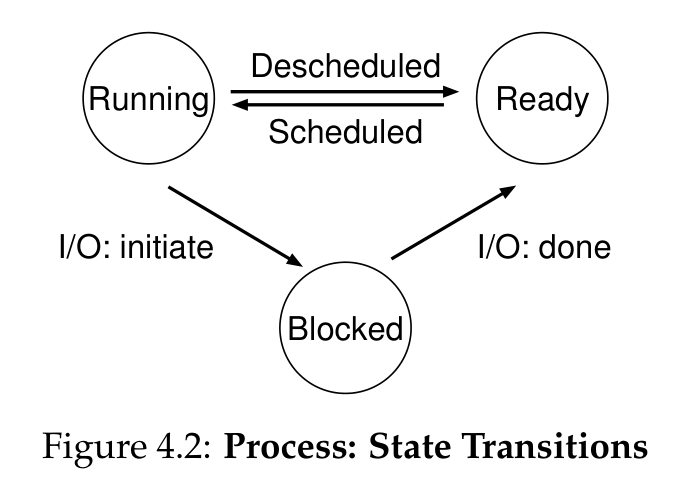

# [Pre-Linux OS Basics Sprint]
## (27/12/25&ndash;28/12/25)
## **Task:**

The Pre-Linux OS Basics Sprint requires me to read the book [*"Operating Systems: Three Easy Pieces"*](https://pages.cs.wisc.edu/~remzi/OSTEP/ "Operating Systems: Three Easy Pieces"). Specifically, the following chapters in particular:
- **Ch. 2 Introduction to Operating systems**
- **Ch. 4 The Abstraction: The Process**
- **Ch. 5 Interlude: Process API**
- **Ch. 6 Mechanism: Limited Direct Execution**
- **Ch. 39 Interlude: Files and Directories**
- **Ch. 45 Data Integrity and Protection**

## **Proof:**
### Ch. 2 Intro to Operating Systems (27/12/25&ndash;29/12/25)

OSTEP's three major themes:
- **Virualization**
- **Concurrency**
- **Persistence**

The OS's key technique: **virtualization**. 
The OS's API: **system calls**.

Each process has its own private virtual address space.

The OS's software that usually manages the disk (HDD, SSD): **file system**. 
It is responsible for storing any files the user creates in a reliable and efficient manner on the disks of the system.

#### **What OS Does**
> It takes physical resources, such as a CPU, memory, or disk, and **virtualizes** them. It handles tough and tricky issues related to **concurrency**. And it stores files **persistently**, thus making them safe over the long-term.

#### **OS Design Goals:**
- **Abstraction**
- **Concurrency**
- **Protection**/**Isolation**
- **Security**
- **Reliability**
- **Energy-Efficiency**
- **Mobility**

**Procedure calls**, as opposed to **system calls**, occur within the same user program. **System calls** are between the application and the OS, and require a privilege-level switch from `User Mode` to `Kernel Mode`.

 

### Ch. 4 The Abstraction: The Process (30/12/25&ndash;31/12/25)

The abstraction provided by the OS of a running program is called a **Process**.

**Time Sharing:** Running one process, then stopping it and running another, and so forth. This is how the OS provides the illusion of nearly-endless CPUs, allowing users to run many concurrent processes.

**Space Sharing:** Where a resource is divided (in space) among those who wish to use it. For example, with disk space.

Virtualization of the CPU is implemented using both some low-level machinery (**mechanisms**) and some high-level intelligence (**policies**),

**Mechanisms:** The low-level methods or protocols that implement a needed piece of functionality (system calls, context switches, memory allocation).
> <!-- --- -->
> **\*\*NOTE****  
**Context Switch:** Gives the OS ability to stop running one program and start running another on a give CPU.
> <!-- --- -->

**Policies:** Algorithms for making some kind of decision within the OS (**e.g.**, scheduling policy).
> <!-- --- -->
> **\*\*NOTE****  
**Scheduling Policy:** Given a number of programs to run on a CPU, this decides the order and duration for which competing processes or threads get access to the CPU.
> <!-- --- -->

**Machine State:** What a program can read or update when it is running. At any given time, what parts of the machine are important to the execution of this program? 
A process's machine state consists of:
- Memory (Address space)
- Registers
  - Program Counter (PC)/Instruction Pointer (IP)
  - Stack Pointer
  - Frame Pointer
- I/O Information

#### **Process API:**
- **Create** 
  OS must have some method to create new processes.
- **Destroy** 
  OS must have some method to destroy processes forcefully.
- **Wait** 
  Wait for a process to stop running.
- **Miscellaneous Control** 
  For example, suspend process, resume process, etc.
- **Status** 
  Interface to get status information about process.

#### **Process Creation (Program&rarr;Process)**
- Programs initially reside on **disk** in some kind of executable format.
- OS must **load** the program's code and static data (initialized variables) into the process's address space in memory.
- This is done **lazily**, as needed during execution.
- Some memory must be allocated for the program's **stack** 
  *(Used for local variables, function parameters, and return addresses)*.
- OS will also likely initilize the stack with arguments to `main()`
- OS may also allocate some memory for the program's **heap** 
  *(used for explicitly requested dynamically-allocated data)*.
- OS will also do other initialization tasks like **I/O setup** (by default, 3 open **file descriptors**: for standard input, standard output, and standard error).

#### **Process States**
- **Running** 
  A process is running on a processor. It is executing instructions.
- **Ready** 
  Process is ready to run but OS has chosen not to at this given moment.
- **Blocked** 
  Process has performed some kind of operation that makes it not ready to run until some other event takes place. **e.g.,** an I/O request to a disk.

Being moved from ready to running means the process has been **scheduled**. 
Being moved from running to ready means the process has been **descheduled**. 

**Zombie state:** Process has exited, but not yet been cleaned up.

> A **Process List** contains information about all processes i the system. Each entry is found in what is sometimes called a **process control block (PCB)**, which is really just a structure that contains information about a specific process.

 

### Ch. 5 Interlude: Process API (31/12/25&ndash;)
## **Takeaway:**