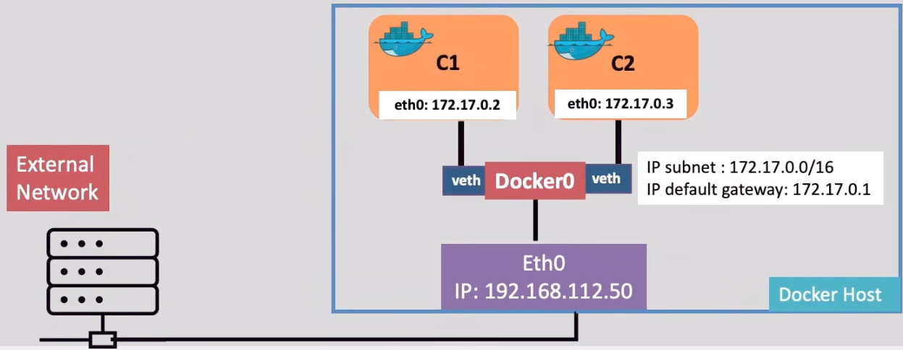
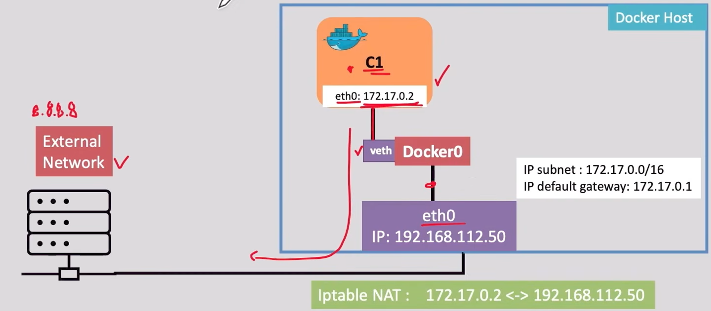

# Docker Fundamentals
## (20/06/26 &ndash; 04/07/26)

### [Learn Docker – Full DevOps Course for Deploying Containerized Apps](https://www.youtube.com/watch?v=rjjES5IsPdg&t=3048s)

#### `docker pull`
`docker pull [OPTIONS] IMAGE[:TAG | @DIGEST]`

Download a docker image from a registry (default is Docker Hub).<br>`:TAG`&ensp;Specific version

| | |
| --- | --- |
| `docker pull ubuntu` | Pulls the latest version of the image *ubuntu* |
| `docker pull ubuntu:20.04` | Pulls version *20.04* of the image *ubuntu* |
| `docker pull --all-tags ubuntu` | Pulls all versions(tags) of the image *ubuntu* |


#### `docker images`
`docker images [OPTIONS]`

Lis the available Docker images on the local Docker host.

| | |
| --- | --- |
| `docker images` | List all images on the local host |
| `docker images -q`| List all the available image IDs |


#### `docker ps`
`docker ps [OPTIONS]`

List the running containers on the Docker host.

| | |
| --- | --- |
| `docker ps` | List the running docker containers on the system |
| `docker ps -a` | List all containers (running and stopped) |


#### `docker create`
`docker create [OPTIONS] IMAGE [COMMAND] [ARG...]`

Create a container in a stopped state.

| | |
| --- | --- |
| `docker create --name my-container nginx` | Create a container where its name is *my-container* and image is *nginx* |
| `docker create --name my-container ubuntu:20.04` | Create a container where its name is *my-container* and image is *ubuntu* release *20.04* |


#### `docker start`
`docker start [OPTIONS] CONTAINER [CONTAINER...]`

Start an already created container that is not running.<br>
`CONTAINER`&ensp;container name or id

| | |
| --- | --- |
| `docker start my-container` | Start the specified container (by name) |
| `docker start abc1234` | Start the specified container (by id) |
| `docker start container1 container2` | Start multiple containers|


#### `docker stop`
`docker stop [OPTIONS] CONTAINER [CONTAINER...]`

Stop a running Docker container gracefully *(within 10sec by default)*.

| | |
| --- | --- |
| `docker stop my-container` | Stop the container *my-container* |
| `docker stop -t 30 my-container` | Stop the container *my-container* and allow it *30* seconds to stop gracefully |
| `docker stop container1 container2` | Stop the two specified containers |


#### `docker exec`
`docker exec [OPTIONS] CONTAINER COMMAND [ARG...]`

Used to execute a command inside a **running** Docker container.<br>
Can be used to interact with a container's file system, processes, and environment.

| | |
| --- | --- |
| `docker exec my-container ls /usr/src/app` | Run the *ls* command inside the container *my-container* to list the contents of the *usr/src/app* directory. |
| `docker exec -t my-container ls /app` | Run the *ls* command inside the container *my-container* to list the contents of the */app* directory. The ***`-t`*** flag allocates a pseudo-TTY (terminal), which formats the output as if it were running in a real terminal. |
| `docker exec -i my-container cat /etc/hostname` | Run the *cat* command inside the container to print the contents of the */etc/hotsname* file. The ***`-i`*** flag keeps STDIN open, allowing interactive input to be piped to the command. |
| `docker exec -it my-container /bin/bash` | Start an interactive *bash* shell inside the container *my-container*. The combined ***`-it`*** flag (interactive + psuedo-TTY) give you a fully interactive command-line session inside the running container. |
| `docker exec -it my-container cat /etc/shells` | Run the *cat* command inside the container to print the contents of the */etc/shells* file, which list the valid login shells available on the system. The ***`-t`*** flags attach an interactive terminal session. |


#### `docker run`
`docker run [OPTIONS] IMAGE [COMMAND] [ARG...]`

Create and start a container from a specified image in a single step.

| | |
| --- | --- |
| `docker run nginx` | Create and start a container using latest *nginx* image |
| `docker run --name cont1 ubuntu:20.04` | Create and start a container from the *ubuntu:20.04* image and assign it a name *cont1* |
| `docker run -d nginx` | Create and start a container from image *nginx* in the background<br>*-d*:&ensp;detached mode |
| `docker run -it ubuntu /bin/bash` | Create and run an *ubuntu* container and open an interactive shell of type *bash*. The container will run in interactive mode with a pseudo-TTY. The command will also enter the shell |
| `docker run --rm ubuntu echo "this will self-destruct"` | Create and run an *ubuntu* container, *echo* the sentence *"this will self-destruct"*, then delete the container |
| `docker run -it --rm ubuntu bash` | Create and run an *ubuntu* container, open an interactive shell into the container. Once the user exits from the shell, delete the container |


#### `docker inspect`
`docker inspect [OPTIONS] OBJECT [OBJECT...]`

Use to retrieve detailed, low-level information about containers, images, volumes, or networks in JSON format.

| | |
| --- | --- |
| `docker inspect my-container` | Returns detailed information about the container (name, ID, Network, Config...) |
| `docker inspect nginx:latest` | Returns information about the image named nginx with the latest tag, including: Image ID, Creation time and more |


#### `docker rm`
`docker rm [OPTIONS] CONTAINER [CONTAINER...]`

Remove or delete one or more containers. *Only removes stopped containers*.

| | |
| --- | --- |
| `docker rm my-container` | Remove *my-container* |
| `docker rm container1 container2 container3` | Remove the specified containers |
| `docker rm -f my-container` | Stop *my-container* and remove it even if it's running |


#### `docker rmi`
`docker rmi [OPTIONS] IMAGE [IMAGE...]`

Remove one or more Docker images from the local system.

| | |
| --- | --- |
| `docker rmi my-image` | Remove the image *my-image* |
| `docker rmi image1 image2 image3` | Remove the specified images |
| `docker rmi -f my-image` | Force remove *my-image* that has dependent containers created from it |


#### `docker logs`
`docker logs [OPTIONS] CONTAINER`

Use to retrieve the logs of a container.

| | |
| --- | --- |
| `docker logs my-container` | Print the logs of the container named *my-container* |
| `docker logs -f my-container` | Display the logs and keep updating the terminal with new log messages as they are written |


#### `docker --help`
`docker --help`

Display the help documentation for Docker, including the list of available commands and their descriptions.

| | |
| --- | --- |
| `docker run --help` | List of available options and flags for the docker *run* command |


#### `docker prune image`
`docker image prune [OPTIONS]`

Remove unused docker images on the host to free up space.


#### `docker history`
`docker history <image name>`

Display image layers and their details.


#### **Docker File**

Example:
```
FROM ubuntu
MAINTAINER John Doe
RUN apt-get update
CMD ["echo", "Hello from DolfinED"]
```
<br>

**Docker File**&ensp;--`docker build`-->&ensp;**Docker Image**

##### **Docker File Structure &mdash; FROM**
`FROM <image>[:tag]`

The `FROM` instruction will set the base image for the Dockerfile.

##### **Docker File Structure &mdash; RUN**
`RUN <command>`

The `RUN` instruction will execute any commands in a new image layer and commit the results.

##### **Docker File Structure &mdash; CMD**
`CMD ["executable","param1","param2"]`

`CMD` is used to specify the command to be executed when the container is started.

*(Only one `CMD` instruction should exist in a Docker file<br>If more than one, only the last one happens)*

| `CMD` | `RUN` |
| --- | --- |
| Executes at Runtime | Executes at Build time |
| Runs a command in a container when it is started | - Adds layers to images<br>- Used to install apps |


#### `docker build`
`docker build [OPTIONS] PATH | URL | -`

Path: The build context &mdash; usually the current directory.

*(By default, Docker looks for a file named `Dockerfile`, unless specified otherwise)*

| | |
| --- | --- |
| `docker build -t myapp .` | Build the image *myapp* from the dockerfie in the current directory. |
| `docker build -f files/test.txt -t image3 /imagefiles` | Build the image *myapp* from the *test.txt* file in the */files*. The */imagefiles* directory is the build context context. |

##### **Docker File Structure &mdash; EXPOSE**
`EXPOSE <port>`

The `EXPOSE` instruction informs Docker that the container listens on the specified network ports at runtime. `EXPOSE` is informational only. It doesn't actually publish or expose the port or open it to the host.

| | |
| --- | --- |
| `EXPOSE 80` | Exposes port 80 *(HTTP)* |
| `EXPOSE 80 443` | Exposes ports 80 and 443 *(HTTP and HTTPS)* |

##### **Docker File Structure &mdash; COPY**
`COPY <src> <dest>`

Te `COPY` instruction copies new files or directories from *\<src\>* and adds them to the filesystem of the container at the path *\<dest\>*.

*(It can copy files from the build context only.)*

| | |
| --- | --- |
| `COPY app/utils /app/code/utils` | Copy only the *app/utils* directory to */app/code/utils* inside the image |
| `COPY app/main.py /app/code/` | Copy just the *app/main.py* file into */app/code* |

##### **Docker File Structure &mdash; WORKDIR**
`WORKDIR </path>`

`WORKDIR` is used to define the working directory of the docker container at any given time.
- The *\</path\>* will be in the resulting image during build time and in the container during runtime.
- The *\</path\>* runs all the following container commands (`RUN`, `CMD`, `ADD`, `COPY`, etc.) into this directory.

| | |
| --- | --- |
| `WORKDIR /app` | Create this directory */app* in the image and any container when it is created from the image. |

Example:
```
FROM python:3.10-slim
WORKDIR /usr/src/app
COPY app/utils /usr/src/app/code/utils
COPY app/main.py /usr/src/app/code/
WORKDIR /usr/src/app/code
CMD ["python3", "main.py"]
```

##### **Docker File Structure &mdash; ENV**
`ENV <key><value>`

The `ENV` instruction allows for setting enviornment variables for the Docker container.

| | |
| --- | --- |
| `ENV name=DolfinED`<br>`CMD ["echo", "$name"]` | **OUTPUT:**<br>DolfinED |

You can use ENV to set the default values of variables, which you can later override at runtime *(with -e)*.<br>
Example:
```
FROM alpine
RUN apk add --no-cache iputils curl
ENV action=ping
ENV target=8.8.8.8
CMD ["sh","-c","exec $action $target"]
```
&darr;<br>
`docker built -t myimage .`
<br>&darr;<br>
`docker run -e action=curl -e target=10.10.1.1 myimage`
<br>&darr;<br>
OUTPUT:

    curl 10.10.1.1

##### **Docker File Structure &mdash; LABEL**
`LABEL key="value"`

The `LABEL` instruction in Docker is a way to add metadata *(author, version, descrioption, environment, etc.)* to an image.

| | |
| --- | --- |
| `LABEL Owner="DolfinED Academy Team <team@support.dolfined.com"` | |

#### **Best Practice Tips**

- Group `COPY` and `RUN` wisely to improve layer caching.
- Put less frequently changed lines early *(like installing dependencies)*.
- Avoid unnecessary `RUN` commands to reduce layer count and image size.

| Goal | What's Better? | Why? |
| --- | --- | --- |
| Fast Builds | More layers (smart caching) | Docker can skip unchanged layers |
| Smaller Images | Fewer layers, clean builds | Fewer intermediate files/layers |
| Maintainability | Readable layers | Easier debugging and edits |
| Layer reusability | Split steps logically | Base images can be reused/cached |

#### **Docker Naming Convention**
`[registry/][username_or_org/]repository[:tag]`

- **Registry**: The name of the container registry *(default is docker.io)*<br>(Optional)
- **Username or organization**: The name of the user or organization<br>(Required for non-official images only)
- **Repository**: The name of the image or the project
- **Tag**: The version *(defaults to Latest)*<br>(Optional)

#### `docker tag`
`docker tag SOURCE_IMAGE[:TAG] TARGET_NAME[:TAG]`

The docker tag command is used to add a new name/alias to an existing Docker image.

If we're going to **push**, images must be correctly tagged with the intended registry & image name before they are pushed:

`docker tag SOURCE_NAME REGISTRY_HOST/USERNAME/REPO:TAG`

For Dockerhub, you do not need to specify the registry as it defauls to *docker.io*:

`docker tag LOCAL_IMAGE_NAME:tag USERNAME/REPO:TAG`

| | |
| --- | --- |
| `docker tag pthon:3.10 my-python-app:latest` | |
| `docker tag myapp registry.mycorp.com/devops/myapp:1.0.0` | This will tag the image *myapp* with the name *registry.mycorp.com/devops/myapp:1.0.0* in preparation to be pushed to the private registry *registry.mycorp.com*, under account *devops*, under repo/image *myapp* with the tag *1.0.0* |
| `docker tag myimage myusername/myapp:latest` | *myimage* is tagged in preparation for pushing to docker hub registry, under account *myusername*, under the repo *myapp* with the tag *latest* |

#### `docker login`
`docker login Registry_Host`

You have to login to Docker Hub to push to a repository.

#### `docker push`
`docker push [DOCKER_HOST]/USERNAME/REPO:TAG`

Uploads a locally tagged image to a Docker registry.

| | |
| --- | --- |
| `docker push myapp myusername/myapp:latest` | This pushes the image to Docker Hub under the account *myusername*, repo *myapp*, with the tag "*latest*" |
| `docker push registry.mycorp.com/devops/myapp:1.0.0` | This pushes the image to registry *registry.mycorp.com* under the account name *devops*, repo *myapp*, with the tag "*1.0.0*" |

<hr>
<br>

#### **Docker Bridge Networks**
In Docker, a bridge network uses a software bridge to allow containers to communicate inside the docker host.<br>
By default, when you start Docker, a bridge (`docker0`) is created automatically.

#### **Docker Network Modes (Drivers)**
- **Bridge** (default)&ensp;&ndash;&ensp;The default network driver.
- **Host**&ensp;&ndash;&ensp;Remove network isolation between the container and the Docker host.
- **None**&ensp;&ndash;&ensp;Completely isolate a container from the host and other containers.
- **Overlay**&ensp;&ndash;&ensp;Overlay networks connect multiple Docker daemons together.
- **Ipvlan**&ensp;&ndash;&ensp;Ipvlan networks provide full control over both IPv4 and IPv6 addressing.
- **Macvlan**&ensp;&ndash;&ensp;Assign a MAC address to a container.
- **Userdefined**&ensp;&ndash;&ensp;Custom network

#### **Brige Driver/Mode**

- Containers connected to the same bridge network can communicate
- A bridge network isolates its containers from other containers on other bridges
- Bridge networks apply within the same Docker host only
- A container can connect to multiple bridge networks at the same time

##### **Docker Default Bridge (`docker0`)**

- The defauolt docker bridge network (`docker0`) IP subnet is 172.17.0.0/16
- 172.17.0.1 is the IP default gateway between bridge `Docker0` and the Docker host
- Unless otherwise specified, all newly created containers attach to `Docker0`
- Each container created in bridge mode has an eth0 with an assigned IP address
- A new bridge virtual interface (veth) us created with every running container



##### **Docker Mode&ensp;&ndash;&ensp;Containers Outbound Connectivity To External Network **

In bridge network mode, when a container communicates outbound with external networks, the Docker host performs **Network Address Translation (NAT)**.<br>
Docker host mainains NAT entries in IPtables.

> <!-- --- -->
> **\*\*NOTE****<br>
> **Network Address Translation (NAT)** is a process where a network device (e.g., Docker host) modifies the IP address and port number in the header of an IP packet as it passes through.
>
> In this case, **NAT** is replacing the container's private internal IP address (`172.17.0.2`) with the Docker host's own public IP address (`192.168.112.50`). 
> <!-- --- -->



#### **Decker Networking Commands**

| Command | What it does |
| --- | --- |
| `ip a` | Display network interfaces and their associated IP addresses on a Linux-based system |
| `docker network ls` | List all available networks |
| `docker network create <name` | Create a new network with a specific name |
| `docker network create --subnet 10.0.0.0/16 <network-name` | Create a new network with a custom subnet range |
| `docker network inspect <network-name or ID>` | Inspect a docker network |
| `docker run --network <network-name> <image-name>` | Run a new container and connect it to a Docker network |
| `docker network connect <network-name> <container_name>` | Connect a running container to a Docker network |
| `docker network disconnect <network-name> <container_name>` | Disconnect a running container from a Docker network *(Does not work with none and host network modes)* |

<hr>
<br>

#### **Persisting Data in Docker**

##### **Benefits**
- Share data between containers
- Separate app code from user data
- Avoid losing data when a container stops or is deleted

Two common ways to persist data in Docker containers:
1. **Volumes**
2. **Bind Mounting**

#### **Docker Volumes**

Volumes are stored in the **host filesystem** in the Docker internal sotrage area which is managed by Docker.<br>
Each volume gets its own volume path as follows:
```
/var/lib/docker/volumes/<volume-name>/_data/
```

A docker volume:
- is **isolated** from container layers
- **persists independently** of containers
- is **mounted into containers** at runtime
- allows data to survive container restarts, deletion, and image rebuilds

##### **`docker volume` Commands**

| | |
| --- | --- |
| `docker volume create <volume-name` | Create a new "named" docker volume |
| `docker volume ls` | List existing docker volumes |
| `docker volume inspect <volume-name>` | Show detailed info about a volume |
| `docker volume rm <volume-name>` | Delete a docker volume |

##### **`docker run` Command Options & Docker Volumes**
`-v [volume name]:[container directory]`

Launch a container with a volume attached.

| | |
| --- | --- |
| `docker run -v mydata:/app/data ubuntu` | Create an *ubuntu* container and a volume *mydata*. Mount the volume at the */app/data* folder in the container. |
| `docker run -v mydata:/app/data:ro ubuntu` | Create an *ubuntu* container and a volume *mydata*. Mount the volume at the */app/data* folder in the container. The container has **read only** access to the *mydata* volume. |

##### **Sharing Data Between Multiple Docker Containers**
The `--volume-from` flag allows you to inherit all the volume mounts from another container.

| | |
| --- | --- |
| `docker run -it --volumes-from cont1 ubuntu` | Create an *ubuntu* container and allow it to inherit all volume mounts from *cont1* |