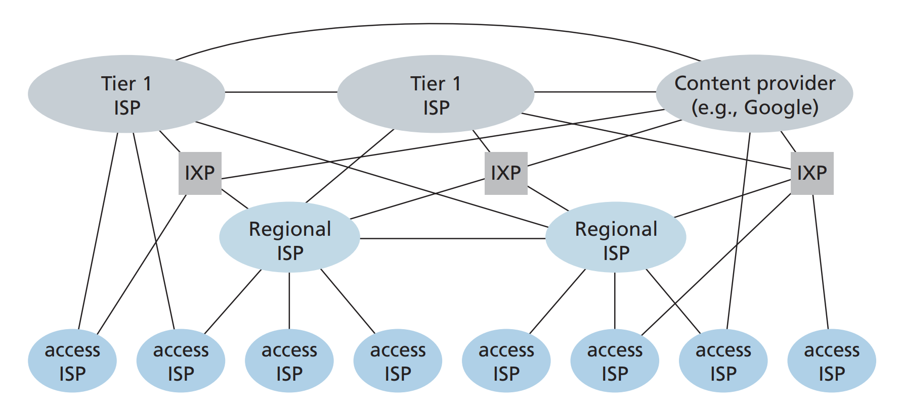
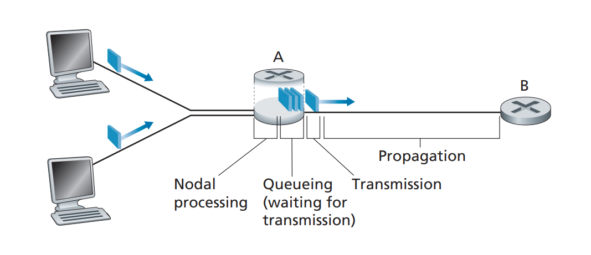
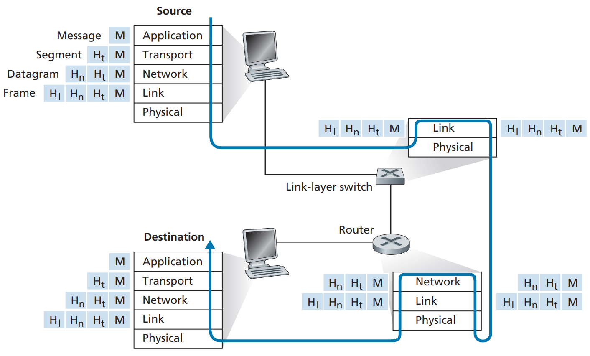

# ["Computer Networking: A Top-Down Approach" by James F. Kurose & Keith W. Ross]
## (27/07/26 &ndash; 07/08/26)
## **Task:**
The task is to read the following chapters of [**"Computer Networking: A Top-Down Approach" by James F. Kurose & Keith W. Ross**](https://gaia.cs.umass.edu/kurose_ross/index.php):
- **Chapter 1: &ensp;Computer Networks and the Internet**
- **Chapter 2: &ensp;Appliccation Layer**
- **Chapter 3: &ensp;Transport Layer**
- **Chapter 4: &ensp;The Network Layer: Data Plane**
- **Chapter 8: &ensp;Security in Computer Networks**

The proof will be the per-chapter notes I write below.

## **Proof:**

### **The OSI Model:**
1. **Application Layer**
2. **Presentation Layer**
3. **Session Layer**
4. **Transport Layer**
5. **Network Layer**
6. **Data Link Layer**
7. **Physical Layer**

### **Ch. 1&emsp;COMPUTER NETWORKS AND THE INTERNET** (27/07/26&ndash;07/08/26)

**Hosts/End Systems:** Any device that is connected to a computer network as a source or destination of data. (e.g., mobile computer, smartphone, router, server, cell phone tower)

End systems are connected together by a network of **communication links** and **packet switches**.
> <!-- --- -->
> **\*\*NOTE**** 
> **Packets:** Small chunks of data that messages are broken into before being sent across a computer network.
> <!-- --- -->
**Packet Switch:** Takes a packet arriving on one of its incoming communication links and forwards that packet on one of its outgoing communication links. 
Two types of packet switches: **Routers** and **Link-layer Switches**.

**Protocols:** define the format and the order  of messages exchanged between two or more communicating entities, as well as the actions taken on the transmission and/or receipt of a message or other event.

Two type of hosts: **Clients** and **Servers**.

**Client:** A device or program that request data or services from a server. *(e.g., desktops, laptops, smartphones)*
 
**Server:** A powerful system or program listens for client requests and provides requested resources. *(e.g., web servers, file servers, database servers)*

**Store-and-Forward Transmission:** The packet switch must receive the entire packet before it can begin to transmit the first bit of the packet onto the outbound link.

Sending one packet from source to destination over a path consisting of $N$ links *(thus, there are $N-1$ routers between source and destination)* each of rate $R$, end-to-end delay = $N\dfrac{L}{R}$.

In addition to store-and-forward delays, there's also **queuing delay** due to output buffers.
 
**Queuing delay:** The time a data packet spends in a router's buffer before it gets transmitted onto a link.
> <!-- --- -->
> **\*\*NOTE**** 
> When the arrival rate *(in bps)* to link exceeds the transmission rate *(in bps)* of link, packets will start to queue.
> <!-- --- -->

Buffer space is finite. If a packet arrives when buffer is already full, there is **packet loss**.

In the Internet, every end system has an IP address. 
When a source end system wants to send a packet to a destination end system, the source includes the destination's IP address in the packet's header.

**Forwarding:** The local action of a router moving arriving packets from its input links to appropriate output links (according to ***forwarding table***).

**Forwarding Table:** Maps destination addresses *(IP or MAC)* to specific outgoing ports. Stored in routers/switches.

Where do the contents of the forwarding table come from? ***Routing***,

**Routing:** The distributed process where routers&mdash;working together&mdash;automically figure out the best paths across a network and use those paths to build the forwarding tables.

 

**Packet Switching:** A networking method that splits data into packets, use a store-and-forward technique through nodes, and reassembles them at the destination.

**Circuit Switching:** A networking method that reserves a dedicated and fixed communication path *(a **circuit**)* between a sender and a receiver before any data moves.
 
When a network establishes a circuit, it also reserves a constant transmission rate in the network's links.
 
*(e.g., traditional telephone networks)*

> <!-- --- -->
> **\*\*NOTE**** 
> **Multiplexing:** A technique that allows the simultaneous transmission of multiple signals through a single channel or link.
> <!-- --- -->

**Frequency-Division Multiplexing (FDM):** divides the frequency spectrum of a link into distinct, non-overlapping frequency bands, allowing multiple independent signals to share the same link simultaneously.

**Time-Division Multiplexing (TDM):** Divides time into fixed-duration frames, subdividing each frame into a fixed number of time slots, and assigns specific slots to individual connections, allowing multiple independent sources to share the same link sequentially.

Unlike FDM, in TDM, each connection has the entire width of the frequency band *(i.e., the **bandwidth**)* at its disposal.

Circuit Switching is considered wasteful because the dedicated circuits are idle during silent periods.

Packet Switching is arguably not suitable for real-time services *(e.g., telephone calls and video conference calls)*.

**Packet Switching Benefits:**
1. Better sharing of transmission capacity than circuit switching.
2. Simpler, more efficient, and less costly to implement than circuit switching.

In packet switching, link capacity is shared on a packet-by-packet basis and only among those users who have a packet to transmit over the link.
 
*(For example, hypothetically, if only one user is transmitting packets over the link and all other users are completely idle, no multiplexing is done at all)*

**Point of Presence:** A group of one or more routers (at the same location) in the provider's network where customer ISPs can connect into the provider ISP.
 
*(Customer ISP run cables from their Central Office to the PoP)*

**Multi-homing:** To connect to two or more provider ISPs at the same time.

**Peering:** A mutual, direct interconnection between two networks that are at the same level in the internet hierarchy. It allows all traffic exchanged between the two peers to travel over this direct connection instead of going through intermediaries (that charge transit fees).

**Internet Exchange Point (IXP):** A physical third-party location where multiple ISPs (and content-provider networks) connect for peering.

**Content-Provider Networks:** Private networks built and operated by large companies *(Google, Netflix, Amazon)* to host and distribute their own content directly to ISPs and end users.

**The Internet:** 
The **Internet** is a network of networks, consisting of a complex hierarchy of provider and customer ISPs, content-provider networks, and IXPs, all linked by standardized protocols.

In packet-switched networks, there are several types of delays:
- **Nodal Processing Delay:** 
    The time required check for bit-level errors in the packet and examine its header to determine where to direct the packet.
- **Queuing Delay**: 
    The time the packet waits in queue to be transmitted onto the link.
- **Transmission Delay**: 
    The amount of time required to push all of the packet's bits into the link. ($\dfrac{L}{R}$)&ensp;*(A function of the packet's length and the link's transmission rate only)*
- **Propagation Delay**: 
    The time required to propagate from the beginning of the link to next router. ($\dfrac{d}{s}$)&ensp;*(A function of the distance between the two routers only)* 
    *($d$: length of physical link,&ensp;$s$: propagation speed (~2x108 m/sec))*

**Total Nodal Delay:** The sum of all of the above.
$$
d_{\text{nodal}} = d_{\text{proc}} + d_{\text{queue}} + d_{\text{trans}} + d_{\text{prop}}
$$

Queuing delay can vary from packet to packet, so for a metric, we use *average queuing delay*, *variance of queuing delay*, and *probability the the queuing delay exceeds some specified value*.

**Traffic Intensity:** $\dfrac{La}{R}$,
 where $L$: packet length *(in bits)*,&ensp;$a$: average rate at which packets arrive at the queue *(in packets/sec)*,&ensp; $R$: link transmission rate *(in bits/sec)*.

If $\frac{La}{R} > 1$, then the average rate at which bits arrive at the queue exceeds the rate at which bits can be transmitted from the queue &rarr; queue will **grow** with no upper bound!
 *(Conversely, when $\frac{La}{R} < 1$, the queue should shrink)*

> ***Design your system so that the traffic intensity is no greater than 1.***

In reality, because traffic is random and bursty, even when traffic intensity < 1, **average queuing delay increases exponentially as traffic intensity approaches 1**.

**Packet Loss:** When a packet is transmitted into the network core, but never reaches its destination.

**End-to-End Delay:** The sum of all nodal delays encountered at each router along the path between two hosts.

**Instantaneous Throughput:** The rate *(in bits/sec)* at which data is actually being received at its destination at a specific moment in time.

**Average Throughput:** $\dfrac{F}{T}$,
 where it takes $T$ seconds for destination to receive all $F$ bits.

For a single, long-lived data transfer with no competing traffic on a network with $N$ links, with transmission rates $R_1$, $R_2$, ... , $R_N$, the throughput is **min{R1, R2, ... , RN}**.

**Throughput**: The end-to-end data delivery rate at the receiver, with the absolute upper bound constrained by the bottleneck link, i.e., **Throughput ≤ min{R1, R2, ... , RN}**.

*(In reality, since there's competing traffic and connections are shared across links, the min{} comparison actually uses effective transmission rate after multiplexing instead of $R$)*

**The Internet Protocol Stack**
 
5\.&emsp;**Application** 
4\.&emsp;**Transport** 
3\.&emsp;**Network** 
2\.&emsp;**Link** 
1\.&emsp;**Physical**

**Application Layer**
- Where the network applications and their protocols reside. These protocols are distributed across end systems to exchange packets between applications.
- Application-layer packets are called **messages**.
- **e.g.**, HTTP protocol, SMTP, and FTP.

**Transport Layer**
- Transports application-layer messages between application endpoints.
- Transport-layer packets are called **segments**.
- Two types of protocols: TCP and UDP.

**Network Layer**
- Responsible for moving network-layer packets from one host to another.
- Network-layer packets are called **datagrams**/**IP packets**.
- Contains the IP protocol and routing protocols.

> <!-- --- -->
> **\*\*NOTE**** 
> The Network Layer (IP) gets the data to the right computer. The Transport Layer gets the data to the right app on that computer.
> <!-- --- -->

**Link Layer**
- Responsible for moving packet from one node's *(host or router)* network layer to the network layer of the next node in the route.
- Link-layer packets are called **frames**.
- **e.g.**, Ethernet, WiFi, DOCSIS protocol.&ensp;(Depends from link to link)

**Physical Layer**
- Responsible for moving the individual bits within the frame from one node to the next.
- Protocols depend on the actual transmission medium of the link. **e.g.**, twisted-pair copper wire, coaxial cable, fibre optics.

 

> <!-- --- -->
> **\*\*NOTE**** 
> Transport-layer protocol **encapsulates** aopplication-layer *message* with transport layer header to create transport-layer *segment*. 
> Network-layer protocol **encapsulates** transport-layer *segment* with network layer heager to create a network-layer *datagram*. 
> Link-layer protocl **encapsulates** network-layer *datagram* with link-layer header to create a *frame*.
> <!-- --- -->

> <!-- --- -->
> **\*\*NOTE**** 
> **Hosts** implement all 5 layers of the protocol stack.
>
> **Link-layer switches** implement only layer 1 and 2.
>
> **Routers** implement only layer layers 1 through 3.
> <!-- --- -->

**Denial-of-Service (DoS) Attack:** A malicious atempt to disrupt the normal functioning of a targeted server, service, or network, leaving it slow, unresponsive, or unavailable to legitimate users.

Three main types of DoS:
- Vulnerability attack
- Bandwidth flooding
- Connection flooding

**Distributed Denial-of-Service (DDoS) attack:** A DoS attack launched from a **botnet** of multiple devices spead across different locations, making it harder to block or trace back.

> <!-- --- -->
> **\*\*NOTE**** 
> **Botnet:** A network of compromised devices.
> <!-- --- -->

**Packet Sniffer:** A passive receiver device/program that captures and records a copy of every packet transmitted across a network segment.

**IP Spoofing:** The ability to inject packets into the Intenet with a false source IP address header.

**End-point Authentication:** A security mechanism that verifies the identity of the communicating peer, ensuring any messages from them are genuine and not from an impostor.