# ["Computer Networking: A Top-Down Approach" by James F. Kurose & Keith W. Ross]
## (27/07/26 &ndash; 03/10/26)
## **Task:**
The task is to read the following chapters of [**"Computer Networking: A Top-Down Approach" by James F. Kurose & Keith W. Ross**](https://gaia.cs.umass.edu/kurose_ross/index.php):
- **Chapter 1: &ensp;Computer Networks and the Internet**
- **Chapter 2: &ensp;Appliccation Layer**
- **Chapter 3: &ensp;Transport Layer**
- **Chapter 4: &ensp;The Network Layer: Data Plane**
- **Chapter 8: &ensp;Security in Computer Networks**

The proof will be the per-chapter notes I write below.

## **Proof:**

### **The OSI Model:**
1. **Application Layer**
2. **Presentation Layer**
3. **Session Layer**
4. **Transport Layer**
5. **Network Layer**
6. **Data Link Layer**
7. **Physical Layer**

### **Ch. 1&emsp;COMPUTER NETWORKS AND THE INTERNET**<br>(27/07/26&ndash;08/08/26)

**Hosts/End Systems:**&ensp;Any device that is connected to a computer network as a source or destination of data. (e.g., mobile computer, smartphone, router, server, cell phone tower)

End systems are connected together by a network of **communication links** and **packet switches**.
> <!-- --- -->
> **\*\*NOTE****<br>
> **Packets:**&ensp;Small chunks of data that messages are broken into before being sent across a computer network.
> <!-- --- -->
**Packet Switch:**&ensp;Takes a packet arriving on one of its incoming communication links and forwards that packet on one of its outgoing communication links.<br>
Two types of packet switches: **Routers** and **Link-layer Switches**.

**Protocols:**&ensp;Define the format and the order  of messages exchanged between two or more communicating entities, as well as the actions taken on the transmission and/or receipt of a message or other event.

Two type of hosts: **Clients** and **Servers**.

**Client:**&ensp;A device or program that request data or services from a server. *(e.g., desktops, laptops, smartphones)*
<br>
**Server:**&ensp;A powerful system or program listens for client requests and provides requested resources. *(e.g., web servers, file servers, database servers)*

**Store-and-Forward Transmission:**&ensp;The packet switch must receive the entire packet before it can begin to transmit the first bit of the packet onto the outbound link.

Sending one packet from source to destination over a path consisting of $N$ links *(thus, there are $N-1$ routers between source and destination)* each of rate $R$, end-to-end delay = $N\dfrac{L}{R}$.

In addition to store-and-forward delays, there's also **queuing delay** due to output buffers.
<br>
**Queuing delay:**&ensp;The time a data packet spends in a router's buffer before it gets transmitted onto a link.
> <!-- --- -->
> **\*\*NOTE****<br>
> When the arrival rate *(in bps)* to link exceeds the transmission rate *(in bps)* of link, packets will start to queue.
> <!-- --- -->

Buffer space is finite. If a packet arrives when buffer is already full, there is **packet loss**.

In the Internet, every end system has an IP address.<br>
When a source end system wants to send a packet to a destination end system, the source includes the destination's IP address in the packet's header.


**Forwarding:**&ensp;The local action of a router moving arriving packets from its input links to appropriate output links (according to ***forwarding table***).

**Forwarding Table:**&ensp;Maps destination addresses *(IP or MAC)* to specific outgoing ports. Stored in routers/switches.

Where do the contents of the forwarding table come from? ***Routing***,

**Routing:**&ensp;The distributed process where routers&mdash;working together&mdash;automically figure out the best paths across a network and use those paths to build the forwarding tables.

<br>

**Packet Switching:**&ensp;A networking method that splits data into packets, use a store-and-forward technique through nodes, and reassembles them at the destination.

**Circuit Switching:**&ensp;A networking method that reserves a dedicated and fixed communication path *(a **circuit**)* between a sender and a receiver before any data moves.
<br>
When a network establishes a circuit, it also reserves a constant transmission rate in the network's links.
<br>
*(e.g., traditional telephone networks)*

> <!-- --- -->
> **\*\*NOTE****<br>
> **Multiplexing:**&ensp;A technique that allows the simultaneous transmission of multiple signals through a single channel or link.
> <!-- --- -->

**Frequency-Division Multiplexing (FDM):**&ensp;divides the frequency spectrum of a link into distinct, non-overlapping frequency bands, allowing multiple independent signals to share the same link simultaneously.

**Time-Division Multiplexing (TDM):**&ensp;Divides time into fixed-duration frames, subdividing each frame into a fixed number of time slots, and assigns specific slots to individual connections, allowing multiple independent sources to share the same link sequentially.

Unlike FDM, in TDM, each connection has the entire width of the frequency band *(i.e., the **bandwidth**)* at its disposal.

Circuit Switching is considered wasteful because the dedicated circuits are idle during silent periods.

Packet Switching is arguably not suitable for real-time services *(e.g., telephone calls and video conference calls)*.

**Packet Switching Benefits:**
1. Better sharing of transmission capacity than circuit switching.
2. Simpler, more efficient, and less costly to implement than circuit switching.

In packet switching, link capacity is shared on a packet-by-packet basis and only among those users who have a packet to transmit over the link.
<br>
*(For example, hypothetically, if only one user is transmitting packets over the link and all other users are completely idle, no multiplexing is done at all)*

**Point of Presence:**&ensp;A group of one or more routers (at the same location) in the provider's network where customer ISPs can connect into the provider ISP.
<br>
*(Customer ISP run cables from their Central Office to the PoP)*

**Multi-homing:**&ensp;To connect to two or more provider ISPs at the same time.

**Peering:**&ensp;A mutual, direct interconnection between two networks that are at the same level in the internet hierarchy. It allows all traffic exchanged between the two peers to travel over this direct connection instead of going through intermediaries (that charge transit fees).

**Internet Exchange Point (IXP):**&ensp;A physical third-party location where multiple ISPs (and content-provider networks) connect for peering.

**Content-Provider Networks:**&ensp;Private networks built and operated by large companies *(Google, Netflix, Amazon)* to host and distribute their own content directly to ISPs and end users.

**The Internet:**<br>
The **Internet** is a network of networks, consisting of a complex hierarchy of provider and customer ISPs, content-provider networks, and IXPs, all linked by standardized protocols.


<hr>


In packet-switched networks, there are several types of delays:
- **Nodal Processing Delay:**<br>
    The time required check for bit-level errors in the packet and examine its header to determine where to direct the packet.
- **Queuing Delay**:<br>
    The time the packet waits in queue to be transmitted onto the link.
- **Transmission Delay**:<br>
    The amount of time required to push all of the packet's bits into the link. ($\dfrac{L}{R}$)&ensp;*(A function of the packet's length and the link's transmission rate only)*
- **Propagation Delay**:<br>
    The time required to propagate from the beginning of the link to next router. ($\dfrac{d}{s}$)&ensp;*(A function of the distance between the two routers only)*<br>
    *($d$: length of physical link,&ensp;$s$: propagation speed (~2x10<sup>8</sup> m/sec))*

**Total Nodal Delay:**&ensp;The sum of all of the above.
$$
d_{\text{nodal}} = d_{\text{proc}} + d_{\text{queue}} + d_{\text{trans}} + d_{\text{prop}}
$$

Queuing delay can vary from packet to packet, so for a metric, we use *average queuing delay*, *variance of queuing delay*, and *probability the the queuing delay exceeds some specified value*.

**Traffic Intensity:**&ensp;$\dfrac{La}{R}$,
<br>where $L$: packet length *(in bits)*,&ensp;$a$: average rate at which packets arrive at the queue *(in packets/sec)*,&ensp; $R$: link transmission rate *(in bits/sec)*.

If $\frac{La}{R} > 1$, then the average rate at which bits arrive at the queue exceeds the rate at which bits can be transmitted from the queue &rarr; queue will **grow** with no upper bound!
<br>*(Conversely, when $\frac{La}{R} < 1$, the queue should shrink)*

> ***Design your system so that the traffic intensity is no greater than 1.***

In reality, because traffic is random and bursty, even when traffic intensity < 1, **average queuing delay increases exponentially as traffic intensity approaches 1**.

**Packet Loss:**&ensp;When a packet is transmitted into the network core, but never reaches its destination.

**End-to-End Delay:**&ensp;The sum of all nodal delays encountered at each router along the path between two hosts.

**Instantaneous Throughput:**&ensp;The rate *(in bits/sec)* at which data is actually being received at its destination at a specific moment in time.

**Average Throughput:**&ensp;$\dfrac{F}{T}$,
<br>where it takes $T$ seconds for destination to receive all $F$ bits.

For a single, long-lived data transfer with no competing traffic on a network with $N$ links, with transmission rates $R_1$, $R_2$, ... , $R_N$, the throughput is **min{R<sub>1</sub>, R<sub>2</sub>, ... , R<sub>N</sub>}**.

**Throughput**: The end-to-end data delivery rate at the receiver, with the absolute upper bound constrained by the bottleneck link, i.e., **Throughput ≤ min{R<sub>1</sub>, R<sub>2</sub>, ... , R<sub>N</sub>}**.

*(In reality, since there's competing traffic and connections are shared across links, the min{} comparison actually uses effective transmission rate after multiplexing instead of $R$)*

**The Internet Protocol Stack**
<br>
5\.&emsp;**Application**<br>
4\.&emsp;**Transport**<br>
3\.&emsp;**Network**<br>
2\.&emsp;**Link**<br>
1\.&emsp;**Physical**


**Application Layer**
- Where the network applications and their protocols reside. These protocols are distributed across end systems to exchange packets between applications.
- Application-layer packets are called **messages**.
- **e.g.**, HTTP protocol, SMTP, and FTP.

**Transport Layer**
- Transports application-layer messages between application endpoints.
- Transport-layer packets are called **segments**.
- Two types of protocols: TCP and UDP.

**Network Layer**
- Responsible for moving network-layer packets from one host to another.
- Network-layer packets are called **datagrams**/**IP packets**.
- Contains the IP protocol and routing protocols.

> <!-- --- -->
> **\*\*NOTE****<br>
> The Network Layer (IP) gets the data to the right computer. The Transport Layer gets the data to the right app on that computer.
> <!-- --- -->

**Link Layer**
- Responsible for moving packet from one node's *(host or router)* network layer to the network layer of the next node in the route.
- Link-layer packets are called **frames**.
- **e.g.**, Ethernet, WiFi, DOCSIS protocol.&ensp;(Depends from link to link)

**Physical Layer**
- Responsible for moving the individual bits within the frame from one node to the next.
- Protocols depend on the actual transmission medium of the link. **e.g.**, twisted-pair copper wire, coaxial cable, fibre optics.

<br>


> <!-- --- -->
> **\*\*NOTE****<br>
> Transport-layer protocol **encapsulates** aopplication-layer *message* with transport layer header to create transport-layer *segment*.<br>
> Network-layer protocol **encapsulates** transport-layer *segment* with network layer heager to create a network-layer *datagram*.<br>
> Link-layer protocl **encapsulates** network-layer *datagram* with link-layer header to create a *frame*.
> <!-- --- -->

> <!-- --- -->
> **\*\*NOTE****<br>
> **Hosts** implement all 5 layers of the protocol stack.
>
> **Link-layer switches** implement only layer 1 and 2.
>
> **Routers** implement only layer layers 1 through 3.
> <!-- --- -->

<hr>

**Denial-of-Service (DoS) Attack:**&ensp;A malicious atempt to disrupt the normal functioning of a targeted server, service, or network, leaving it slow, unresponsive, or unavailable to legitimate users.

Three main types of DoS:
- Vulnerability attack
- Bandwidth flooding
- Connection flooding

**Distributed Denial-of-Service (DDoS) attack:**&ensp;A DoS attack launched from a **botnet** of multiple devices spead across different locations, making it harder to block or trace back.

> <!-- --- -->
> **\*\*NOTE****<br>
> **Botnet:**&ensp;A network of compromised devices.
> <!-- --- -->

**Packet Sniffer:**&ensp;A passive receiver device/program that captures and records a copy of every packet transmitted across a network segment.

**IP Spoofing:**&ensp;The ability to inject packets into the Intenet with a false source IP address header.

**Lines of Defense:**

- **Authentication:** Proving you are who you say you are (to protect from IP spoofing)
- **Confidentiality:** cia encryption
- **Integrityy checks:** digital signatures prevent/detect tampering
- **Access Restrictions:** password-protected VPNs
- **Firewalls:** Specialized "middle boxes" in access and core networks


<hr>
<br>


### **Ch. 2&emsp;APPLICATION LAYER**<br>(11/08/26&ndash;09/09/26)

Two main application architectural paradigms:
- **Client-Server Architecture**
- **Peer-to-Peer (P2P) Architecture**

**Client-Server Architecture:**&ensp;There is an always-on host, called the **server**, which passively listens for and services requests from many other hosts, called **clients**. The server has a fixed, well-known IP address, which a client sends packets to in order to contact the server.<br>
Example applications: the Web, e-mail, video streaming.

Client-server applications with single-server can become overwhelmed, so they often use **data centers**, housing many hosts, to create a powerful virtual server.

**Peer-to-Peer Architecture:**&ensp;The application exploits direct communication between pairs of intermittently connected hosts, called **peers**, which are user-controlled devices *(desktops, laptops, etc.)*. Because peers exchange data without passing through a dedicated server, each peer can act as both a client and a server.

A **network application** consists of pairs of processes that send messages to each other over a network.<br>For each pair, the process that initiates the communication is called the **client**, and the process that waits to be contacted is the **server**.

**Socket:**&ensp;One endpoint of a two-way communication between two processes. A process sends messages into, and receives messages from the network through the socket.<br>
The socket is the interface between the application layer and the transport layer.
> <!-- --- -->
> **\*\*NOTE****<br>
> **Application Programming Interface (API):**&ensp;The broad, abstract set of rules, functions, and protocols that a programmer uses to interact with a system.
> <!-- --- -->
Socket is the **API** between the application and the network.

A receiving process *(specifically its socket)* is uniquely identified by two pieces of information:
1. the address of the host: **IP Address**
2. identifier for the specific receiving process in the destination host: **Port Number**

> <!-- --- -->
> **\*\*NOTE****<br>
> **Telephony:**&ensp;The technology that converts voice, fax, and multimedia signals into digital data packets.
> <!-- --- -->

There's multiple transport-layer protocols, which we may have to pick between.

Transport-layer protocols' services can be classified across the following dimensions:
- **Reliable Data Transfer**<br>
  *(data sent by one end of the application is delivered correctly and completely to the other end of the application)*
- **Throughput**<br>
  *(guaranteed available throughput at some specified rate)*
- **Timing**<br>
  *(guarantees like "every bit that the sender pumps into the socket arrives at the receiver's socket no more than x msec later")*
- **Security**<br>
  *(e.g., encryption-decrpytion, data integrity, end-point authentication)*

**Loss-Tolerant Applications:** Applications that can tolerate some amount of data loss. (**e.g.,** audio/video calls)

**Bandwidth-Sensitive Applications:** Applications that have throughput requirements.

**Elastic Applications:** Applications that can make use of as much, or as little, throughput as happens to be available.

The Internet has only two available transport-layer protocols: **TCP** and **UDP**.<br>*(When creating a new network application, we have to decide up-front whether we'll be using TCP or UDP)*

**TCP Services:**
- **Connection-oriented service:**<br>
  Client and server exchange transport-layer control information with each other (TCP handshake) before the application-level messages begin to flow. After the handshake, we say there's a TCP connection between them, which is **full-duplex**.
- **Reliable data transfer:**<br>
  Processes can rely on TCP to deliver all data without error and in the proper order.
- **Congestion-control mechanism:**<br>
  Throttles a sending process when the network is congested between sender and receiver. Also attempts to limit each TCP connection to its fair share of network bandwidth.
> <!-- --- -->
> **\*\*NOTE****<br>
> **Full-Duplex Connection:**&ensp;A connection over which both processes can send messages to each other at the same time.
> <!-- --- -->

**UDP Services:**
- **No-frills, lightweight:**<br>
  Connectionless *(no handshake)*, unreliable data transfer service *(may be packet loss, messages may arrive out of order)*, no congestion-control mechanism.

Neither TCP nor UDP provides any encryption (**Security**).

Niether TCP nor UDP provide any **Throughput** or **Timing** guarantees either, but they're not really needed anyway. *(Internet already provides satisfactory service to time-sensitive applications)*

There exists an enhancement for TCP, that implements Security services in the application layer: **Transport Layer Security (TLS)**.

**TCP-enhanced-with-TLS:**&ensp;TCP but with security services like encryption, data integrity, and end-point authentication.

    When an application uses TLS, the sending process passes cleartext data to the TLS socket; TLS in the sending host then encrypts the data and passes the encrypted data to the TCP socket. The encrypted data travels over the Internet to the TCP socket in the receiving process. The receiving socket passes the encrypted data to TLS, which decrypts the data. Finally, TLS passes the cleartext data through its TLS socket to the receiving process.

<br>

**Application-Layer Protocols** define:
- types of messages exchanged
- message syntax
- message semantics
- rules for when and how processes send and respond to messages

Two types of Application-Layer Protocols: 
1. **Open Protocols** *(defined in RFCs (e.g., HTTP, SMTP))*
2. **Proprietary Protocols** *(e.g., Skype, Zoom)*

<br>

**World Wide Web:**&ensp;A client-server application that allows users to obtain documents from Web servers *on demand*. The Web application consists of many components, including a naming schema (URLs), a standard for document formats (HTML), Web browsers, Web servers, and an application-layer protocol (HTTP) that defines the sequence of messages exchanged between browser and Web server.

**HTTP (HyperText Transfer Protocol):**&ensp;A fundamental protocol of the Internet, *(defined in [RFC 1945], [RFC 7230], [RFC 7540], [RFC 9114])*, which serves as the foundation of data communication for the World Wide Web.

**HTTP** is implemented in two programs: a client program and a server program.
<br>
**Web browsers** *(e.g., Chrome, Edge)* implement the client side of HTTP, and **Web servers** *(e.g., Apache, Nginx, Microsoft Internet Information Server)* implement the server side of HTTP.
<br>
HTTP defines how Web clients request Web pages from Web servers and how servers transfer Web pages to clients.

A **Web Page** consists of objects. Most Web pages consist of a base HTML file and several referenced objects. The base HTML file references the other objects in the page with the objects' URLs.
> <!-- --- -->
> **\*\*NOTE****<br>
> Each URL has two components: the **hostname** of the server that houses the object, and the object's **path name**.<br>
> In `http://www.someSchool.edu/someDepartment/picutre.gif`, `www.someSchool.edu` is the hostname and `/someDepartment/picutre.gif` is the path name.
> <!-- --- -->

HTTP is a **Stateless Protocol:** the server does not retain any state information between successive requests. Every request is treated as a brand-new, isolated transaction, with no memory of previous requests from the same client.

HTTP/1 and HTTP/2 run over TCP. HTTP/3 runs over UDP.

Two types of HTTP connections: **Non-Persistent Connection** and **Persistant Connection**.

**Non-Persistent Connection** is established for and immediately closed after exactly one request message and one response message.<br>
Time it takes for a client to request and receive a single object:&ensp;2 RTTs + transmission time.&ensp;*(one RTT to establish the TCP connection, one RTT to handle the HTML request)*
> <!-- --- -->
> **\*\*NOTE****<br>
> **Round-Trip Time (RTT):**&ensp;The time it takes for a small packet to travel from a client to a server and back to the client.
> <!-- --- -->

**Persistent Connection** is when a TCP connection remains open across multiple request-response exchanges. It is closed when it isn't used for a certain time.<br>
Multiple, subsequent requests can also be made to a server using "**pipelining**" i.e., back-to-back without waiting for response. The server then sends the responses/objects back-to-back.<br>

Two types of HTTP messages: **Request Messages** and **Response Messages**

**HTTP Request Message**

General format:<br>
<br>
It has three sections, the **Request Line**, **Header Line(s)**, and the **Entity Body**.

The **request line** has 3 fields: method field, URL field, and HTTP version field.

Method field can take on several different values, e.g.:
- **`GET`**:<br>Used when browser requests an object, with the requested object identified in the URL field.
- **`POST`**:<br>Used when the client submits data (e.g., form entries or file uploads)&mdash;like when user provides search words to a search engine. The data is carried in the entity body.
- **`HEAD`**:<br>Used to get the same response from server as for `GET`, but without the requested object.&ensp;*(Used for debugging)*
- **`PUT`**:<br>Used to upload an object to a specific path *(specified in URL field)* on a specific Web server.
- **`DELETE`**:<br>Used to request the removal of an object form a Web server, with the target object identified in the URL field.

Subsequent lines after request line are called **header lines**.

**Example:**
```
GET /somedir/page.html HTTP/1.1
Host: www.someschool.edu
Connection: close
User-agent: Mozilla/5.0
Accept-language: fr
```
- In request line, the browser is requesting the object `/somedir/page.html`. The browser implements version HTTP/1.1
- `Host: www.someschool.edu` specifies the host on which the object resides.&ensp;*(required for Web proxy caches)*
- `Connection: close` tells the server to close the connection after sending the requested object.
- `User-agent` header line specifies the user agent *(browser type)* that is making the request to the server: `Mozilla/5.0`.
- `Accept-language: fr` indicates that the user prefers to receive a French version of the object, if available, otherwise, server should send the default version.

<br>

**HTTP Response Message**

General format:<br>
<br>
It has three sections, the **Status Line**, **Header Line(s)**, and the **Entity Body**.

The **entity body** is the meat of the message&mdash;it contains the requested object.

The **status line** has 3 fields: the protocol version field, a status code, and a corresponding status message.

The status code and associated phrase indicate the result of the request. Some common ones are as follows:
- **`200 OK`:**<br>Request succeeded and the information is returned in the response.
- **`301 Moved Permanently`:**<br>Requested object has been permanently moved; the new URL is specified in `Location:` header of the response message. The client software will automatically retrieve the new URL.
- **`400 Bad Request`:**<br>This is a generic error code indicating that the request could not be understood by the server.
- **`404 Not Found`:**<br>The requested document does not exist on this server.
- **`505 HTTP Version Not Supported`:**<br>The requested HTTP protocol version is not supported by the server.

**Example:**
```
HTTP/1.1 200 OK
Connection: close
Date: Mon, 21 Oct 2024 18:58:21 GMT
Server: Apache/2.2.3 (CentOS)
Last-Modified: Sun, 20 Oct 2024 13:20:46 GMT
Content-Length: 6821
Content-Type: text/html
  (data data data data data ...)
```
- The status line is indicating that the sever is using `HTTP/1.1` and that everything is `OK` *(i.e., the server has found, and is sending, the requested object)*.
- `Connection: close` tells the client that the server is going to close the connection after sending the message.
- `Data:` header indicates the time and date when the HTTP response was created and sent by the server.
- `Server:` indicates that the message was generated by an `Apache` Web server.
- `Last-Modified:` indicates the time and date when the object was created or last modified.
- `Content-Length:` indicates the number of bytes in the object being sent.
- `Content-Type:` indicates that the object in the entity body is `HTML` text.
- `(data data data data data ...)` is the entity body *(i.e., the object being sent)*.

<br>

**Cookies** allow sites to maintain user-specific state information across multiple otherwise stateless HTTP transactions.

Cookie technology has four components:
1. A cookie header line in the HTTP response message;
2. A cookie header line in the HTTP request message;
3. A cookie file kept on the user's end system and managed by the user's browser;
4. A back-end database at the website.

How cookies work:<br>


The client browser sees `Set-cookie:` header on the Web server's HTTP response, and appends a line to the special cookie file that it manages. This line includes the hostname of the server and the identification number in the `Set-cookie:` header.<br>
All susbequent HTTP requests to this server consult the cookie file, extract the identification number, and include the `Cookie:` header.

This implements a user session layer on top of stateless HTTP.

<br>

**Browser Caching:**&ensp;A client-side mechanism where the Web browser locally stores the content of recently received Web objects in its browser cache. When a user requests a Web object, the browser first checks its brower cache. If the object is there, it may be immediately displayed, without having to make a new Web server request.

Browser caching optimizes the browser's minimum delay of 2RTT down to a potential zero RTT.

HTTP provides fields in both `HTTP GET` and response messages to help the server and browser manage browser caching:
- **`Cache-Control`:**<br>
  `Cache-Control` field in an HTTP response message lets the server specify how the content in the HTTP respone message should be cached.&ensp;*(e.g., `Cache-Control: no-store`, `Cache-Control: max-age=3600`)*
- **`If-Modified-Since`:**<br>
  HTTP's mechanism to facilitate caching in request messages is the conditional GET message: the usual `HTTP GET` message but with a `If-Modified-Since:` header line.<br>The server will reply with the full object if that object has changed since time specified in `If-Modified-Since:` field; otherwise, it will simply let the browser know that its cached object is still current (`304 NOT Modified`) and doesn't send the object again.

<br>

On HTTP/1.1 pipelining multiple requests on a singular persistent TCP connection would lead to **Head of Line (HOL) Blocking**.
> <!-- --- -->
> **\*\*NOTE****<br>
> **HOL Blocking:**&ensp;A performance bottleneck where the first item in a queue delays all items behind it.
>
> Large/slow response at the front of a pipelined TCP connection blocks subsequent smaller/faster responses behind it from being delivered to the client, even though they could have been processed earlier, thus resulting in user-perceived delay.
> <!-- --- -->

On HTTP/1.1, HOL was circumvented by opening multiple parallel TCP connections to handle separate objects. As a result, a browser would end up opening multiple TCP connections just to transport a single Web page  *(Not ideal!)*.

**HTTP/2:**<br>A revision of HTTP that gets rid of the parallel TCP connections by introducing request/response multiplexing over a *single* TCP connection. It also provides request prioritization, server push, binary framing, and header compression.

> <!-- --- -->
> **\*\*NOTE****<br>
> HTTP/2 doesn't fully resolve the HOL blocking problem either.
> Since multiple messages are being multiplexed over a single TCP connection, if a packet is lost and thus has to be retransmitted and processed, that delays all other messages, even if they don't depend on the lost packet (TCP holds ALL packets in its buffer until lost packet is received).
> <!-- --- -->

**Request/Response Multiplexing:**&ensp;Each message is broken down into frames, and the frames are then interleaved on the same TCP connection. This is done for both responses *(holding Web objects)* as well as requests, significantly decreasing user-perceived delay.
> <!-- --- -->
> **\*\*NOTE****<br>
> **Interleaving:** If there are n response messages *(and thus n objects)*, first TCP transports the 1st frame of the first response, then the 1st frame of the second response, then up to the 1st frame of the nth response, then the 2nd frame of the first response, and so on...
>
> Interleaving doesn't *have* to be this round-robin implementation exactly, but it will at least be similar in spirit.
> <!-- --- -->

> <!-- --- -->
> **\*\*NOTE****<br>
> The header field of the message becomes one frame, and the body of the message is broken down into one or more additional frames.
> <!-- --- -->

Messages are broken down into frames (or re-assembled from frames) and binary encoded *(for efficiency)* in the framing sublayer of the HTTP/2 protocol.

**Request Prioritization:**&ensp;When a client sends concurrent requests to a server, it can prioritize the responses it is requesting by assigning a weight between 1 and 256 to each message *(higher number = higher priority)*.
> <!-- --- -->
> **\*\*NOTE****<br>
> It's not like higher-priority responses get sent first completely, ignoring multiplexing; their frames get preferential treatment in interleaving implementation.
> <!-- --- -->

**Server Pushing:**&ensp;The ability for a server to send multiple responses for a single request. It allows a server to proactively send additional resources to a client before the cient explicitly requests them.<br>
*(e.g., analyzing base HTML page to identify all the objects needed to fully render the Web page, and sending all the objects not even requested yet along with current response)*

<br>

While HTTP/1.0, HTTP/1.1, and HTTP/2 all run on TCP, **HTTP/3** runs on UDP *(specifically **QUIC**)*.

**Quick UDP Internet Connections (QUIC):**&ensp;A UDP-based transport protocol that integrates TLS encryption and stream-level multiplexing, along with numerous other services into the previously barebones UDP protocol.
> <!-- --- -->
> **\*\*NOTE****<br>
> Technically, **QUIC** is a sub-layer in the application layer that uses UDP to send and receive packets over the internet *(analogous to TCP-enhanced-with-TLS and TCP)*.
> <br>
> However, from the application developor's directive, QUIC may as well just be a new transport layer protocol.
> <!-- --- -->

> <!-- --- -->
> **\*\*NOTE****<br>
> **HTTPS:**&ensp;The secure version of HTTP, achieved by the standard HTTP application-layer protocol over TCP-enhanced-with-TLS instead of basic TCP.
>
> HTTPS is slower than HTTP as it has **two** handshake phases before messages can be exchanged: 1) TCP handshake, 2) TLS handshake *(sharing encryption keys between client and server)*.
> <!-- --- -->

"**Streams**" in QUIC refer to the different data streams *(different HTTP messages, in an HTTP context)* sharing the same QUIC connection.

**QUIC Services:**
- **Connection-Oriented:**<br>
  Like TCP.
- **Reliable Data Transfer:**<br>
  Like TCP.
- **Congestion and Flow Control:**<br>
  Like TCP.
- **Built-In Encryption:**<br>
  Integrates TLS 1.3 directly into QUIC protocol, eliminating second handshake for TLS over TCP.
- **Independent Data Streams:**<br>
  Fixes the problem of HOL blocking in case of packet loss.<br>*(every stream has its own buffer, so streams with full data get to go through)*
- **0-RTT Handshakes:**<br>
  For returning clients.
- **Connection Migration:**<br>
  Allowing connections to remain active if the client's IP address changes.

**HTTP/3:**<br>The latest version of HTTP. It uses a persistent QUIC connection between client and server, instead of TCP.

<hr>

**E-Mail** has three major components: 
- **user agent** *(e.g., Microsoft Outlook, Apple Mail, Gmail)*
- **mail server** *(contains mailbox and message queue)*
- **Simple Mail Transfer Protocol (SMTP)**.

**SMTP:**&ensp;The principal application-layer protocol for email. It uses TCP to reliably transfer mail from the sender's mail server to the recipient's mail server.<br>
*([RFC 5321], port `25`)*

SMTP has two sides: client side and server side. Both sides run on every mail server.<br>When a mail server is sending mail, it acts as an SMTP client. When a mail server receives mail, it acts as an SMTP server.

SMTP is archaic, so it requires message *(header and body)* to be in 7-bit ASCII.

Unlike user agent, mail server doesn't typically reside on the local host, since the SMTP server must be always-on. Typically, there's a remote, shared mail server that user agent has to access (using SMTP or HTTP when sending mail, and IMAP or HTTP when accessing mail).
> <!-- --- -->
> **\*\*NOTE****<br>
> **Internet Message Access Protocol (IMAP):**&ensp;An application-layer protocol used by email clients to access, retrieve, and manage messages stored on a remote mail server.<br>*([RFC 3501])*


<hr>

IP Address consists of four bbytes and has a rigid hierarchical structure. As we read it from left to right, we get more specific information about the host's location.

Two ways to identify a host: by **hostname**, and **IP address**.

**DNS (Domain Name System):**&ensp;It is (1) a distributed database implemented in a hierarchy of DNS servers, and (2) application-layer protocol that allows hosts to query the distributed database. It serves as a directory service that translates hostnames to IP addresses.

DNS protocol runs over UDP and uses port `53`.<br>
(All DNS query and reply messages are sent within UDP datagrams to port `53`)

DNS is commonly employed by other application-layer protocols like HTTP and SMTP.<br>
For every hostname, HTTP first receives the IP address from DNS, and only then can it initiate a TCP connection to the HTTP server process located at port `80` at that IP address.

**DNS Services:**
- **Translating hostnames to IP address**
- **Hostnsme-to-IP-Address Translation:**<br>
  Allows a single physical host (with one canonical hostname) to be reachable via multiple alias hostnames.
- **Mail Server Aliasing**:<br>
  Allows multiple domain names to have their mail delivered to the same actual mail server (with one canonical mail server hostname).
- **Load Distribution:**<br>
  DNS performs load distribution among replicated servers, each having a different IP address. One alias hostname is associated with a *set* of IPs, and DNS rotates the ordering of the addresses with each reply, distributing traffic among the replicated servers.

DNS uses a large number of servers organized in a hierarchical fashion and distributed around the world.

Three classes of DNS servers (in hierarchical order):
- **Root DNS Servers**<br>
  Nearly 2000 root servers scattered around the world.<br>Root servers provide the IP addresses of the TLD servers.
- **Top-Level Domain (TND) DNS Servers**<br>
   For each of the top-level domains *(`com`,`org`,`net`,`edu`,`gov`,`uk`,`fr`,`ca`,`jp`, etc.)*, there is TLD server *(or server cluster)*.<br>TLD servers provide the IP addresses for authoritative servers.
- **Authoritative DNS Servers**<br>
  Authoritative DNS Servers house the official DNS records for a specific organization's publicly accessible hosts, mapping those hostnames to their corresponding IP addresses.<br>
  Definitive source of truth for queries about that domain.

> <!-- --- -->
> **\*\*NOTE****<br>
> These ~2000 root servers are copies of 13 different root servers, managed by 12 different organizations, and coordinated through the **Internet Assigned Numbers Authority (IANA)**.
> <!-- --- -->

Another type of DNS server (not part of this hierarchy): **Local DNS Server**.

Each ISP has a local DNS server. When a host connects to an ISP, the ISP provides the host with the IP addresses of one or more of its local DNS servers.

When a host makes a DNS query, the query is sent to the local DNS server, which acts as a proxy, forwarding the query into the DNS server hierarchy.<br>


Any DNS query can be iterative or recursive.
In the above Figure, the query sent from "Requesting host" to "Local DNS server" is a **recursive query**, and the subsequent three queries are **iterative queries**.

**Recursive Query:**&ensp;The DNS server takes full responsibility for resolving the query. It contacts other DNS servers on the client's behalf, follows the chain of referrals, and returns on the final answer (IP address) to the client. The client sends just one request and waits for the complete result.

**Iterative Query:**&ensp;The DNS server does not do the legwork and instead gives back a referral to another DNS server that is closer to the answer. The client must then send a new query directly to that referred server, repeating the process until it finally gets the IP address.

A fully recursive DNS query chain:<br>


**DNS Caching**&ensp;When a DNS server receives a DNS reply *(containing a hostname-to-IP mapping)*, it can cache that mapping in its local memory. If another query arrives for the same hostname, the DNS server can provide the desired IP address, even if it is not authoritative for the hostname.

Local DNS servers can cache the IP addresses of TLD servers. Because of this, root servers are almost always bypassed in the query chain.<br>*(It also protects DNS root servers from DDoS)*

DNS servers implement the DNS distributed database by each storing **Resource Records (RR)**.
<br>
Each DNS reply messages carries one or more **resource records**.
<br>
A **resource record** is a four-tuple of the following fields:&ensp;**(`Name`, `Value`, `Type`, `TTL`)**

**`TTL`** is the "time to live" of the resource record **(determines when a resource should be removed from cache)**.

The meaning of `Name` and `Value` depends on `Type`:
- If `Type=A`, then `Name` is a hostname and `Value` is the IP address for the hostname.<br>*(e.g., `(relay1.bar.foo.com, 145.37.93.126, A)`)*
- If `Type=NS`, then `Name` is a domain and `Value` is the hostname of an authoritative DNS server that knows how to obtain the IP addresses for hosts in the domain.<br>*(e.g., `(foo.com, dns.foo.com, NS)`)*
- If `Type=CNAME`, then `Value` is a canonical hostname for the alias hostname `Name`.<br>*(e.g., `(foo.com, relay1.bar.foo.com, CNAME)`)*
- If `Type=MX`, then `Value` is the canonical name of a mail server that has an alias hostname `Name`.<br>*(e.g., `(foo.com, mail.bar.foo.com, MX)`)*

If a DNS server is authoritative for a particular hostname, then the DNS server will contain a Type A record for the hostname.<br>*(Or even if a DNS server is not authoritative, it may have Type A record stored in cache)*

If a server is not authoritative for a hostname, then server will contain a Type NS record for the domain that includes the hostname, and a Type A record that provides the IP address of the DNS server in the `Value` field of the `NS` record.<br>*(**e.g.**, `edu` TLD server for the host `gaia.cs.umss.edu` will contain: `(umass.edu, dns.umass.edu, NS)` and `(dns.umass.edu, 128.119.40.111, A)`)*

<br>

**DNS Message:**&ensp;A standardized packet consisting of a fixed 12-byte header, followed by a query (Question) section and three variable-length sections of relevant resource records (Answers, Authority, and Additional).

Two types of DNS Messages: query messages and reply messages. Both have the same format:<br>
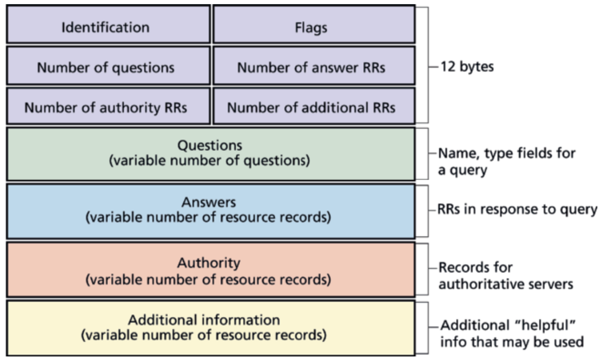
- **Identification** is a 16-bit number that identifies the query. This identifier is also copied into reply messages, allowing client to match received replies with sent queries.<br>
**Flag** field includes a number of flags, like 1-bit query/reply flag *(0: query, 1: reply)*, 1-bit authoritative flag, 1-bit recursion-desired flag, 1-bit recursion-available flag, etc.
- **Questions** section contains information about the query that is being made.
- **Answers** section, in a reply from a DNS server, contains the resource records for the name that was originally queried.
- **Authority** section contains records of other authoritative servers.
- **Additional** section contains other helpful records.

<br>

**Registrar:**&ensp;A commercial entity that verifies the uniqueness of the domain name and enters the domain name into the DNS database (for a small fee).

Registrars are accredited by the **Internet Corporation for Assigned Names and Numbers (ICANN)**.

Alice in Australia wants to view the Web page `www.networkutopia.com`:
- Alice's host will send a DNS query to her local DNS server.
- The local DNS server will then contact a TLD `com` server. *(Assuming root DNS server is bypassed due to DNS caching)*
- This TLD server contains the Type NS and Type A resources, `(networkingutopia.com, dn1.networkingutopia.com, NS)` and `(dns1.networkingutopia.com, 212.212.212.1, A)` as they were inserted into all of the TLD `com` servers by a registrar.
- The TLD `com` server sends a reply to Alice's local DNS server, containing the two recourse records.
- The local DNS server then sends a DNS query to `212.212.212.1`, asking for the Type A record corresponding to `www.networkutopia.com`.
- This Type A provides the IP address of the desired Web server: `212.212.212.4`, which the local DNS server passes back to Alice's host.
- Alice's browser can now initiate a TCP connection to the host `212.212.212.4` and send an HTTP request for the Web page's contents.

<br>

Videos can be compressed to any bit rate desired, trading off video quality to with bit rate *(higher the bit rate, better the image quality)*.

Average end-to-end throughput is the most important performance metric for video streaming.

For continuous playout, the network's provided average end-to-end throughput must be at least as large as the bit rate of the compressed video.

**HTTP Streaming:**&ensp;The video is simply stored at an HTTP server as an ordinary file with a specific URL, and accessed like by client via a `HTTP GET` request.

**Dynamic Adaptive Streaming over HTTP (DASH):**&ensp;The video is encoded into several different versions, each version having a different bit rate/video quality. Each version is stored in the HTTP server&mdash;each with a different URL, along with with a manifest file, which provides a URL for each version. The videos are all segmented temporally such that a client can dynamically request chunks from different versions at a time, depending on available bandwidth.

The client first requests the **manifest file** and learns about the various versions. The client then selects one chunk at a time by specifying a URL and a byte range in an `HTTP GET` request message for each chunk. While downloading chunks, the client also measures the received bandwidth and runs a rate determination algorithm to select the version to request the next chunk from.


**Content Distribution Network (CDN):**&ensp;A geographically distributed network of servers that stores cached copies of web content *(video, images, documets)* and routes each user's request to the server lcationm that will deliver that content with the best possible speed and user experience.

Two types of CDNs:
- **Private CDN**:<br>Owned by the content provider itself *(**e.g.**, Google's CDN, Netlfix's CDN)*.
- **Third-Party CDN**:<br>Distributes content on behalf of multiple content providers *(**e.g.**, Akamai, Cloudflare, Amazon Cloudfront)*.

Two different CDN philosophies:
- **Enter Deep**
  - Deploying server clusters in access ISPs all over the world.
  - Improve user delay and throughput by reducing links between user and CDN server.
  - Highly distributed, so hard to maintain.
- **Bring Home**
  - Building large clusters at smaller number of sites. Instead of getting inside the access ISP, these CDNs typically place their clusters in IXPs.
  - Lower maintenance and management overhead.
  - Higher delay and lower throughput to end users.

When a browser is instructed to retrieve a specific video, the CDN must intercept the request so that it can:
1) Determine a suitable CDN server cluster for that client at that time
2) Redirect the client's request to a server in that cluster.

CDN takes advantage of DNS to intercept and redirect requests.<br>
**e.g.**, if there's a DNS request for `http://video.netcinema.com/6Y7B23V`, the authoritative DNS server will see the "`video`" in the URL and, instead of returning anIP address, it will redirect the LDNS to the CDN's own DNS system, which eventually returns the IP address for the correct CDN server for that query.

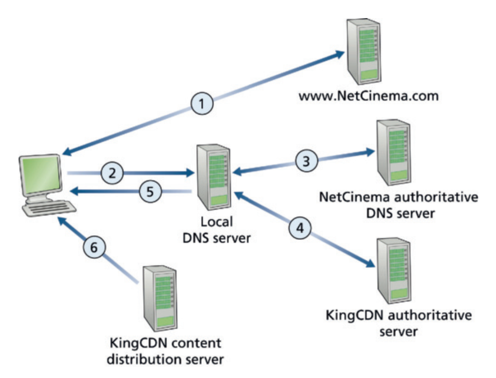

CDN selects the appropriate cluster to redirect requests to via a **cluster selection strategy**.

One simple strategy is to just assign a client to the cluster that is **geographically closest**.

Another, more nuanced strategy is to pick based on **real-time measurements** of delay and loss performrance between clusters and clients.<br>To perform these measurements, CDN can have each of its clusters periodically send probes to all of the LDNSs around the world.

A CDN doesn't place all of its contents in all of its servers. Instead, it depends on **CDN Caching**.

**CDN Caching:**&ensp;The practice of storing different subsets of content at different geographic locations, regularly swapping out older or less popular content for fresher or more in-demand content. The servers at each location collectively act as a **cache**.

Two fundamental strategies for caching:
- **Push**<br>
  CDN preemptively sends to each of its geographical locations the content it expects to be in greatest demand.&ensp;*(e.g., Netflix)*
- **Pull**<br>
  User request first gets redirected to a nearby cache. If the cache has the video, it's streamed to user. If it doesn't, it's retrieved from a central CDN server, streamed to user, and stored in cache.&ensp;*(e.g., YouTube)*

<br>

**Google**'s worldwide infrastructure consists of two tier of data centers *(**Large Scale data centers** and **Network Edge sites**)*, interconnected by global, wide-area private network *(**B4**)*, and connected to the ISPs at hundreds of peering points. Also Google cloud.

<br>

A typical network application consists of a pair of programs&mdash;a client program and a server program&mdash;residing in two different end systems. When these two programs are executed, a client process and a server process are created, and these processes communicate with each other by reading from, and writing to, **sockets**.

Two types of networking applications: "**open**" and **proprietary**.

An "**open**" application is just an implementation whose operation is specified in a protocol standard (RFC).<br>
A client program and a server program, written by two independent developers carefully following the rules of the RFC, should be able to interoperate.

#### **Socket Programming with UDP**

Before sending process can push a packet of data out of the socket door , when using UDP, it must first attach a destination address *(IP address and port number)* to the packet.<br>
The sender's source address *(IP address and port number)* are also attached to the packet. This isn't typically done in UDP application code, OS does it automatically.

**Example Client-Server Application:**
1. The client reads a line of characters from its keyboard and sends the data to the server.
2. The server receives the data and convers the characters to uppercase.
3. The servers sends the modified data to the client.
4. The client receives the modified data and display the line on its screen.

UDPClient.py
``` python 3
from socket import *
serverName = 'hostname'
serverPort = 12000
clientSocket = socket(AF_INET, SOCK_DGRAM)
message = input('Input lowercase sentence: ')
clientSocket.sendto(message.encode(), (serverName, serverPort))
modifiedMessage, serverAddress = clientSocket.recvfrom(2048)
print(modifiedMessage.decode())
clientSocket.close()
```

UDPServer.py
``` python 3
from socket import *
serverPort = 12000
serverSocket = socket(AF_INET, SOCK_DGRAM)
serverSocket.bind(('', serverPort))
print("The server is ready to receive")
while True:
  message, clientAddress = serverSocket.recvfrom(2048)
  modifiedMessage = message.decode().upper()
  serverSocket.sendto(modifiedMessage.encode(), clientAddress)
```

> <!-- --- -->
> **\*\*NOTE****<br>
> - `AF_NET` means the underlying network is using IPv4.
> - `SOCK_DGRAM` means it is a UDP socket.
> - `recvfrom()` input `2048` is buffer size.
> 
> <br>
> 
> - `serverSocket.bind((", serverPort))` assigns port number `12000` to the server's socket.
> <!-- --- -->

#### **Socket Programming with TCP**

In TCP, before client and server can start exchanging data, they first need to handshake to establish a TCP connection.

For the handshake, TCP server program must have a special welcoming socket, which is the initial point of contact for all clients wanting to communicate with the server.
<br>
During the three-way TCP handshake, the client process contacts the welcoming socket (`serverSocket`) of the server to request a connection with that server. When the server accepts this request, it creates a new socket (`connectionSocket`) that is dedicated to that particular client.

With the TCP connection established, when one side wants to send data to other side, they just drop the data into the connection, no addresses needed.

**Example Client-Server Application:**

Same application as before.

TCPClient.py
``` python 3
from socket import *
serverName = 'servername'
serverPort = 12000
clientSocket = socket(AF_INET, SOCK_STREAM)
clientSocket.connect((serverName, serverPort))
sentence = input('Input lowercase sentence: ')
clientSocket.send(sentence.encode())
modifiedSentence = clientSocket.recv(1024)
print('From Server: ', modifiedSentence.decode())
clientSocket.close()
```

TCPServer.py
``` python 3
from socket import *
serverPort = 12000
serverSocket = socket(AF_INET, SOCK_STREAM)
serverSocket.bind(('', serverPort))
serverSocket.listen(1)
print('The server is ready to receive')
while True:
  connectionSocket, addr = serverSocket.accept()
  sentence = connectionSocket.recv(1024).decode()
  capitalizedSentence = sentence.upper()
  connectionSocket.send(capitalizedSentence.encode())
  connectionSocket.close()
```


<hr>
<br>


### **Ch. 3&emsp;TRANSPORT LAYER**<br>(20/09/26&ndash;03/10/26)

**Transport Layer** extends the network layer's delivery service between two end systems to a delivery service between two application-layer processes running on the end systems.

Transport layer deals with two fundamental problems in networking:
1. How two entities can communicate reliably over a medium that may lsoe and corrupt data
2. Controlling the transmission rate of transport=layer entities in order to avoid, or recover from, congestion within the network.

Transport layer protocols live in the end systems only.

***On the sending side,*** the transport converts the application-layer **messages** it receives from a sending application process into transport-layer **segments**.<br>
***On the receiving side,*** the network layer extracts the transport-layer **segment** from the **datagram** and passes the **segment** up to the transport layer. The transport layer then processes the received segment, making the data in the segment available to the receiving application.

More than one transport-layer protocol may be available to a network application *(**e.g.,** TCP and UDP for the Internet)*.

The services that a transport protocol can provide are often constrained by the services model of the underlying network-layer protocol.<br>*(Transport layer can't provide delay or bandwidth guarantees between processes if network layer doesn't provide delay or bandwidth guarantees between hosts)*

Again, Internet has two transport-layer protocols: **UDP** and **TCP**.

> <!-- --- -->
> **\*\*NOTE****<br>
> Some literature *(like RFCs)* refers to tansport-layer packets over TCP as **segments** and tansport-layer packets over TCP as **datagrams**.
> <!-- --- -->

**UDP Services:**&ensp;Process-to-Process Data Delivery; Error Checking.
<br>
**TCP Services:**&ensp;Process-to-Process Data Delivery; Error Checking; Reliable Data Transfer; Congestion Control.

The transport layer provides process-to-process delivery through **transport-layer multiplexing** and **demultiplexing**.

Remember, a process can have multiple uniquely identified sockets.<br>
Transport layer in a receiving host doesn't deliver data directly to a process, but rather to a process socket.

**Transport-Layer Multiplexing:**&ensp;At the source host, collecting data from multiple sockets/processes, adding transport-layer header information to each chunk to form segments, and passing them to the network layer.

**Transport-Layer Demultiplexing:**&ensp;At the receiving host, using an incoming transport-layer segment's header fields to identify the correct socket and deliver the segment's data to the socket/process.

> <!-- --- -->
> **\*\*NOTE****<br>
> Each port number is a 16-bit number, ranging from `0` to `65536`.
>
> Port numbers `0`&ndash;`1023` are **well-known port numbers**.
> <!-- --- -->

**Connectionless Multiplexing and Demultiplexing with UDP**
- UDP socket is fully identified by a two-tuple:&ensp;**(`Destination IP Address`,`Destination Port Number`)**
- If two UDP segments have *different* source IP addresses and/or source port numbers, but the *same* destination IP address and destination port number, then the two segements will be directed to the same destination process via the same destination socket.

<br>

**Connection-Oriented Multiplexing and Demultiplexing with TCP**
- Remember, TCP is connection-oriented, and each connection has its own socket.
- TCP socket is fully identified by a four-tuple:&ensp;**(`Source IP Address`,`Source Port Number`,`Destination IP Address`,`Destination Port Number`)**.
- Two arriving TCP segments with *different* source IP addresses or source port numbers will *(with the exception of TCP segment carrying original connection-establishment request)* be directed to two different sockets, even if they have the *same* destination IP address and destination port number.

<br>

Why some applications pick UDP over TCP:
- **Finer application-level control over what data is sent and when**<br>
  *(No delay from congestion-control mechanisms. Doesn't automatically resend segments like TCP does.)*
- **No connection establishment**
  *(No handshake delay.)*
- **No connection state**<br>
  *(TCP stores connection state (send/receive buffers, congestion-control parameters, etc.) in end system.)*
- **Small packet header overhead*<br>
  *(UDP has 8 bytes of header overhead in every segment, as compared to TCP's 20 bytes.)*

Applications that run over UDP:
- DNS usually runs over UDP
- UDP is used to carry network management (SNMP) data
- Real-time applications

Any services *(reliable data transfer, security)* UDP doesn't have can be implemented over it in the application layer (QUIC).

UDP's lack of congestion control can result in high loss rates between sender and receiver, and the crowding out of TCP sessions sharing the same bottleneck link.

**UDP Segment Structure:**

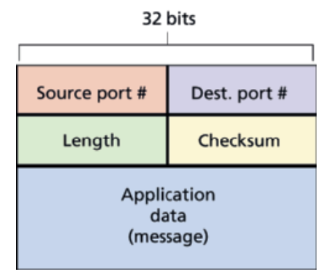<br>
- UDP header has four fields, 2 bytes each.
- **Length** field specifies the number of bytes in the UDP segment *(header + data)*.
- **Checksum** is used by receiving host to check whether errors have been introduced into the segment.<br>
  UDP at the sender side performs the 1s complement of the sum of all the 16-bit words in the segment *(**whole** segment, including headers; checksum field is set to `0`s)*, with any overflow encountered during the sum being wrapped around. This result is what's put in the checksum field of the UDP segment.

At the receiver, the checksum field is added to the sum of all the other 16-bit words in the segment, and the final sum at the receiver should obviously be `1111111111111111`. If one of the bits is a `0`, then we know that errors have been introduced into the packet.

> <!-- --- -->
> **\*\*NOTE****<br>
> In reality, the checksum is also calculated over a few of the fields in the IP header in addition to the UDP segment.
> <!-- --- -->

UDP *must* provide error detection at the transport layer, on an end-to-end basis, if the end-to-end data transfer service is to provide error detection.
> <!-- --- -->
> **\*\*NOTE****<br>
> **End-End Principle:**&ensp;Functions that are essential to communication between two endpoints *(reliability, error detection, security)* should be implemented at the communicating endpoints, not assumed to be guaranteed by the intermediate network.
> <!-- --- -->

UDP only provides error checking, it doesn't do anything to recover from an error.

<br>

The problem of implementing **reliable data transfer** occurs not only at the transport layer, but also at the link layer and the application layer as well.

Part of the problem is that the layer below the reliable data transfer protocol may be unreliable.<br>
*(TCP is a reliable data transfer protocol that is implemented on top of an unreliable network layer)*
<br>
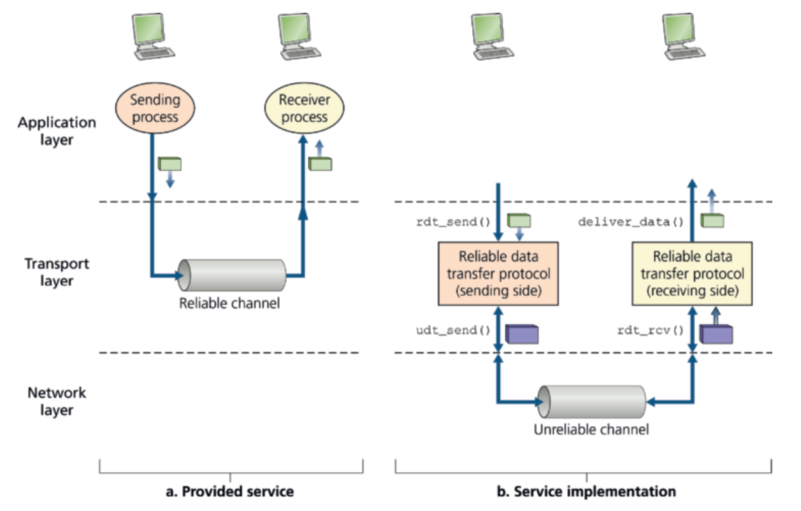


**Reliable Data Transfer over a Lossy Channel with Bit Errors: `rdt3.0`**

`rdt3.0` sender:<br>
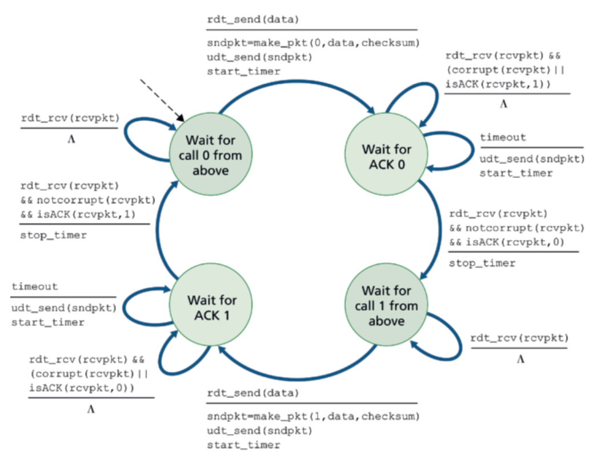
<br>
`rdt3.0` receiver:<br>
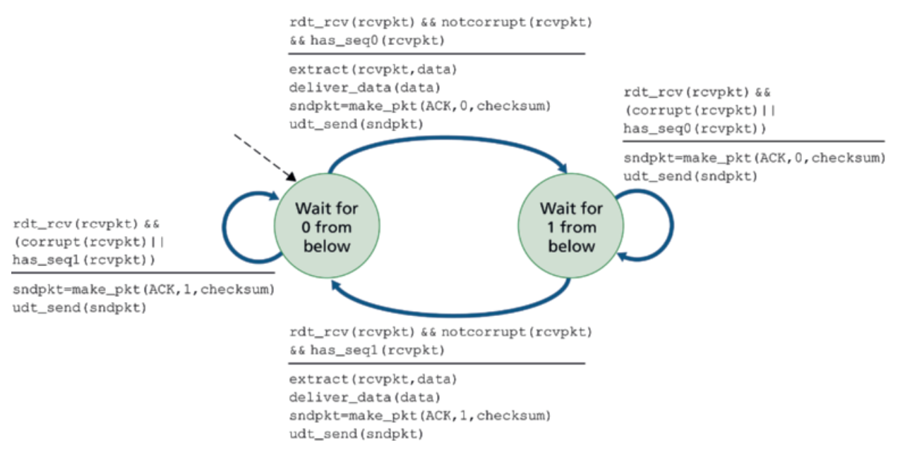

`rdt3.0` is a:
- **ARQ (Automatic Repeat reQuest) protocol:**&ensp;*Any protocol that uses acknowledgements and retransmissions to achieve reliable transfer.*
- **Stop-and-wait protocol:**&ensp;*Sender sends one packet, then waits for an ACK before sending the next.*
- **Alternating-bit protocol:**&ensp;*Uses 1-bit sequence numbers (0,1,0,1,...)*.

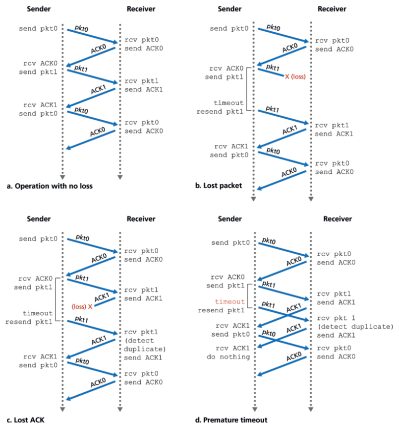

This is a funtional reliable data transfer protocol, but it would have horrible performance because it's **stop-and-wait**.

The solution to this performance problem: **pipelining**.

Pipelining requires the following changes in protocol:
- The range of sequence numbers must be increased
- The sender and receiver sides of the protocols may have to buffer more than one packet

Two approaches to pipelined error recovery: **Go-Back-N** and **Selective Repeat**.<br>
These are both **sliding-window protocols**.
> <!-- --- -->
> **\*\*NOTE****<br>
> **Sliding-Window Protocol:**&ensp;A general ARQ strategy uses a moving window of sequence numbers to allow multiple packets in flight, with the window sliding as acknowledgements arrive.
> <!-- --- -->

**Go-Back-N (GBN):**&ensp;A sliding-window protocol where the sender may have up to $N$ unacknowledged packets outstanding, but uses cumulative ACKs and a single timer; on timeout or loss, it retransmits the lost packet and all subsequent unacknowledged packets. The receiver accepts only in-order packets and discards out-of-order ones.
<br>
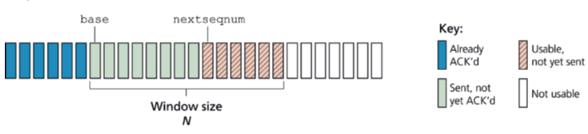
<br>
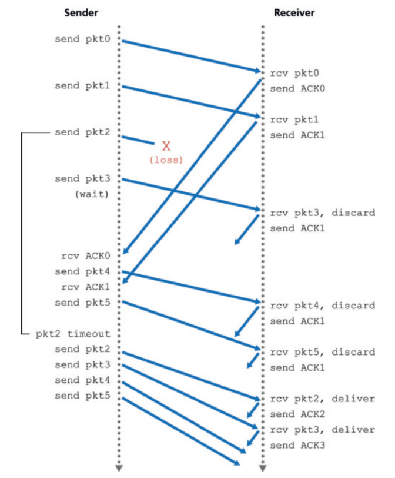

**Selective Repeat (SR):** A sliding-window protocol where both sender and receiver have separate windows. The receiver buffers out-of-order packets and ACKs them individually, so the sender retransmits only the specific packets that are lost or unacknowledged.
<br>
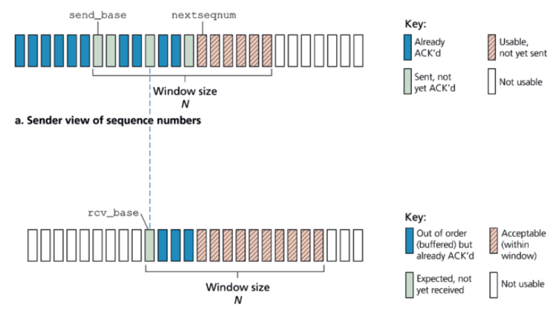
<br>
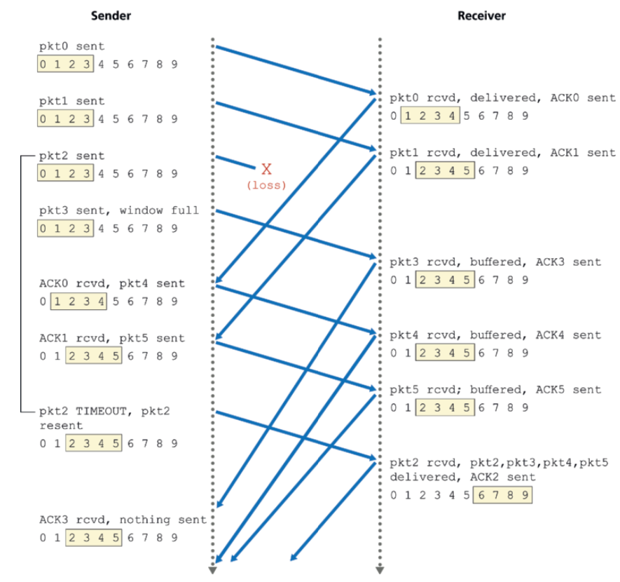

<br>

**TCP** provides a **full-duplex service** *(data can flow from Process A to Process B and from Process B to Process A at the same time)*.

TCP connection is always **point-to-point** *(between **two** hosts)*.

**TCP three-way handshake:**&ensp;First, client sends a special TCP segment (**SYN Segment**) to server's welcoming socket. Second, the server creates a dedicated connection socket from which it sends back a special TCP segment (**SYNACK Segment**). Third, the client responds back to the server with a special segment (**ACK Segment**) *(which may or may not carry a piggybacked payload)*.
> <!-- --- -->
> **\*\*NOTE****<br>
> TCP server's listening socket and connection socket(s) all have the same port number (`80`), so client is blind to these socket internals; it's just "sending to socket".<br>
> TCP can have all its sockets have the same port number because multiplexing/demultiplexing is based on 4-tuple, which includes source address and source port.
> <!-- --- -->

TCP sender and receiver both have their own respective **send and receive buffers**.<br>
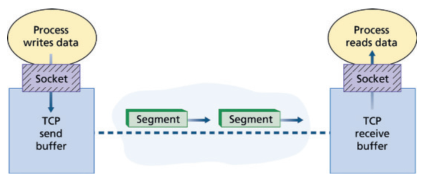

**Maximum Segment Size:**&ensp;The maximum amount of payload data *(in bytes)* a TCP segment can carry. This does not include headers.

**Maximum Transmission Unit (MTU):**&ensp;The maximum size of an IP datagram (header + payload) that can be sent by the local sending host.
<br>
**Path MTU:** The bottleneck MTU over a connection.

MSS is oviously set to always be smaller than MTU.

**TCP Segment Structure**

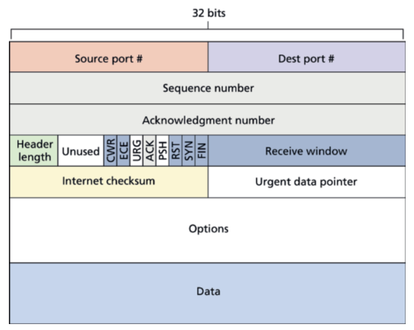<br>
- 32-bit **Sequence Number** field and **Acknowledgement Number** field are used for reliable data transfer.
- 16-bit **Receive Window** field indicates the number of bytes that a receiver is willing to accept. Used for flow control.
- 4-bit **Header Length** field specifies the length of the TCP header. (Typically 20 bytes, but may vary due to **Options** field)
- **Flag Field** classically contains 6 bits.
  - `ACK`:&ensp;Indicates that the value in the acknowledgement field is valid and acknowledsges a successfully received segment
  - `RST`:&ensp;Used for connection teardown
  - `SYN`:&ensp;Used for connection setup
  - `FIN`:&ensp;Used for connection teardown
  - `PSH`:&ensp;Indicates that the receiver should pass the data to the upper layer immediately
  - `URG`:&ensp;Indicates that the segment contains data marked as "urgent" by the sending upper-layer entity
  > <!-- --- -->
  > **\*\*NOTE****<br>
  > Modern TCP flag field is actually 8 bits.
  > - `CWR`:&ensp;Used in congestion control
  > - `ECE`:&ensp;Used in congestion control
  > <!-- --- -->
- 16-bit **Urgent Data Pointer** field indicates the location of the last byte of urgent data within the segment. Only meaningful when `URG` is set to 1.
> <!-- --- -->
> **\*\*NOTE****<br>
> In practice, `PSH`, `URG`, and the urgent data pointer are not used. They're basically dead weight.
> <!-- --- -->

TCP views data in terms of an ordered **byte stream**, rather than structured segments.<br>
The **sequence number** for a segment is therefore the byte-stream number of the first byte in the segment.<br>
The **acknowledgemnt number** that host A puts in its segment is the sequence number of the next byte Host A is expecting from Host B.

TCP provides **cumulative acknowledgments**.<br>If a receiver puts `43` in the acknowledgment field, it's telling the sender it has received everything through byte `42`.

TCP technically leaves handling of out-of-order segments up to the programmer *(whether to discard or cache)*. In practice, the move is obviously to cache out-of-order bytes and wait for the missing bytes to fill in the gaps.

Sequence number doesn't start at 0; both sides of a TCP connection randomly choose an initial sequence number.

**Simple Telnet Example:**
<br>
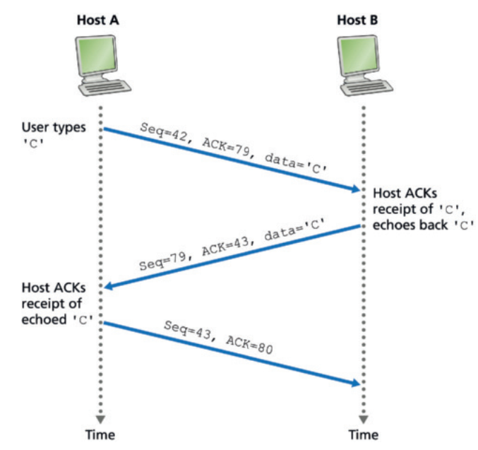

> <!-- --- -->
> **\*\*NOTE****<br>
> **Telnet:**&ensp;An application-layer protocol used for remote login, that runs over TCP. It allows a user on one host to interactively log in to another host, sending each typed character to the remote machine and receiving it echoed back.<br>
> Telnet is unencrypted, so it's now been effectively replaced by SSH.
> <!-- --- -->

TCP uses a **single retransmission timer per conneciton**.

The timer is associated with the oldest unacknowledged segment, and when it receives an `ACK`, the timer is either reset or stopped depending on whether there are still any unacknowledged segments.

**Deriving Timeout Interval:**

Clearly, we know timeout should be larger than RTT, but also not too large and should also be flexible based on congestion.

**SampleRTT:**&ensp;The amount of time between when a segment is send and when an acknowledgement for the segment is received.

**EstimatedRTT:**&ensp;Exponential weighted moving average of SampleRTT values.
$$
EstimatedRTT = (1-\alpha) \cdot EstimatedRTT + \alpha \cdot SampleRTT
$$
> <!-- --- -->
> **\*\*NOTE****<br>
> Recommended value of $\alpha$ is $0.125$
> <!-- --- -->

**DevRTT:**&ensp;Exponential weighted moving average of the difference between SampleRTT and EstimatedRTT.
$$
EstimatedRTT = (1-\beta) \cdot DevRTT + \beta \cdot |SampleRTT-EstimatedRTT|
$$
> <!-- --- -->
> **\*\*NOTE****<br>
> Recommended value of $\beta$ is $0.25$
> <!-- --- -->

Finally,
$$
TimeoutInterval = EstimatedRTT + 4 \cdot DevRTT
$$

TCP's **reliable data transfer** service ensures that the data that a process reads out of its TCP receive buffer is uncorrupted, without gaps, without duplication, and in sequence.

Only using timeout for loss-recovery is inefficient, which is why TCP also uses duplicate acknowledgements, i.e., **Fast Retransmit**.

**Fast Retransmit:**&ensp;The sender, upon receiving three duplicate ACKs for the same data *(not counting the origin ACK for this data)*, infers segment was lost and immediately retransmits it without waiting for timeout.

TCP's error-recovery mechanism is a hybrid of GBN and SR (single timer, cumuulative acknowledgements, caching out-of-order segments).

In a TCP connnection, sent data first gets stored in the receiver application's receive buffer. If the receiver application reads from its buffer too slowly, and sender keeps sending too quickly, the receiver buffer will overflow, resulting in packet loss.
To prevent this, TCP provides a **flow control service**.

**Flow Control:**&ensp;Matching the rate at which the sender is sending against the rate at which the receiving application is reading.

TCP provides flow control by having sender maintain a dynamic variable called **receive window**, which is used to give the sender an idea of how much free buffer space is available at the receiver.
> <!-- --- -->
> **\*\*NOTE****<br>
> Since TCP is duplex, both sides of the connection maintains a receive window, since they're both senders.
> <!-- --- -->
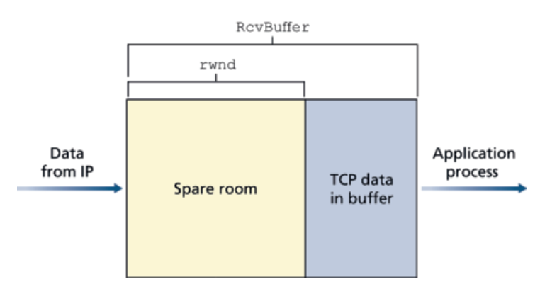
$$
rwnd = RcvBuffer - [LastByteRcvd - LastByteRead]
$$

Host B tells Host A how much spare room it has in the buffer by placing its current value of $rwnd$ in the **receive window field** of every segment it sends to Host A.<br>
Host A, in turn, makes sure throughout the connection's life that:
$$
LastByteSent - LastByteAcked \leq rwnd
$$
> <!-- --- -->
> **\*\*NOTE****<br>
> $LastByteRcvd - LastByteRead$:&ensp;TCP data in buffer.
> <br>
> $LastByteSent - LastByteAcked$:&ensp;Amount of unacknowledged data that A has sent into the connection.
> <!-- --- -->

Once Host B's receive buffer becomes full *($rwnd=0$)*, Host A doesn't stop sending completely. Instead, it switches to sending segments with 1 byte of data. This way, it can keep track of `rwnd` through Host B's acknowledgement messages.

<br>

TCP connection begins with the **three-way handshake**.

Since TCP server allocates buffers and variables *(creates connection)* before step 3 of the handshake even takes place, that leaves TCP vulnerable to **SYN flooding** attacks.

**SYN Flooding:**&ensp;Attacker(s) send a large number of TCP SYN segments, without completing the third handshake step. The server's connection resources become exhausted as they are allocated for half-open connections. Consequently, legitimate clients are denied service.

The defense against this: **SYN cookies**.

**SYN Cookies:**&ensp;After step 2 of the handshake, instead of allocating state, the server encodes connection state into the 32-bit intial sequence number (ISN) of the SYN-ACK. That ISN is the "cookie." The client, if legitimate, responds with ISN+1 in its final ACK. The server validates it and uses ISN to reconstruct the connection state. This way, server remains stateless and doesn't exhaust any memory until after step 3 of the handshake.

The three-way handshake inherently causes a one RTT delay *(Steps 1 and 2)*. This can be elimated using **Fast Open**/**0-RTT Handshaking**.

**TCP Fast Open:**&ensp;During an intial connection, client obtains a fast-open cookie from the server, which encodes all of the connection information needed for future connections. On a later connection to the same server, the client forgoes steps 1 and 2 and just sends this cookie along with the piggyback data from step 3 in its very first message. The server may *(or may not!)* accept this cookie, in which case the connection is established with 0 RTT.

**Closing a TCP Connection:**<br>
- The client application process issues a close command.
- This causes the client TCP to send a special segment with `FIN` flag bit set to 1.
- The server receives the segment, and sends an acknowledgement segment in return.
- The server sends its own shutdown segment with `FIN` bit set to 1, to client.
- Client receives and acknowledges the server's shutdown segment.
- Delay to handle possible packet-loss of this final acknowledgemnet.
- All resources in the two hosts are deallocated.

**TCP States of Client TCP**<br>
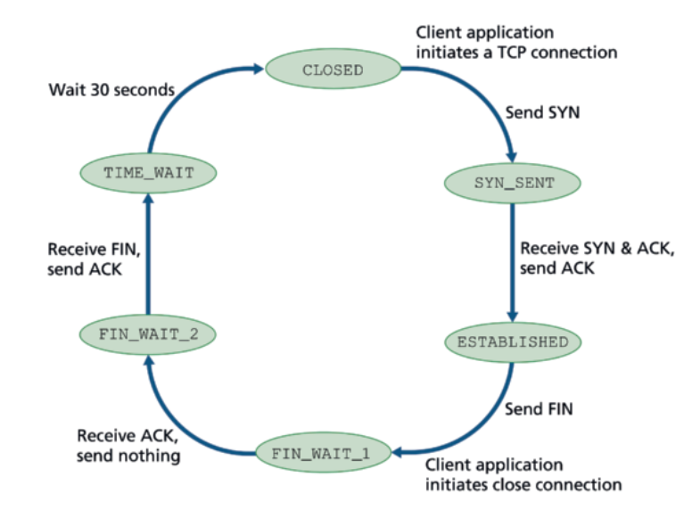

**TCP States of Server TCP**<br>
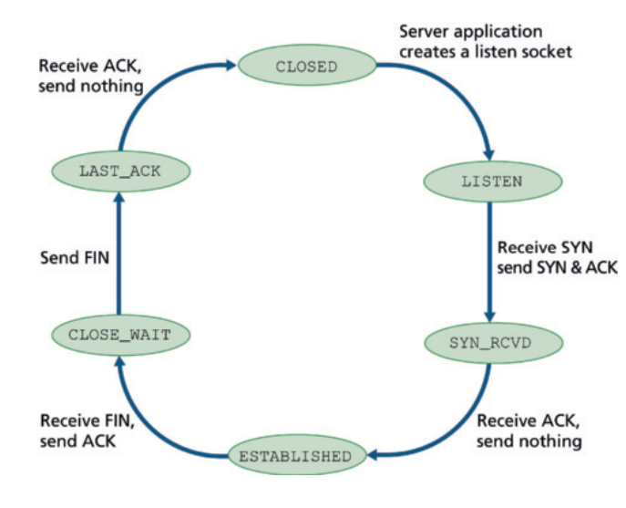

<br>

If host ever receives a TCP segment whose port number or source IP don't match any ongoing sockets, it sends back a special reset segment, with `RST` flag bit set to 1. This tells the original sender "I don't have a socket for that segment. Please do not resend."

<br>

**Network congestion** occurs when there's too many sources attempting to send data at too high a rate.

Routers along a connection path have buffers that allow them to store incoming packets when the packet-arrival rate exceeds the outgoing link's capacity. In congestion, these router buffers become overwhelmed.

**Sending Rate:**&ensp;The rate at which application sends original data into the socket.&ensp;*($\lambda_{in}$ bytes/sec)*<br>
**Offered Load:**&ensp;The rate at which transport layer sends segments (original data *and* retransmitted data) into the network.&ensp;*($\lambda'_{in}$ bytes/sec)*

> <!-- --- -->
> **\*\*NOTE****<br>
> Considering link capacity is R; if offered load is 0.5R bytes/sec and the rate at which data are delivered to the receiving application is 0.333 bytes/sec, that means out of 0.5R units of data transmitted, on average, 0.333R bytes/sec are original data and 0.166R bytes/sec are retransmitted.
> <!-- --- -->

**Costs of Congestion:**
- Large queuing delays are experienced as the packet-arrival rate nears the link capacity.
- The sender must perform retransmissions in order to compensate for dropped (lost) packets due to buffer overflow.
- Unneeded retransmissions by the sender in the cace of large delays may cause a router to use its link bandwidth to forward unneeded copies of a packet.
- When a packet is dropped along a path, the transmission capacity that was used at each of the upstream links to forward that packet to the point at which it is dropped ends up having been wasted.

In other words:
- **Increased queueing delay as the packet arrival rate to a congested link nears its capacity**
- **Decreased application-to-application throughput due to presence of retransmitted packets**
- **Potential for congestion collapse**

**Congestion Collapse:**&ensp;Increasing the offered load causes useful end-to-end throughput to actually decrease *(potentially to 0)*. Packets consume buffer and transmission resources upstream before being dropped downstream, and retransmissions add even more load.

The **bottleneck link** is the link along the end-to-end path, such that if senders slowly increase their transmission rate, that link will be the first link to experience congestion loss.<br>
A connection has at most one bottleneck link.

The aggregate end-to-end throughput achieved by the $N$ connections passing through a bottleneck link will be determined by the bottleneck link's transmission rate, $R$.

**The goal of congestion control:**<br>
For the $N$ connections to set their transport layers' sending rates so that their aggregate sending rate is close to, but does not exceed, the bottleneck link capacity.

Two broad approaches to congestion control: **End-to-End Congestion Control** and **Network-Assisted Congestion Control**.

**End-to-End Congestion Control:**&ensp;The network layer provides no explicit support to the transport layer for congestion-control purposes. Even the presence of network congestion must be inferred based on observed network behavior (packet loss, etc.).<br>
TCP takes the end-to-end approach.

**Network-Assisted Congestion Control:**&ensp;Routers provide explicit feedback to the sender and/or receiver regarding the congestion state of the network.<br>
More recent IP and TCP may use the network-assisted approach.

Network feeds back congestion information to sender in one of two ways:
- **Direct network feedback**<br>
  Choke packet sent directly from a network router to the sender. 
- **Network feedback via receiver**<br>
  Router marks/updates a field in a packet flowing from sender to receiver to indicate congestion. The receiver then notifies the sender of the congestion indication through the ACK reply to the sender's congestion-marked packet *(by setting the `ECE` flag in ACK reply's TCP header to 1)*.

<br>

#### **End-to-End TCP Congestion Control**

TCP has each sender limit the rate at which it sends traffic into its connection as a funcion of perceived network congestion.<br>
If TCP sender perceives congestion on the path, it reduces its send rate; if it perceives theire is little congestion, it increases its send rate.

Many different flavors of TCP congestion control" **"Classic" TCP**, **TCP Vegas**, **CUBIC TCP**, **BBR**.

In "Classic" TCP, each side of a connection keeps track of a **congestion window** variable, `cwnd`, and imposes the following constraint:
$$
LastByteSent - LastByteAcked \leq min\{cwnd, rwnd\}
$$

This constraint limits the amount of unacknowledged data at the sender and therefore indirectly limits the sender's send rate. Sender can adjust the congestion window to adjust its send rate.

Classic TCP guiding principles:
- **A lost segment implies congestion**, and hence, the TCP sender's rate should be decreased when a segment is lost.
- **An acknowledged segment indicates that the network is delivering the sender's segments to the receiver**, and hence, the sender's rate can be increased when an ACK arrives for a previously unacknowledged segment
- **Bandwidth probing**<br>
  *(TCP's strategy for adjusting transmission rate. Keep increasing transmission rate until loss occurs, back off by decreasing rate, then probe again by increasing again.)*

TCP is **self-clocking:**&ensp;The network's own feedback (ACKs) determines how fast the sender injects data, rather than a fixed timer.<br>
*(If ACKs arrive slowly, the congestion window will increase slowly; if ACKs arrive at a high rate, the congestion window increase more quickly)*

**TCP Congestion Control Algorithm**

Three components: **Slow Start**, **Congestion Avoidance**, **Fast Recovery**
1. **Slow Start**<br>
   TCP connection begins in slow start phase. The value of `cwnd` begins at 1 MSS *(thus an initial sending rate of MSS/RTT bytes/sec)* and increases by 1 MSS for every acknowledgment that arrives. Therefore, send rate grows exponentially fast, doubling every RTT.<br>
   If there is a timeout loss event:&ensp;`ssthresh`=`cwnd`/2; `cwnd`=1.<br>
   If there is a triple duplicate ACKs loss event:&ensp;&rarr; Fast Recovery mode.<br>
   When `cwnd` = `ssthresh`:&ensp;&rarr; Congestion Avoidance mode.
2. **Congestion Avoidance**<br>
   Rather than doubling `cwnd` every RTT, TCP now increases the `cwnd` by 1 MSS every RTT.<br>
   If there is a timeout loss event:&ensp;&rarr; Slow Start mode.<br>
   If there is a triple duplicate ACKs loss event:&ensp;&rarr; Fast Recovery mode.
3. **Fast Recovery** (optional)<br>
   If there is a triple duplicate ACKs loss event:&ensp;`ssthresh`=`cwnd`/2; `cwnd`=(`cwnd`/2)+3.<br>
   During Fast Recovery, `cwnd` increases by 1 MSS for every additional duplicate ACK received the missing segment.<br>
   If an ACK arrives for new data: `cwnd`=`ssthresh`, and &rarr; Congestion Avoidance mode.<br>
   If a timeout loss event occurs, `ssthresh`=`cwnd`/2; `cwnd`=1, and &rarr; Slow Start.

**TCP Tahoe** does not implement Fast Recovery *(its `cwnd` is always cut down to 1)*.
<br>
**TCP Reno** is just TCP Tahoe + Fast Recovery.
<br>
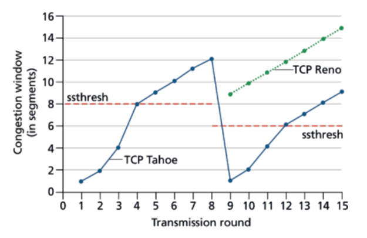

TCP is said to have **AIMD** *(additive-increase, multiplicative-decrease)* congestion control.

Classic TCP congestion control algorithms *(like Tahoe and RENO)* have been entirely replaced, first by TCP CUBIC, and then by BBR.

**TCP CUBIC** only differs slightly from TCP Reno, and that's in its Congestion Avoidance phase.
- Let $W_{max}$ be the size of `cwnd` when loss was last detected, and $K$ be the future point in time when window size will again reach $W_{max}$.
- TCP CUBIC increases the congestion window as a cubic function of time since the last congestion event *(i.e., the distance between current time $t$ and $K$)*.
- When $t$ is far from $K$, the congestion window size increases are much larger than when $t$ is close to $K$.<br>
  When $t<K$, CUBIC quickly ramps up TCP's sending rate to get close to $W_{max}$, and then probes cautiously.<br>
  When $t>K$, congestion window increases are initially small because it's in the cautious probing stage. As $t$ keeps exceeding $K$, window size increases rapidly to more quickly find a new $W_{max}$.

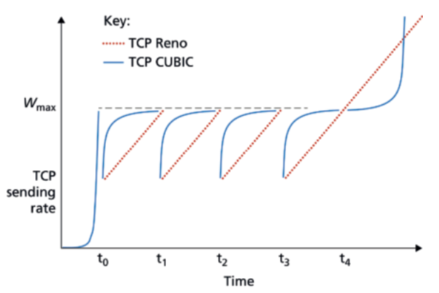

**TCP Vegas**, instead of inferring congestion from packet loss events, uses measured RTT delay to proactively detect congestion onset, hopefully before packet loss occurs.

In TCP Vegas, the sender measures the RTT for all acknowledge packets. The smallest measurement, $RTT_{min}$, is said to be the RTT for when the path is uncongested. $RTT_{min}$ gives us the uncongested throughput rate, `cwnd`/$RTT_{min}$.

If the actual sender-measured throughput is close the uncongested throughput, the path isn't congested, so the TCP sending rate can be increased.<br>
If the sender-measured throughput is significantly less than the uncongested throughput, the path is congested and the Vegas TCP sender will decrease its sending rate.