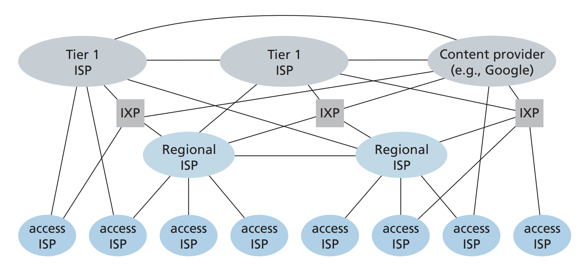
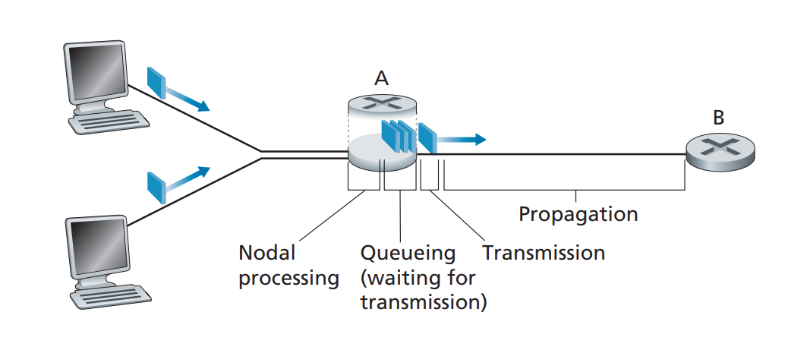
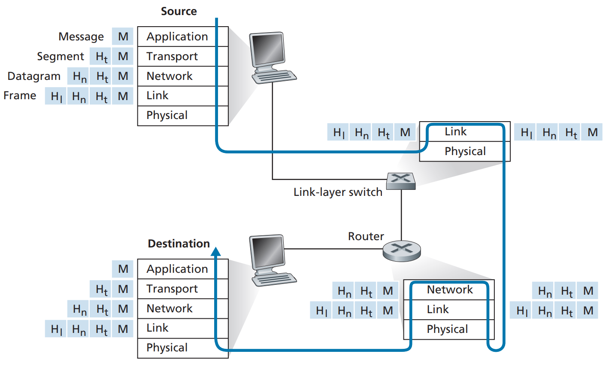
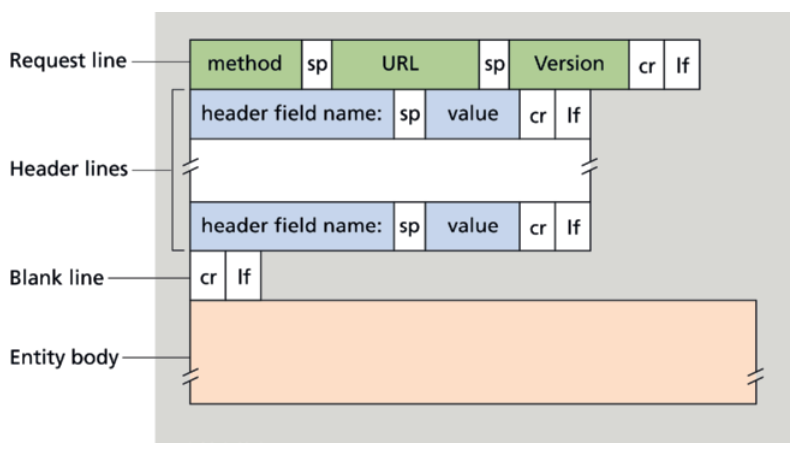
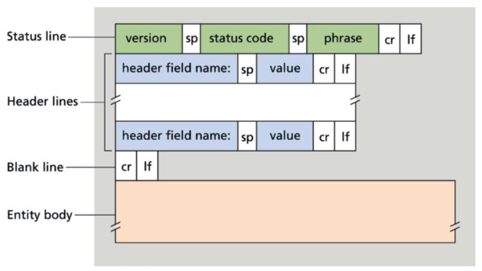
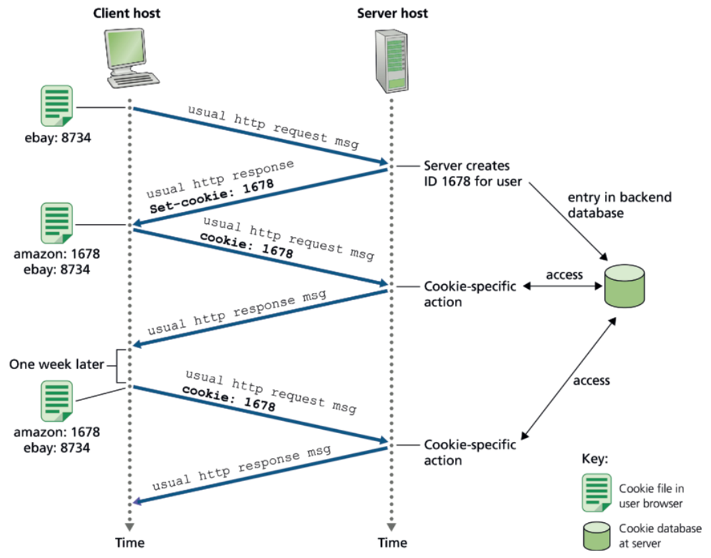
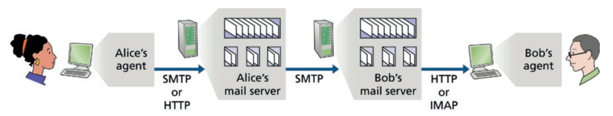
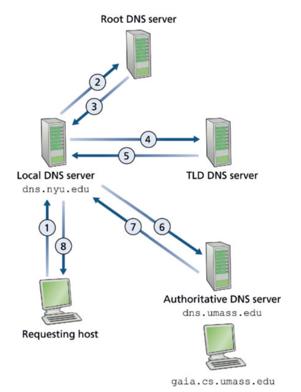
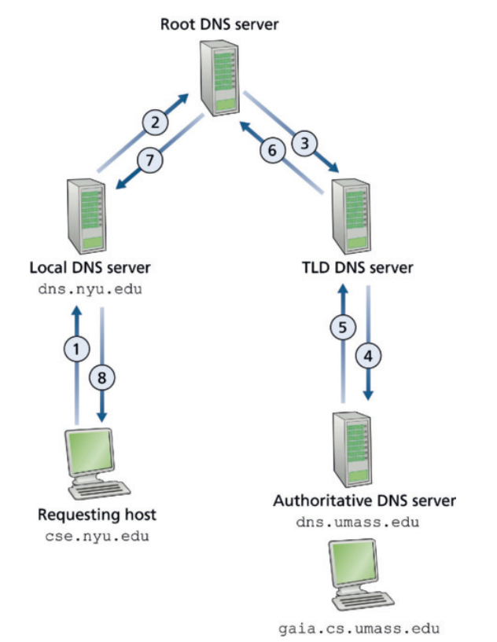

# ["Computer Networking: A Top-Down Approach" by James F. Kurose & Keith W. Ross]
## (27/07/26 &ndash; 30/08/26)
## **Task:**
The task is to read the following chapters of [**"Computer Networking: A Top-Down Approach" by James F. Kurose & Keith W. Ross**](https://gaia.cs.umass.edu/kurose_ross/index.php):
- **Chapter 1: &ensp;Computer Networks and the Internet**
- **Chapter 2: &ensp;Appliccation Layer**
- **Chapter 3: &ensp;Transport Layer**
- **Chapter 4: &ensp;The Network Layer: Data Plane**
- **Chapter 8: &ensp;Security in Computer Networks**

The proof will be the per-chapter notes I write below.

## **Proof:**

### **The OSI Model:**
1. **Application Layer**
2. **Presentation Layer**
3. **Session Layer**
4. **Transport Layer**
5. **Network Layer**
6. **Data Link Layer**
7. **Physical Layer**

### **Ch. 1&emsp;COMPUTER NETWORKS AND THE INTERNET**<br>(27/07/26&ndash;08/08/26)

**Hosts/End Systems:**&ensp;Any device that is connected to a computer network as a source or destination of data. (e.g., mobile computer, smartphone, router, server, cell phone tower)

End systems are connected together by a network of **communication links** and **packet switches**.
> <!-- --- -->
> **\*\*NOTE****<br>
> **Packets:**&ensp;Small chunks of data that messages are broken into before being sent across a computer network.
> <!-- --- -->
**Packet Switch:**&ensp;Takes a packet arriving on one of its incoming communication links and forwards that packet on one of its outgoing communication links.<br>
Two types of packet switches: **Routers** and **Link-layer Switches**.

**Protocols:**&ensp;Define the format and the order  of messages exchanged between two or more communicating entities, as well as the actions taken on the transmission and/or receipt of a message or other event.

Two type of hosts: **Clients** and **Servers**.

**Client:**&ensp;A device or program that request data or services from a server. *(e.g., desktops, laptops, smartphones)*
<br>
**Server:**&ensp;A powerful system or program listens for client requests and provides requested resources. *(e.g., web servers, file servers, database servers)*

**Store-and-Forward Transmission:**&ensp;The packet switch must receive the entire packet before it can begin to transmit the first bit of the packet onto the outbound link.

Sending one packet from source to destination over a path consisting of $N$ links *(thus, there are $N-1$ routers between source and destination)* each of rate $R$, end-to-end delay = $N\dfrac{L}{R}$.

In addition to store-and-forward delays, there's also **queuing delay** due to output buffers.
<br>
**Queuing delay:**&ensp;The time a data packet spends in a router's buffer before it gets transmitted onto a link.
> <!-- --- -->
> **\*\*NOTE****<br>
> When the arrival rate *(in bps)* to link exceeds the transmission rate *(in bps)* of link, packets will start to queue.
> <!-- --- -->

Buffer space is finite. If a packet arrives when buffer is already full, there is **packet loss**.

In the Internet, every end system has an IP address.<br>
When a source end system wants to send a packet to a destination end system, the source includes the destination's IP address in the packet's header.


**Forwarding:**&ensp;The local action of a router moving arriving packets from its input links to appropriate output links (according to ***forwarding table***).

**Forwarding Table:**&ensp;Maps destination addresses *(IP or MAC)* to specific outgoing ports. Stored in routers/switches.

Where do the contents of the forwarding table come from? ***Routing***,

**Routing:**&ensp;The distributed process where routers&mdash;working together&mdash;automically figure out the best paths across a network and use those paths to build the forwarding tables.

<br>

**Packet Switching:**&ensp;A networking method that splits data into packets, use a store-and-forward technique through nodes, and reassembles them at the destination.

**Circuit Switching:**&ensp;A networking method that reserves a dedicated and fixed communication path *(a **circuit**)* between a sender and a receiver before any data moves.
<br>
When a network establishes a circuit, it also reserves a constant transmission rate in the network's links.
<br>
*(e.g., traditional telephone networks)*

> <!-- --- -->
> **\*\*NOTE****<br>
> **Multiplexing:**&ensp;A technique that allows the simultaneous transmission of multiple signals through a single channel or link.
> <!-- --- -->

**Frequency-Division Multiplexing (FDM):**&ensp;divides the frequency spectrum of a link into distinct, non-overlapping frequency bands, allowing multiple independent signals to share the same link simultaneously.

**Time-Division Multiplexing (TDM):**&ensp;Divides time into fixed-duration frames, subdividing each frame into a fixed number of time slots, and assigns specific slots to individual connections, allowing multiple independent sources to share the same link sequentially.

Unlike FDM, in TDM, each connection has the entire width of the frequency band *(i.e., the **bandwidth**)* at its disposal.

Circuit Switching is considered wasteful because the dedicated circuits are idle during silent periods.

Packet Switching is arguably not suitable for real-time services *(e.g., telephone calls and video conference calls)*.

**Packet Switching Benefits:**
1. Better sharing of transmission capacity than circuit switching.
2. Simpler, more efficient, and less costly to implement than circuit switching.

In packet switching, link capacity is shared on a packet-by-packet basis and only among those users who have a packet to transmit over the link.
<br>
*(For example, hypothetically, if only one user is transmitting packets over the link and all other users are completely idle, no multiplexing is done at all)*

**Point of Presence:**&ensp;A group of one or more routers (at the same location) in the provider's network where customer ISPs can connect into the provider ISP.
<br>
*(Customer ISP run cables from their Central Office to the PoP)*

**Multi-homing:**&ensp;To connect to two or more provider ISPs at the same time.

**Peering:**&ensp;A mutual, direct interconnection between two networks that are at the same level in the internet hierarchy. It allows all traffic exchanged between the two peers to travel over this direct connection instead of going through intermediaries (that charge transit fees).

**Internet Exchange Point (IXP):**&ensp;A physical third-party location where multiple ISPs (and content-provider networks) connect for peering.

**Content-Provider Networks:**&ensp;Private networks built and operated by large companies *(Google, Netflix, Amazon)* to host and distribute their own content directly to ISPs and end users.

**The Internet:**<br>
The **Internet** is a network of networks, consisting of a complex hierarchy of provider and customer ISPs, content-provider networks, and IXPs, all linked by standardized protocols.



<hr>



In packet-switched networks, there are several types of delays:
- **Nodal Processing Delay:**<br>
    The time required check for bit-level errors in the packet and examine its header to determine where to direct the packet.
- **Queuing Delay**:<br>
    The time the packet waits in queue to be transmitted onto the link.
- **Transmission Delay**:<br>
    The amount of time required to push all of the packet's bits into the link. ($\dfrac{L}{R}$)&ensp;*(A function of the packet's length and the link's transmission rate only)*
- **Propagation Delay**:<br>
    The time required to propagate from the beginning of the link to next router. ($\dfrac{d}{s}$)&ensp;*(A function of the distance between the two routers only)*<br>
    *($d$: length of physical link,&ensp;$s$: propagation speed (~2x10<sup>8</sup> m/sec))*

**Total Nodal Delay:**&ensp;The sum of all of the above.
$$
d_{\text{nodal}} = d_{\text{proc}} + d_{\text{queue}} + d_{\text{trans}} + d_{\text{prop}}
$$

Queuing delay can vary from packet to packet, so for a metric, we use *average queuing delay*, *variance of queuing delay*, and *probability the the queuing delay exceeds some specified value*.

**Traffic Intensity:**&ensp;$\dfrac{La}{R}$,
<br>where $L$: packet length *(in bits)*,&ensp;$a$: average rate at which packets arrive at the queue *(in packets/sec)*,&ensp; $R$: link transmission rate *(in bits/sec)*.

If $\frac{La}{R} > 1$, then the average rate at which bits arrive at the queue exceeds the rate at which bits can be transmitted from the queue &rarr; queue will **grow** with no upper bound!
<br>*(Conversely, when $\frac{La}{R} < 1$, the queue should shrink)*

> ***Design your system so that the traffic intensity is no greater than 1.***

In reality, because traffic is random and bursty, even when traffic intensity < 1, **average queuing delay increases exponentially as traffic intensity approaches 1**.

**Packet Loss:**&ensp;When a packet is transmitted into the network core, but never reaches its destination.

**End-to-End Delay:**&ensp;The sum of all nodal delays encountered at each router along the path between two hosts.

**Instantaneous Throughput:**&ensp;The rate *(in bits/sec)* at which data is actually being received at its destination at a specific moment in time.

**Average Throughput:**&ensp;$\dfrac{F}{T}$,
<br>where it takes $T$ seconds for destination to receive all $F$ bits.

For a single, long-lived data transfer with no competing traffic on a network with $N$ links, with transmission rates $R_1$, $R_2$, ... , $R_N$, the throughput is **min{R<sub>1</sub>, R<sub>2</sub>, ... , R<sub>N</sub>}**.

**Throughput**: The end-to-end data delivery rate at the receiver, with the absolute upper bound constrained by the bottleneck link, i.e., **Throughput ≤ min{R<sub>1</sub>, R<sub>2</sub>, ... , R<sub>N</sub>}**.

*(In reality, since there's competing traffic and connections are shared across links, the min{} comparison actually uses effective transmission rate after multiplexing instead of $R$)*

**The Internet Protocol Stack**
<br>
5\.&emsp;**Application**<br>
4\.&emsp;**Transport**<br>
3\.&emsp;**Network**<br>
2\.&emsp;**Link**<br>
1\.&emsp;**Physical**


**Application Layer**
- Where the network applications and their protocols reside. These protocols are distributed across end systems to exchange packets between applications.
- Application-layer packets are called **messages**.
- **e.g.**, HTTP protocol, SMTP, and FTP.

**Transport Layer**
- Transports application-layer messages between application endpoints.
- Transport-layer packets are called **segments**.
- Two types of protocols: TCP and UDP.

**Network Layer**
- Responsible for moving network-layer packets from one host to another.
- Network-layer packets are called **datagrams**/**IP packets**.
- Contains the IP protocol and routing protocols.

> <!-- --- -->
> **\*\*NOTE****<br>
> The Network Layer (IP) gets the data to the right computer. The Transport Layer gets the data to the right app on that computer.
> <!-- --- -->

**Link Layer**
- Responsible for moving packet from one node's *(host or router)* network layer to the network layer of the next node in the route.
- Link-layer packets are called **frames**.
- **e.g.**, Ethernet, WiFi, DOCSIS protocol.&ensp;(Depends from link to link)

**Physical Layer**
- Responsible for moving the individual bits within the frame from one node to the next.
- Protocols depend on the actual transmission medium of the link. **e.g.**, twisted-pair copper wire, coaxial cable, fibre optics.

<br>



> <!-- --- -->
> **\*\*NOTE****<br>
> Transport-layer protocol **encapsulates** aopplication-layer *message* with transport layer header to create transport-layer *segment*.<br>
> Network-layer protocol **encapsulates** transport-layer *segment* with network layer heager to create a network-layer *datagram*.<br>
> Link-layer protocl **encapsulates** network-layer *datagram* with link-layer header to create a *frame*.
> <!-- --- -->

> <!-- --- -->
> **\*\*NOTE****<br>
> **Hosts** implement all 5 layers of the protocol stack.
>
> **Link-layer switches** implement only layer 1 and 2.
>
> **Routers** implement only layer layers 1 through 3.
> <!-- --- -->

<hr>

**Denial-of-Service (DoS) Attack:**&ensp;A malicious atempt to disrupt the normal functioning of a targeted server, service, or network, leaving it slow, unresponsive, or unavailable to legitimate users.

Three main types of DoS:
- Vulnerability attack
- Bandwidth flooding
- Connection flooding

**Distributed Denial-of-Service (DDoS) attack:**&ensp;A DoS attack launched from a **botnet** of multiple devices spead across different locations, making it harder to block or trace back.

> <!-- --- -->
> **\*\*NOTE****<br>
> **Botnet:**&ensp;A network of compromised devices.
> <!-- --- -->

**Packet Sniffer:**&ensp;A passive receiver device/program that captures and records a copy of every packet transmitted across a network segment.

**IP Spoofing:**&ensp;The ability to inject packets into the Intenet with a false source IP address header.

**Lines of Defense:**

- **Authentication:** Proving you are who you say you are (to protect from IP spoofing)
- **Confidentiality:** cia encryption
- **Integrityy checks:** digital signatures prevent/detect tampering
- **Access Restrictions:** password-protected VPNs
- **Firewalls:** Specialized "middle boxes" in access and core networks


<hr>
<br>


### **Ch. 2&emsp;APPLICATION LAYER**<br>(11/08/26&ndash;30/08/26)

Two main application architectural paradigms:
- **Client-Server Architecture**
- **Peer-to-Peer (P2P) Architecture**

**Client-Server Architecture:**&ensp;There is an always-on host, called the **server**, which passively listens for and services requests from many other hosts, called **clients**. The server has a fixed, well-known IP address, which a client sends packets to in order to contact the server.<br>
Example applications: the Web, e-mail, video streaming.

Client-server applications with single-server can become overwhelmed, so they often use **data centers**, housing many hosts, to create a powerful virtual server.

**Peer-to-Peer Architecture:**&ensp;The application exploits direct communication between pairs of intermittently connected hosts, called **peers**, which are user-controlled devices *(desktops, laptops, etc.)*. Because peers exchange data without passing through a dedicated server, each peer can act as both a client and a server.

A **network application** consists of pairs of processes that send messages to each other over a network.<br>For each pair, the process that initiates the communication is called the **client**, and the process that waits to be contacted is the **server**.

**Socket:**&ensp;One endpoint of a two-way communication between two processes. A process sends messages into, and receives messages from the network through the socket.<br>
The socket is the interface between the application layer and the transport layer.
> <!-- --- -->
> **\*\*NOTE****<br>
> **Application Programming Interface (API):**&ensp;The broad, abstract set of rules, functions, and protocols that a programmer uses to interact with a system.
> <!-- --- -->
Socket is the **API** between the application and the network.

A receiving process *(specifically its socket)* is uniquely identified by two pieces of information:
1. the address of the host: **IP Address**
2. identifier for the specific receiving process in the destination host: **Port Number**

> <!-- --- -->
> **\*\*NOTE****<br>
> **Telephony:**&ensp;The technology that converts voice, fax, and multimedia signals into digital data packets.
> <!-- --- -->

There's multiple transport-layer protocols, which we may have to pick between.

Transport-layer protocols' services can be classified across the following dimensions:
- **Reliable Data Transfer**<br>
  *(data sent by one end of the application is delivered correctly and completely to the other end of the application)*
- **Throughput**<br>
  *(guaranteed available throughput at some specified rate)*
- **Timing**<br>
  *(guarantees like "every bit that the sender pumps into the socket arrives at the receiver's socket no more than x msec later")*
- **Security**<br>
  *(e.g., encryption-decrpytion, data integrity, end-point authentication)*

**Loss-Tolerant Applications:** Applications that can tolerate some amount of data loss. (**e.g.,** audio/video calls)

**Bandwidth-Sensitive Applications:** Applications that have throughput requirements.

**Elastic Applications:** Applications that can make use of as much, or as little, throughput as happens to be available.

The Internet has only two available transport-layer protocols: **TCP** and **UDP**.<br>*(When creating a new network application, we have to decide up-front whether we'll be using TCP or UDP)*

**TCP Services:**
- **Connection-oriented service:**<br>
  Client and server exchange transport-layer control information with each other (TCP handshake) before the application-level messages begin to flow. After the handshake, we say there's a TCP connection between them, which is **full-duplex**.
- **Reliable data transfer:**<br>
  Processes can rely on TCP to deliver all data without error and in the proper order.
- **Congestion-control mechanism:**<br>
  Throttles a sending process when the network is congested between sender and receiver. Also attempts to limit each TCP connection to its fair share of network bandwidth.
> <!-- --- -->
> **\*\*NOTE****<br>
> **Full-Duplex Connection:**&ensp;A connection over which both processes can send messages to each other at the same time.
> <!-- --- -->

**UDP Services:**
- **No-frills, lightweight:**<br>
  Connectionless *(no handshake)*, unreliable data transfer service *(may be packet loss, messages may arrive out of order)*, no congestion-control mechanism.

Neither TCP nor UDP provides any encryption (**Security**).

Niether TCP nor UDP provide any **Throughput** or **Timing** guarantees either, but they're not really needed anyway. *(Internet already provides satisfactory service to time-sensitive applications)*

There exists an enhancement for TCP, that implements Security services in the application layer: **Transport Layer Security (TLS)**.

**TCP-enhanced-with-TLS:**&ensp;TCP but with security services like encryption, data integrity, and end-point authentication.

    When an application uses TLS, the sending process passes cleartext data to the TLS socket; TLS in the sending host then encrypts the data and passes the encrypted data to the TCP socket. The encrypted data travels over the Internet to the TCP socket in the receiving process. The receiving socket passes the encrypted data to TLS, which decrypts the data. Finally, TLS passes the cleartext data through its TLS socket to the receiving process.

<br>

**Application-Layer Protocols** define:
- types of messages exchanged
- message syntax
- message semantics
- rules for when and how processes send and respond to messages

Two types of Application-Layer Protocols: 
1. **Open Protocols** *(defined in RFCs (e.g., HTTP, SMTP))*
2. **Proprietary Protocols** *(e.g., Skype, Zoom)*

<br>

**World Wide Web:**&ensp;A client-server application that allows users to obtain documents from Web servers *on demand*. The Web application consists of many components, including a naming schema (URLs), a standard for document formats (HTML), Web browsers, Web servers, and an application-layer protocol (HTTP) that defines the sequence of messages exchanged between browser and Web server.

**HTTP (HyperText Transfer Protocol):**&ensp;A fundamental protocol of the Internet, *(defined in [RFC 1945], [RFC 7230], [RFC 7540], [RFC 9114])*, which serves as the foundation of data communication for the World Wide Web.

**HTTP** is implemented in two programs: a client program and a server program.
<br>
**Web browsers** *(e.g., Chrome, Edge)* implement the client side of HTTP, and **Web servers** *(e.g., Apache, Nginx, Microsoft Internet Information Server)* implement the server side of HTTP.
<br>
HTTP defines how Web clients request Web pages from Web servers and how servers transfer Web pages to clients.

A **Web Page** consists of objects. Most Web pages consist of a base HTML file and several referenced objects. The base HTML file references the other objects in the page with the objects' URLs.
> <!-- --- -->
> **\*\*NOTE****<br>
> Each URL has two components: the **hostname** of the server that houses the object, and the object's **path name**.<br>
> In `http://www.someSchool.edu/someDepartment/picutre.gif`, `www.someSchool.edu` is the hostname and `/someDepartment/picutre.gif` is the path name.
> <!-- --- -->

HTTP is a **Stateless Protocol:** the server does not retain any state information between successive requests. Every request is treated as a brand-new, isolated transaction, with no memory of previous requests from the same client.

HTTP/1 and HTTP/2 run over TCP. HTTP/3 runs over UDP.

Two types of HTTP connections: **Non-Persistent Connection** and **Persistant Connection**.

**Non-Persistent Connection** is established for and immediately closed after exactly one request message and one response message.<br>
Time it takes for a client to request and receive a single object:&ensp;2 RTTs + transmission time.&emsp;*(one RTT to establish the TCP connection, one RTT to handle the HTML request)*
> <!-- --- -->
> **\*\*NOTE****<br>
> **Round-Trip Time (RTT):**&ensp;The time it takes for a small packet to travel from a client to a server and back to the client.
> <!-- --- -->

**Persistent Connection** is when a TCP connection remains open across multiple request-response exchanges. It is closed when it isn't used for a certain time.<br>
Multiple, subsequent requests can also be made to a server using "**pipelining**" i.e., back-to-back without waiting for response. The server then sends the responses/objects back-to-back.<br>

Two types of HTTP messages: **Request Messages** and **Response Messages**

**HTTP Request Message**

General format:<br>
<br>
It has three sections, the **Request Line**, **Header Line(s)**, and the **Entity Body**.

The **request line** has 3 fields: method field, URL field, and HTTP version field.

Method field can take on several different values, e.g.:
- **`GET`**:<br>Used when browser requests an object, with the requested object identified in the URL field.
- **`POST`**:<br>Used when the client submits data (e.g., form entries or file uploads)&mdash;like when user provides search words to a search engine. The data is carried in the entity body.
- **`HEAD`**:<br>Used to get the same response from server as for `GET`, but without the requested object.&ensp;*(Used for debugging)*
- **`PUT`**:<br>Used to upload an object to a specific path *(specified in URL field)* on a specific Web server.
- **`DELETE`**:<br>Used to request the removal of an object form a Web server, with the target object identified in the URL field.

Subsequent lines after request line are called **header lines**.

**Example:**
```
GET /somedir/page.html HTTP/1.1
Host: www.someschool.edu
Connection: close
User-agent: Mozilla/5.0
Accept-language: fr
```
- In request line, the browser is requesting the object `/somedir/page.html`. The browser implements version HTTP/1.1
- `Host: www.someschool.edu` specifies the host on which the object resides.&ensp;*(required for Web proxy caches)*
- `Connection: close` tells the server to close the connection after sending the requested object.
- `User-agent` header line specifies the user agent *(browser type)* that is making the request to the server: `Mozilla/5.0`.
- `Accept-language: fr` indicates that the user prefers to receive a French version of the object, if available, otherwise, server should send the default version.

<br>

**HTTP Response Message**

General format:<br>
<br>
It has three sections, the **Status Line**, **Header Line(s)**, and the **Entity Body**.

The **entity body** is the meat of the message&mdash;it contains the requested object.

The **status line** has 3 fields: the protocol version field, a status code, and a corresponding status message.

The status code and associated phrase indicate the result of the request. Some common ones are as follows:
- **`200 OK`:**<br>Request succeeded and the information is returned in the response.
- **`301 Moved Permanently`:**<br>Requested object has been permanently moved; the new URL is specified in `Location:` header of the response message. The client software will automatically retrieve the new URL.
- **`400 Bad Request`:**<br>This is a generic error code indicating that the request could not be understood by the server.
- **`404 Not Found`:**<br>The requested document does not exist on this server.
- **`505 HTTP Version Not Supported`:**<br>The requested HTTP protocol version is not supported by the server.

**Example:**
```
HTTP/1.1 200 OK
Connection: close
Date: Mon, 21 Oct 2024 18:58:21 GMT
Server: Apache/2.2.3 (CentOS)
Last-Modified: Sun, 20 Oct 2024 13:20:46 GMT
Content-Length: 6821
Content-Type: text/html
  (data data data data data ...)
```
- The status line is indicating that the sever is using `HTTP/1.1` and that everything is `OK` *(i.e., the server has found, and is sending, the requested object)*.
- `Connection: close` tells the client that the server is going to close the connection after sending the message.
- `Data:` header indicates the time and date when the HTTP response was created and sent by the server.
- `Server:` indicates that the message was generated by an `Apache` Web server.
- `Last-Modified:` indicates the time and date when the object was created or last modified.
- `Content-Length:` indicates the number of bytes in the object being sent.
- `Content-Type:` indicates that the object in the entity body is `HTML` text.
- `(data data data data data ...)` is the entity body *(i.e., the object being sent)*.

<br>

**Cookies** allow sites to maintain user-specific state information across multiple otherwise stateless HTTP transactions.

Cookie technology has four components:
1. A cookie header line in the HTTP response message;
2. A cookie header line in the HTTP request message;
3. A cookie file kept on the user's end system and managed by the user's browser;
4. A back-end database at the website.

How cookies work:<br>


The client browser sees `Set-cookie:` header on the Web server's HTTP response, and appends a line to the special cookie file that it manages. This line includes the hostname of the server and the identification number in the `Set-cookie:` header.<br>
All susbequent HTTP requests to this server consult the cookie file, extract the identification number, and include the `Cookie:` header.

This implements a user session layer on top of stateless HTTP.

<br>

**Browser Caching:**&ensp;A client-side mechanism where the Web browser locally stores the content of recently received Web objects in its browser cache. When a user requests a Web object, the browser first checks its brower cache. If the object is there, it may be immediately displayed, without having to make a new Web server request.

Browser caching optimizes the browser's minimum delay of 2RTT down to a potential zero RTT.

HTTP provides fields in both `HTTP GET` and response messages to help the server and browser manage browser caching:
- **`Cache-Control`:**<br>
  `Cache-Control` field in an HTTP response message lets the server specify how the content in the HTTP respone message should be cached.&ensp;*(e.g., `Cache-Control: no-store`, `Cache-Control: max-age=3600`)*
- **`If-Modified-Since`:**<br>
  HTTP's mechanism to facilitate caching in request messages is the conditional GET message: the usual `HTTP GET` message but with a `If-Modified-Since:` header line.<br>The server will reply with the full object if that object has changed since time specified in `If-Modified-Since:` field; otherwise, it will simply let the browser know that its cached object is still current (`304 NOT Modified`) and doesn't send the object again.

<br>

On HTTP/1.1 pipelining multiple requests on a singular persistent TCP connection would lead to **Head of Line (HOL) Blocking**.
> <!-- --- -->
> **\*\*NOTE****<br>
> **HOL Blocking:**&ensp;A performance bottleneck where the first item in a queue delays all items behind it.
>
> Large/slow response at the front of a pipelined TCP connection blocks subsequent smaller/faster responses behind it from being delivered to the client, even though they could have been processed earlier, thus resulting in user-perceived delay.
> <!-- --- -->

On HTTP/1.1, HOL was circumvented by opening multiple parallel TCP connections to handle separate objects. As a result, a browser would end up opening multiple TCP connections just to transport a single Web page  *(Not ideal!)*.

**HTTP/2:**<br>A revision of HTTP that gets rid of the parallel TCP connections by introducing request/response multiplexing over a *single* TCP connection. It also provides request prioritization, server push, binary framing, and header compression.

> <!-- --- -->
> **\*\*NOTE****<br>
> HTTP/2 doesn't fully resolve the HOL blocking problem either.
> Since multiple messages are being multiplexed over a single TCP connection, if a packet is lost and thus has to be retransmitted and processed, that delays all other messages, even if they don't depend on the lost packet (TCP holds ALL packets in its buffer until lost packet is received).
> <!-- --- -->

**Request/Response Multiplexing:**&ensp;Each message is broken down into frames, and the frames are then interleaved on the same TCP connection. This is done for both responses *(holding Web objects)* as well as requests, significantly decreasing user-perceived delay.
> <!-- --- -->
> **\*\*NOTE****<br>
> **Interleaving:** If there are n response messages *(and thus n objects)*, first TCP transports the 1st frame of the first response, then the 1st frame of the second response, then up to the 1st frame of the nth response, then the 2nd frame of the first response, and so on...
>
> Interleaving doesn't *have* to be this round-robin implementation exactly, but it will at least be similar in spirit.
> <!-- --- -->

> <!-- --- -->
> **\*\*NOTE****<br>
> The header field of the message becomes one frame, and the body of the message is broken down into one or more additional frames.
> <!-- --- -->

Messages are broken down into frames (or re-assembled from frames) and binary encoded *(for efficiency)* in the framing sublayer of the HTTP/2 protocol.

**Request Prioritization:**&ensp;When a client sends concurrent requests to a server, it can prioritize the responses it is requesting by assigning a weight between 1 and 256 to each message *(higher number = higher priority)*.
> <!-- --- -->
> **\*\*NOTE****<br>
> It's not like higher-priority responses get sent first completely, ignoring multiplexing; their frames get preferential treatment in interleaving implementation.
> <!-- --- -->

**Server Pushing:**&ensp;The ability for a server to send multiple responses for a single request. It allows a server to proactively send additional resources to a client before the cient explicitly requests them.<br>
*(e.g., analyzing base HTML page to identify all the objects needed to fully render the Web page, and sending all the objects not even requested yet along with current response)*

<br>

While HTTP/1.0, HTTP/1.1, and HTTP/2 all run on TCP, **HTTP/3** runs on UDP *(specifically **QUIC**)*.

**Quick UDP Internet Connections (QUIC):**&ensp;A UDP-based transport protocol that integrates TLS encryption and stream-level multiplexing, along with numerous other services into the previously barebones UDP protocol.
> <!-- --- -->
> **\*\*NOTE****<br>
> Technically, **QUIC** is a sub-layer in the application layer that uses UDP to send and receive packets over the internet *(analogous to TCP-enhanced-with-TLS and TCP)*.
> <br>
> However, from the application developor's directive, QUIC may as well just be a new transport layer protocol.
> <!-- --- -->

> <!-- --- -->
> **\*\*NOTE****<br>
> **HTTPS:**&ensp;The secure version of HTTP, achieved by the standard HTTP application-layer protocol over TCP-enhanced-with-TLS instead of basic TCP.
>
> HTTPS is slower than HTTP as it has **two** handshake phases before messages can be exchanged: 1) TCP handshake, 2) TLS handshake *(sharing encryption keys between client and server)*.
> <!-- --- -->

"**Streams**" in QUIC refer to the different data streams *(different HTTP messages, in an HTTP context)* sharing the same QUIC connection.

**QUIC Services:**
- **Connection-Oriented:**<br>
  Like TCP.
- **Reliable Data Transfer:**<br>
  Like TCP.
- **Congestion and Flow Control:**<br>
  Like TCP.
- **Built-In Encryption:**<br>
  Integrates TLS 1.3 directly into QUIC protocol, eliminating second handshake for TLS over TCP.
- **Independent Data Streams:**<br>
  Fixes the problem of HOL blocking in case of packet loss.<br>*(every stream has its own buffer, so streams with full data get to go through)*
- **0-RTT Handshakes:**<br>
  For returning clients.
- **Connection Migration:**<br>
  Allowing connections to remain active if the client's IP address changes.

**HTTP/3:**<br>The latest version of HTTP. It uses a persistent QUIC connection between client and server, instead of TCP.

<hr>

**E-Mail** has three major components: 
- **user agent** *(e.g., Microsoft Outlook, Apple Mail, Gmail)*
- **mail server** *(contains mailbox and message queue)*
- **Simple Mail Transfer Protocol (SMTP)**.

**SMTP:**&ensp;The principal application-layer protocol for email. It uses TCP to reliably transfer mail from the sender's mail server to the recipient's mail server.<br>
*([RFC 5321], port `25`)*

SMTP has two sides: client side and server side. Both sides run on every mail server.<br>When a mail server is sending mail, it acts as an SMTP client. When a mail server receives mail, it acts as an SMTP server.

SMTP is archaic, so it requires message *(header and body)* to be in 7-bit ASCII.

Unlike user agent, mail server doesn't typically reside on the local host, since the SMTP server must be always-on. Typically, there's a remote, shared mail server that user agent has to access (using SMTP or HTTP when sending mail, and IMAP or HTTP when accessing mail).
> <!-- --- -->
> **\*\*NOTE****<br>
> **Internet Message Access Protocol (IMAP):**&ensp;An application-layer protocol used by email clients to access, retrieve, and manage messages stored on a remote mail server.<br>*([RFC 3501])*



<hr>

IP Address consists of four bbytes and has a rigid hierarchical structure. As we read it from left to right, we get more specific information about the host's location.

Two ways to identify a host: by **hostname**, and **IP address**.

**DNS (Domain Name System):**&ensp;It is (1) a distributed database implemented in a hierarchy of DNS servers, and (2) application-layer protocol that allows hosts to query the distributed database. It serves as a directory service that translates hostnames to IP addresses.

DNS protocol runs over UDP and uses port `53`.<br>
(All DNS query and reply messages are sent within UDP datagrams to port `53`)

DNS is commonly employed by other application-layer protocols like HTTP and SMTP.<br>
For every hostname, HTTP first receives the IP address from DNS, and only then can it initiate a TCP connection to the HTTP server process located at port `80` at that IP address.

**DNS Services:**
- **Translating hostnames to IP address**
- **Hostnsme-to-IP-Address Translation:**<br>
  Allows a single physical host (with one canonical hostname) to be reachable via multiple alias hostnames.
- **Mail Server Aliasing**:<br>
  Allows multiple domain names to have their mail delivered to the same actual mail server (with one canonical mail server hostname).
- **Load Distribution:**<br>
  DNS performs load distribution among replicated servers, each having a different IP address. One alias hostname is associated with a *set* of IPs, and DNS rotates the ordering of the addresses with each reply, distributing traffic among the replicated servers.

DNS uses a large number of servers organized in a hierarchical fashion and distributed around the world.

Three classes of DNS servers (in hierarchical order):
- **Root DNS Servers**<br>
  Nearly 2000 root servers scattered around the world.<br>Root servers provide the IP addresses of the TLD servers.
- **Top-Level Domain (TND) DNS Servers**<br>
   For each of the top-level domains *(`com`,`org`,`net`,`edu`,`gov`,`uk`,`fr`,`ca`,`jp`, etc.)*, there is TLD server *(or server cluster)*.<br>TLD servers provide the IP addresses for authoritative servers.
- **Authoritative DNS Servers**<br>
  Authoritative DNS Servers house the official DNS records for a specific organization's publicly accessible hosts, mapping those hostnames to their corresponding IP addresses.<br>
  Definitive source of truth for queries about that domain.


> <!-- --- -->
> **\*\*NOTE****<br>
> **IANA**
> <!-- --- -->



